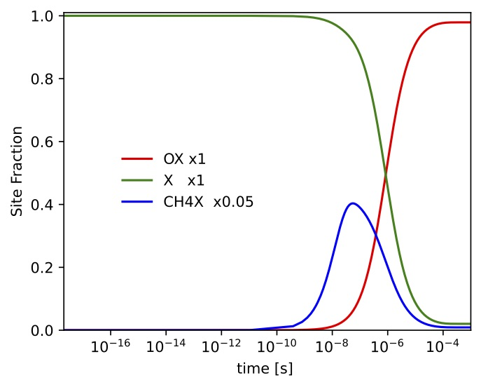

<p align="center"></p>

# TChem - A Software Toolkit for the Analysis of Complex Kinetic Models

1\.  [Introduction](#introduction)  
1.1\.  [Citing](#citing)  
1.2\.  [Nomenclature](#nomenclature)  
2\.  [Building TChem](#buildingtchem)  
2.1\.  [Download Libraries](#downloadlibraries)  
2.2\.  [Building Libraries and Configuring TChem](#buildinglibrariesandconfiguringtchem)  
2.2.1\.  [Kokkos](#kokkos)  
2.2.2\.  [Tines](#tines)  
2.2.3\.  [TChem](#tchem)  
2.2.4\.  [Script to Build and Install TChem and its TPLs](#scripttobuildandinstalltchemanditstpls)  
3\.  [Input Files](#inputfiles)  
3.1\.  [Reaction Mechanism and Thermal Property Data](#reactionmechanismandthermalpropertydata)  
3.2\.  [Input State Vectors  (sample.dat)](#inputstatevectorssample.dat)  
3.3\.  [Input Site Fraction (inputSurf.dat)](#inputsitefractioninputsurf.dat)  
4\.  [Thermodynamic Properties](#thermodynamicproperties)  
4.1\.  [Mass-Molar Conversions](#mass-molarconversions)  
4.2\.  [Equation of State](#equationofstate)  
4.3\.  [Gas-Phase Properties](#gas-phaseproperties)  
4.3.1\.  [Examples](#examples)  
4.4\.  [Surface Species Properties](#surfacespeciesproperties)  
5\.  [Reaction Rates](#reactionrates)  
5.1\.  [Gas-Phase Chemistry](#gas-phasechemistry)  
5.1.1\.  [Forward and Reverse Rate Constants](#forwardandreverserateconstants)  
5.1.2\.  [Concentration of the Third-Body](#concentrationofthethird-body)  
5.1.3\.  [Pressure-Dependent Reactions](#pressure-dependentreactions)  
5.1.4\.  [Note on Units for Net Production Rates](#noteonunitsfornetproductionrates)  
5.1.5\.  [Example](#example)  
5.2\.  [Surface Chemistry](#surfacechemistry)  
5.2.1\.  [Forward and Reverse Rate Constants](#forwardandreverserateconstants-1)  
5.3\.  [Sticking Coefficients](#stickingcoefficients)  
5.3.1\.  [Note on Units for Surface Production Rates](#noteonunitsforsurfaceproductionrates)  
5.3.2\.  [Example](#example-1)  
6\.  [Reactors](#reactors)  
6.1\.  [Time Integration](#timeintegration)  
6.2\.  [Homogeneous Constant-Pressure Batch Reactors](#homogeneousconstant-pressurebatchreactors)  
6.2.1\.  [Jacobian Formulation](#jacobianformulation)  
6.2.2\.  [Selecting Jacobian in Reactor Models](#selectingjacobianinreactormodels)  
6.2.3\.  [Running the 0D Ignition Utility](#runningthe0dignitionutility)  
6.2.4\.  [Ignition Delay Time Parameter Study for IsoOctane](#ignitiondelaytimeparameterstudyforisooctane)  
6.2.5\.  [Python Interface for Homogeneous Batch Reactors](#pythoninterfaceforhomogeneousbatchreactors)  
6.3\.  [Homogeneous Constant-Volume Batch Reactors](#homogeneousconstant-volumebatchreactors)  
6.3.1\.  [Jacobian of RHS](#jacobianofrhs)  
6.3.2\.  [Running the Constant Volume Ignition Utility](#runningtheconstantvolumeignitionutility)  
6.4\.  [Plug Flow Reactor (PFR) Model with Gas-Phase and Surface Reactions](#plugflowreactorpfrmodelwithgas-phaseandsurfacereactions)  
6.4.1\.  [Jacobian of RHS](#jacobianofrhs-1)  
6.4.2\.  [Running the Plug Flow Reactor with Surface Reactions Utility](#runningtheplugflowreactorwithsurfacereactionsutility)  
6.4.3\.  [Initial Condition for PFR Problem](#initialconditionforpfrproblem)  
6.5\.  [Transient continuous stirred tank reactor (T-CSTR)](#transientcontinuousstirredtankreactort-cstr)  
6.5.1\.  [Jacobian of RHS](#jacobianofrhs-2)  
6.5.2\.  [Running the Transient Continuous Stirred Tank Reactor with Surface Reactions Utility](#runningthetransientcontinuousstirredtankreactorwithsurfacereactionsutility)  
6.5.3\.  [Results](#results)  
7\.  [Application Programming Interface](#applicationprogramminginterface)  
7.1\.  [TChem::KineticModelData](#tchem::kineticmodeldata)  
7.1.1\.  [Gas-Phase Kinetic Model Setup using Chemkin Input Files](#gas-phasekineticmodelsetupusingchemkininputfiles)  
7.1.2\.  [Gas-Phase and Surface Kinetic Model using Chemkin Input Files](#gas-phaseandsurfacekineticmodelusingchemkininputfiles)  
7.1.3\.  [Gas Kinetic Model using Cantera-YAML Input Files](#gaskineticmodelusingcantera-yamlinputfiles)  
7.1.4\.  [Gas-Phase and Surface Kinetic Models using Cantera-YAML Input Files](#gas-phaseandsurfacekineticmodelsusingcantera-yamlinputfiles)  
7.2\.  [Function List](#functionlist)  
7.2.1\.  [Thermodynamic Properties](#thermodynamicproperties-1)  
7.2.1.1\.  [SpecificHeatCapacityPerMass](#specificheatcapacitypermass)  
7.2.1.2\.  [SpecificHeatCapacityConsVolumePerMass](#specificheatcapacityconsvolumepermass)  
7.2.1.3\.  [EnthalpyMass](#enthalpymass)  
7.2.1.4\.  [EntropyMass](#entropymass)  
7.2.1.5\.  [InternalEnergyMass](#internalenergymass)  
7.2.2\.  [Kinetic Quantities](#kineticquantities)  
7.2.2.1\.  [NetProductionRatesPerMass](#netproductionratespermass)  
7.2.2.2\.  [NetProductionRatesPerMole](#netproductionratespermole)  
7.2.2.3\.  [NetProductionRateSurfacePerMass](#netproductionratesurfacepermass)  
7.2.2.4\.  [NetProductionRateSurfacePerMole](#netproductionratesurfacepermole)  
7.2.2.5\.  [RateOfProgress](#rateofprogress)  
7.2.3\.  [Reactor Models: Time Advance](#reactormodels:timeadvance)  
7.2.3.1\.  [IgnitionZeroD](#ignitionzerod)  
7.2.3.2\.  [ConstantVolumeIgnitionReactor](#constantvolumeignitionreactor)  
7.2.3.3\.  [PlugFlowReactor](#plugflowreactor)  
7.2.3.4\.  [TransientContStirredTankReactor](#transientcontstirredtankreactor)  
7.2.3.5\.  [SimpleSurface](#simplesurface)  
7.2.4\.  [Homogeneous Constant-Pressure Reactors: RHS, Jacobians, and Smatrix](#homogeneousconstant-pressurereactors:rhsjacobiansandsmatrix)  
7.2.4.1\.  [SourceTerm](#sourceterm)  
7.2.4.2\.  [JacobianReduced](#jacobianreduced)  
7.2.4.3\.  [IgnitionZeroDNumJacobian](#ignitionzerodnumjacobian)  
7.2.4.4\.  [Smatrix](#smatrix)  
7.2.5\.  [Plug Flow Reactor](#plugflowreactor-1)  
7.2.5.1\.  [PlugFlowReactorRHS](#plugflowreactorrhs)  
7.2.6\.  [Other Interfaces](#otherinterfaces)  
7.2.6.1\.  [InitialCondSurface](#initialcondsurface)  
8\.  [Python Interface - pytchem](#pythoninterface-pytchem)  
9\.  [Summary](#summary)  
10\.  [On-going and Future Work](#on-goingandfuturework)  
11\.  [Acknowledgement](#acknowledgement)  

<a name="introduction"></a>

## 1\. Introduction

The TChem open-source software is a toolkit for computing thermodynamic properties, source term, and source term's Jacobian matrix for chemical kinetic models that involve gas and surface reactions. The software provides support for


* complex kinetic models for gas-phase and surface chemistry,
* thermodynamic properties based on NASA polynomials,
* parser for Chemkin/Cantera-YAML input files,
* species production/consumption rates,
* canonical reactor models such as constant pressure homogeneous gas-phase ignition, constant volume homogeneous gas-phase ignition, transient continuously stirred tank reactor, and plug-flow reactor,
* automatic evaluation of source term's Jacobian matrix using either finite difference schemes or automatic differentiation via the SACADO library.

TChem v3 is written in C++ and is based on [Kokkos](https://github.com/kokkos) for portability to heterogenous computing platforms i.e., multi/many core computing platforms with GPU (Graphics Processing Unit) accelerators. The toolkit includes gas-phase and surface chemistry models and several canonical reactor model examples including homogenous ignition, Plug Flow Reactor (PFR), and Transient Continuously Stirred Tank Reactors (T-CSTR). To exploit the massive parallelism available from modern computing platforms, the current software interface is designed to evaluate samples in parallel, which enables large scale parametric studies, e.g., for sensitivity analysis and model calibration. TChem v3 adds new interfaces for Python, C, and Fortran as well as kinetic model specifications in YAML format to facilitate the use of TChem in a broader range of applications.


<a name="citing"></a>

### 1.1\. Citing

* Kyungjoo Kim, Oscar Diaz-Ibarra, Cosmin Safta, and Habib Najm, TChem v3.0 - A Software Toolkit for the Analysis of Complex Kinetic Models, Sandia National Laboratories, SAND 2021-14064, 2021.

<a name="nomenclature"></a>  

### 1.2\. Nomenclature

In the table below,  stands for reaction order, for the forward and reverse paths, respectively.

Symbol|Description|Units
--|--|--
 | number of species   |-
 | number of gas-phase species |-
 | number of surface species   |-
 | number of surface species in phase  |-
 | number of reactions |-
 | gas-phase density | kg/m
   |  thermodynamic pressure |  Pa
   |  temperature  | K
 |  mixture heat capacity at constant pressure | J/(K.kmol)
 | for species  | J/(K.kmol)
 |  specific | J/(K.kg)
 |  specific, for species  | J/(K.kg)
 | mixture molar enthalpy | J/kmol
 | for species  | J/kmol
 |  specific| J/kg
 |  specific, for species | J/kg
 | mixture molar entropy  | J/(kmol.K)
|   for species  | J/(K.kmol)
   |specific | J/(K.kg)
 | specific, for species  | J/(K.kg)
  |Gibbs free energy for the mixture | J/kmol
 |for species  | J/kmol
 |specific| J/kg
 | specific, for species | J/kg
| mass fraction of species   | -
| mole fraction of species   | -
| site fraction of species   | -
| for species  in phase  | -
|molar concentration of species   | kmol/m
|surface site density of phase  | kmol/m
|site occupancy by species  in phase |-
|mixture molecular weight | kg/kmol
| for species  | kg/kmol
|universal gas constant | J/(kmol.K)
| forward rate constant of reaction  | 
| reverse rate constant of reaction  | 
|rate of progress of reaction  | kmol/(m.s)
|sticking coefficient for reaction  | 
|molar production rate of species  | kmol/(m.s)
|surface molar production rate of species  | kmol/(m.s)
<a name="buildingtchem"></a>

## 2\. Building TChem

TChem is designed and implemented using [Kokkos](https://github.com/kokkos/kokkos.git) (a performance portable parallel programming model) and requires a set of third-party libraries including [BLAS/LAPACK](http://www.openblas.net), [YAML](https://github.com/jbeder/yaml-cpp) and [Tines](https://github.com/sandialabs/Tines.git).
As most third-party libraries (TPLs) can be installed by using a package manager i.e., macports on OSX and yum/apt on Linux, we mainly explain how to build Kokkos, Tines, and TChem.
To simplify the TChem build process we define the following environment variables. These should be tailored to specific working environments by the user.


```
/// repositories
export TCHEM_REPOSITORY_PATH=/where/you/clone/tchem/git/repo
export KOKKOS_REPOSITORY_PATH=/where/you/clone/kokkos/git/repo
export TINES_REPOSITORY_PATH=/where/you/clone/tines/git/repo

/// build directories
export TCHEM_BUILD_PATH=/where/you/build/tchem
export KOKKOS_BUILD_PATH=/where/you/build/kokkos
export TINES_BUILD_PATH=/where/you/build/tines

/// install directories
export TCHEM_INSTALL_PATH=/where/you/install/tchem
export KOKKOS_INSTALL_PATH=/where/you/install/kokkos
export TINES_INSTALL_PATH=/where/you/install/tines

/// third party libraries install path
export GTEST_INSTALL_PATH=/where/you/install/gtest
export OPENBLAS_INSTALL_PATH=/where/you/install/openblas
export LAPACKE_INSTALL_PATH=/where/you/install/lapacke
export YAML_INSTALL_PATH=/where/you/intall/yaml-cpp
```

<a name="downloadlibraries"></a>

### 2.1\. Download Libraries


Please see below the syntax for downloading the Kokkos, Tines, and TChem repositories.

```
git clone https://github.com/sandialabs/Tines.git  ${TINES_REPOSITORY_PATH};
git clone https://github.com/kokkos/kokkos.git ${KOKKOS_REPOSITORY_PATH};
git clone https://github.com/sandialabs/TChem.git ${TCHEM_REPOSITORY_PATH};
```
In the next section we present the workflow for building TChem and the pre-requisite TPLs.

<a name="buildinglibrariesandconfiguringtchem"></a>

### 2.2\. Building Libraries and Configuring TChem

<a name="kokkos"></a>

#### 2.2.1\. Kokkos

Kokkos requires a ``Kokkos_ARCH_XXXX`` flag to perform optimization based on the given architecture information. This particular example script is based on Intel Sandy-Bridge i.e., ``-D Kokkos_ENABLE_SNB=ON`` and will install the library to ``${KOKKOS_INSTALL_PATH}``. For more details, see [Kokkos github pages](https://github.com/kokkos/kokkos).

```
cd ${KOKKOS_BUILD_PATH}
cmake \
    -D CMAKE_INSTALL_PREFIX="${KOKKOS_INSTALL_PATH}" \
    -D CMAKE_CXX_COMPILER="${CXX}"  \
    -D Kokkos_ENABLE_SERIAL=ON \
    -D Kokkos_ENABLE_OPENMP=ON \
    -D Kokkos_ENABLE_DEPRECATED_CODE=OFF \
    -D Kokkos_ARCH_SNB=ON \
    ${KOKKOS_REPOSITORY_PATH}
make -j install
export KOKKOS_CXX_COMPILER=${CXX}
```

To compile for NVIDIA GPUs, one can customize the following cmake script. Note that we use Kokkos ``nvcc_wrapper`` as its compiler. The architecture flag indicates that the host architecture is Intel Sandy-Bridge and the GPU architecture is Volta 70 generation. With Kokkos 3.1, the CUDA architecture flag is optional (the script automatically detects the correct CUDA arch flag).
```
cd ${KOKKOS_BUILD_PATH}
cmake \
    -D CMAKE_INSTALL_PREFIX="${KOKKOS_INSTALL_PATH}" \
    -D CMAKE_CXX_COMPILER="${KOKKOS_REPOSITORY_PATH}/bin/nvcc_wrapper"  \
    -D Kokkos_ENABLE_SERIAL=ON \
    -D Kokkos_ENABLE_OPENMP=ON \
    -D Kokkos_ENABLE_CUDA:BOOL=ON \
    -D Kokkos_ENABLE_CUDA_UVM:BOOL=OFF \
    -D Kokkos_ENABLE_CUDA_LAMBDA:BOOL=ON \
    -D Kokkos_ENABLE_DEPRECATED_CODE=OFF \
    -D Kokkos_ARCH_VOLTA70=ON \
    -D Kokkos_ARCH_SNB=ON \
    ${KOKKOS_REPOSITORY_PATH}
make -j install
export KOKKOS_CXX_COMPILER=${KOKKOS_INSTALL_PATH}/bin/nvcc_wrapper
```
For GPUs, we note that the compiler is switched to ``nvcc_wrapper`` by adding ``-D CMAKE_CXX_COMPILER="${KOKKOS_INSTALL_PATH}/bin/nvcc_wrapper"``. To use the same compiler setup for other libraries, we export an environmental variable ``KOKKOS_CXX_COMPILER`` according to its target architecture.  


<a name="tines"></a>

#### 2.2.2\. Tines
Compiling Tines follows the Kokkos configuration information available under ``${KOKKOS_INSTALL_PATH}``. The *OpenBLAS* and *LAPACKE* libraries are required on a host device providing an optimized version of dense linear algebra library. With an Intel compiler, one can replace these libraries with Intel MKL by adding the flag ``TINES_ENABLE_MKL=ON`` instead of using *OpenBLAS* and *LAPACKE*. On Mac OSX, we use the *OpenBLAS* library managed by **MacPorts**. This version has different header names and we need to distinguish this version of the code from others which are typically used on Linux distributions. To discern the two version of the code, cmake looks for "cblas\_openblas.h" to tell that the installed version is from MacPorts. This mechanism can be broken if MacPorts' *OpenBLAS* is changed later. Furthermore, the MacPorts *OpenBLAS* version include LAPACKE interface and one can remove  ``LAPACKE_INSTALL_PATH`` from the configure script. Additionally, the yaml-cpp (version 0.6.3) is used for parsing input files in YAML format.


```
cmake \
    -D CMAKE_INSTALL_PREFIX=${TINES_INSTALL_PATH} \
    -D CMAKE_CXX_COMPILER="${KOKKOS_CXX_COMPILER}" \
    -D CMAKE_CXX_FLAGS="-g" \
    -D TINES_ENABLE_DEBUG=OFF \
    -D TINES_ENABLE_VERBOSE=OFF \
    -D TINES_ENABLE_TEST=ON \
    -D TINES_ENABLE_EXAMPLE=ON \
    -D KOKKOS_INSTALL_PATH="${KOKKOS_INSTALL_PATH} \
    -D GTEST_INSTALL_PATH="${GTEST_INSTALL_PATH" \
    -D OPENBLAS_INSTALL_PATH="${OPENBLAS_INSTALL_PATH}" \
    -D LAPACKE_INSTALL_PATH="${LAPACKE_INSTALL_PATH}" \
    -D YAML_INSTALL_PATH="${YAML_INSTALL_PATH}" \
    ${TINES_REPOSITORY_PATH}/src
make -j install
```

<a name="tchem"></a>

#### 2.2.3\. TChem

The following example cmake script compiles TChem on host linking with the libraries described in the above e.g., KOKKOS, Tines, GTEST, and OpenBLAS.
```
cd ${TCHEM_BUILD_PATH}
cmake \
    -D CMAKE_INSTALL_PREFIX="${TCHEM_INSTALL_PATH}" \
    -D CMAKE_CXX_COMPILER="${KOKKOS_CXX_COMPILER}" \
    -D CMAKE_BUILD_TYPE=RELEASE \
    -D TCHEM_ENABLE_VERBOSE=OFF \
    -D TCHEM_ENABLE_TEST=ON \
    -D TCHEM_ENABLE_EXAMPLE=ON \
    -D KOKKOS_INSTALL_PATH="${KOKKOS_INSTALL_PATH}" \
    -D TINES_INSTALL_PATH="${TINES_INSTALL_PATH}" \
    -D GTEST_INSTALL_PATH="${GTEST_INSTALL_PATH}" \
    -D TCHEM_ENABLE_PYTHON=OFF \
    ${TCHEM_REPOSITORY_PATH}/src
make -j install
```
Optionally, a user can enable the Python interface with ``-D TCHEM_ENABLE_PYTHON=ON``. The Python interface of TChem is ported via [pybind11](https://pybind11.readthedocs.io/en/stable) and the code is distributed together with TChem.

<a name="scripttobuildandinstalltchemanditstpls"></a>

#### 2.2.4\. Script to Build and Install TChem and its TPLs

We put together a script, ``${TCHEM_REPOSITORY_PATH}/doc/config/master_bld.sh``, that clones, builds, and installs TChem, and the required TPLs (Kokkos, Tines, OpenBLAS, GTEST, and yaml-cpp). To use this script, update the compiler information for the C compiler,``MY_CC``, the C++ compiler ``MY_CXX``, and Fortran compiler ``MY_FC``. One can also choose whether to build/install the entire framework for GPU computations, i.e. ``CUDA``. These variables are located at the top of the script.    
<a name="inputfiles"></a>

## 3\. Input Files

TChem requires two input files to prescribe the choice of models. For a gas-phase system, a user provides (1) the reaction mechanisms, (2) the thermal properties, and (3) initial state vector. For surface chemistry, in addition to (1), (2), and (3), (4) the surface reaction mechanism, (5) the surface thermal properties, and (6) input site fraction vector. Alternatively, the kinetic model data can be provided in a single file with appropriate keyword selections.


<a name="reactionmechanismandthermalpropertydata"></a>

### 3.1\. Reaction Mechanism and Thermal Property Data

TChem can parse kinetic model and thermal properties data in either [Chemkin](https://www.osti.gov/biblio/5681118) format or the [Cantera-Yaml](https://cantera.org/documentation/dev/sphinx/html/yaml/index.html) format. Additional information for the Chemkin formats can be found in the technical reports below:

 * R. J. Kee, F. M. Rupley, and J. A. Miller,Chemkin-II: A Fortran Chemical Kinetics Package for the Analysis of Gas-Phase Chemical Kinetics, Sandia Report, SAND89-8009B (1995). [(link)](https://www.osti.gov/biblio/5681118)

* Michael E. Coltrin, Robert J. Kee, Fran M. Rupley, Ellen Meeks, Surface Chemkin-III: A FORTRAN Package for Analyzing Heterogeneous Chemical Kinetics at a Solid-surface--Gas-phase Interface, Sandia Report SAND96-8217 (1996). [(link)](https://www.osti.gov/biblio/481906-surface-chemkin-iii-fortran-package-analyzing-heterogeneous-chemical-kinetics-solid-surface-gas-phase-interface)

We provide an example using the YAML input. See ``${TCHEM_REPOSITORY_PATH}/src/example/TChem_ThermalProperties_Yaml.cpp`` for more details.

<a name="inputstatevectorssample.dat"></a>

### 3.2\. Input State Vectors  (sample.dat)

The set of specifications for gas-phase reaction examples are provided in a matrix form as:
````
T P SPECIES_NAME1 SPECIES_NAME2 ... SPECIES_NAMEN
T#1 P#1 Y1#1 Y2#1 ... YN#1 (sample #1)
T#2 P#2 Y1#2 Y2#2 ... YN#2 (sample #2)
...
...
...
T#N P#N Y1#N Y2#N ... YN#N (sample #N)
````   
Here T is the temperature [K], P is the pressure [Pa] and SPECIES_NAME1 is the name of the first gas species from the reaction mechanism input file. Y1#1 is the mass fraction of SPECIES_NAME1 in sample #1. The sum of the mass fractions on each row has to be equal to one since TChem does not normalize mass fractions. New samples can be created by adding rows to the input file. The excerpt below illustrates a setup for an example with 8 samples using a mixture of CH, O, N, and Ar:

````
T P CH4 O2 N2 AR
800 101325 1.48e-01 1.97e-01 6.43e-01 1.14e-02
800 101325 2.82e-02 2.25e-01 7.34e-01 1.30e-02
800 4559625 1.48e-01 1.97e-01 6.43e-01 1.14e-02
800 4559625 2.82e-02 2.25e-01 7.34e-01 1.30e-02
1250 101325 1.48e-01 1.97e-01 6.43e-01 1.14e-02
1250 101325 2.82e-02 2.25e-01 7.34e-01 1.30e-02
1250 4559625 1.48e-01 1.97e-01 6.43e-01 1.14e-02
1250 4559625 2.82e-02 2.25e-01 7.34e-01 1.30e-02
````
The eight samples in the above example correspond to the corners of a cube in a 3D parameter space with temperatures between 800 K and 1250 K, pressures between 1 atm to 45 atm, and equivalence ratios () for methane/air mixtures between 0.5 to 3.


<a name="inputsitefractioninputsurf.dat"></a>

### 3.3\. Input Site Fraction (inputSurf.dat)

Similarly, the set of specifications for surface reaction examples are provided in a matrix form as:
````
SURF_SPECIES_NAME_1 SURF_SPECIES_NAME_2 ... SURF_SPECIES_NAME_N
Z1#1 Z2#1 ... ZN#1 (sample #1)
Z1#2 Z2#2 ... ZN#2 (sample #2)
...
...
...
Z1#M Z2#M ... ZN#M (sample #M)
````  
where SURF_SPECIES_NAME1 is name of the first surface species from the chemSur.inp file and Z1#1 is the site fraction of this species for sample #1, and so forth.
<a name="thermodynamicproperties"></a>

## 4\. Thermodynamic Properties

We first present conversion formulas and the gas-phase equation of state, followed by a description of molar and mass-based expression for several thermodynamic properties.

<a name="mass-molarconversions"></a>

### 4.1\. Mass-Molar Conversions

The molar mass of the mixture,  is computed as

<p align="center"></p>

where  and  are the mole and mass fractions, respectively, of species , and  is the molecular weight of species . Mass and mole fractions can be computed from each other as

<p align="center"></p>

The the molar concentration of species  is given by , and the molar concentration of the mixture is given by

<p align="center"></p>

For problems that include heterogeneous chemistry, the site fractions  describe the composition of species on the surface. The number of surface phases is denoted by  and the site fractions are normalized with respect to each phase.

<p align="center"></p>

Here,  is the number of species on surface phase . TChem currently handles  surface phase only, . The surface concentration of surface species  is given by

<p align="center"></p>

where  is the surface site density of surface phase  and  is the site occupancy number for species .  represents the number of sites in phase  occupied by species .

<a name="equationofstate"></a>

### 4.2\. Equation of State    

The ideal gas equation of state is used throughout the library,

<p align="center"></p>

where  is the thermodynamic pressure,  and  are the molecular weights of the mixture and of species , respectively,  is the temperature, and  is the molar concentration of species .

<a name="gas-phaseproperties"></a>

### 4.3\. Gas-Phase Properties

The standard-state thermodynamic properties for a thermally perfect gas are computed based on NASA polynomials \cite{McBride:1993}. The molar heat capacity at constant pressure for species  is computed as

<p align="center"></p>

where  the universal gas constant. The molar enthalpy is computed as

<p align="center"></p>

The molar entropy is given by

<p align="center"></p>

The temperature units are Kelvin in the polynomial expressions above. Other thermodynamic properties are computed based on the polynomial fits above. The molar heat capacity at constant volume , the internal energy , and the Gibbs free energy  are given by

<p align="center"></p>

The mixture properties in molar units are given by

<p align="center"></p>

where  the mole fraction of species . The entropy and Gibbs free energy for species  account for the entropy of mixing and thermodynamic pressure

<p align="center"></p>

The mixture values for these properties are computed as above

<p align="center"></p>

The specific thermodynamic properties in mass units are obtained by dividing the above expression by the species molecular weight, ,

<p align="center"></p>

and

<p align="center"></p>

For the thermodynamic properties in mass units the mixture properties are given by

<p align="center"></p>

where  the mass fraction of species .

The mixture properties in mass units can also be evaluated from the equivalent molar properties as

<p align="center"></p>

where  is the molecular weight of the mixture.

<a name="examples"></a>

#### 4.3.1\. Examples

A example to compute the specific heat at constant pressure  and the specific enthalpy  is provided in "example/TChem_ThermalProperties.cpp". Enthalpy per species and the mixture enthalpy are computed with this [function call](#cxx-api-EnthalpyMass). Heat capacity per species and mixture with this [function call](#cxx-api-SpecificHeatCapacityPerMass). This example can be used in batch mode, and several samples are computed simultaneously. The next two figures were constructed based on  samples spanning several temperature and equivalent ratio values for CH--air mixtures.


Figure. Mixture Enthalpy compute with gri3.0 mechanism.


Figure.  Mixture Specific Heat Capacity  computed with GRIMech v3.0 mechanism for methane.


<a name="surfacespeciesproperties"></a>

### 4.4\. Surface Species Properties

The thermal properties of the surface species are computed with the same type of expressions described in Section [Gas-Phase Properties](#gas-phaseproperties) for the gas-phase species.

<!-- ## Examples -->
<a name="reactionrates"></a>

## 5\. Reaction Rates

In this chapter we present reaction rate expressions for gas-phase reactions in Section [Gas-Phase Chemistry](#cxx-api-ReactionRates) and for surface species or between surface and gas-phase species in Section [Surface Chemistry](#cxx-api-ReactionRatesSurface).


<a name="gas-phasechemistry"></a>

### 5.1\. [Gas-Phase Chemistry](#cxx-api-ReactionRates)

The production rate for species  in molar units is written as
<p align="center"></p>
where  is the number of reactions and  and  are the stoichiometric coefficients of species  in reaction  for the reactant and product side of the reaction, respectively. The rate-of-progress of reaction  is , with

|Reaction Type
--|--|--
 | basic reaction
 | 3-rd body enhanced, no pressure dependence
 | unimolecular/recombination fall-off reactions
 | chemically activated bimolecular reactions

and
<p align="center"></p>

The above expressions are detailed below.

<a name="forwardandreverserateconstants"></a>

#### 5.1.1\. Forward and Reverse Rate Constants

The forward rate constant has typically an Arrhenius expression,
<p align="center"></p>
where , , and  are the pre-exponential factor, temperature exponent, and activation energy, respectively, for reaction . For reactions with reverse Arrhenius parameters specified, the reverse rate constant  is computed similar to . If the reverse Arrhenius parameters are not specified,  is computed as
<p align="center"></p>
where  is the equilibrium constant (in concentration units) for reaction 
<p align="center"></p>
When computing the equilibrium constant, the atmospheric pressure, atm, and the universal gas constant  are converted to cgs units, dynes/cm and erg/(mol.K), respectively.

Note: If a reaction is irreversible, .

<a name="concentrationofthethird-body"></a>

#### 5.1.2\. Concentration of the Third-Body   

If the expression "+M" is present in the reaction string, some of the species might have custom efficiencies for their contribution in the mixture. For these reactions, the mixture concentration is computed as

<p align="center"></p>

where  is the efficiency of species  in reaction  and  is the concentration of species .  coefficients are set to 1 unless specified in the kinetic model description.

<a name="pressure-dependentreactions"></a>

#### 5.1.3\. Pressure-Dependent Reactions

* Reduced pressure . If expression "(+M)" is used to describe a reaction, then .
* For reactions that contain expressions like "(+)" ( is the name of species ), the reduced pressure is computed as .

For *unimolecular/recombination fall-off reactions* the Arrhenius parameters for the high-pressure limit rate constant  are given on the reaction line, while the parameters for the low-pressure limit rate constant  are given on the auxiliary reaction line that contains the keyword **LOW**. For *chemically activated bimolecular reactions* the parameters for  are given on the reaction line while the parameters for  are given on the auxiliary reaction line that contains the keyword **HIGH**.

The following expressions are employed to compute the :
|Reaction Type
--|--
 | Lindemann reaction
 | Troe reaction
 | SRI reaction

* For the Troe form, , , and  are

<p align="center"></p>

<p align="center"></p>

Parameters , , , and  are provided (in this order) in the kinetic model description for each Troe-type reaction. If  is omitted, only the first two terms are used to compute .

* For the SRI form exponent  is computed as

<p align="center"></p>

Parameters , , , , and  are provided in the kinetic model description for each SRI-type reaction. If  and  are omitted, these parameters are set to  and .

Miller~\cite{PLOGprinceton} has developed an alternative expression for the pressure dependence for pressure fall-off reactions that cannot be fitted with a single Arrhenius rate expression. This approach employs linear interpolation of  as a function of pressure for reaction  as follows

<p align="center"></p>

Here,  is the Arrhenius rate corresponding to pressure . For  the Arrhenius rate is set to , and similar for  where  is the number of pressures for which the Arrhenius factors are provided, for reaction . This formulation can be combined with 3 body information, e.g. . For PLOG reactions for which there are multiple PLOG entries for each pressure value, the forward rate constants are evaluated as

<p align="center"></p>

where  is the index for the entries corresponding to pressure .

<a name="noteonunitsfornetproductionrates"></a>

#### 5.1.4\. Note on Units for Net Production Rates

In most cases, the kinetic models input files contain parameters that are based on *calories, cm, moles, kelvin, seconds*. The mixture temperature and species molar concentrations are necessary to compute the reaction rate. Molar concentrations are typically available in [kmol/m]. For the purpose of reaction rate evaluation, the concentrations are transformed to [mol/cm]. The resulting reaction rates and species production rates are in [mol/(cm.s)]. In the last step these are converted back to SI units [kg/(m.s)].

<a name="example"></a>

#### 5.1.5\. Example

The production rate for species  in mole units  [kmol/m/s] is computed via the [function call](#cxx-api-ReactionRatesMole) ``NetProductionRatesPerMole`` and in mass units  [kg/m/s] via the [function call](#cxx-api-ReactionRates) ``NetProductionRatesPerMass``. The example provided in ``src/example/TChem_NetProductionRatesPerMass.cpp``
computes the production rate in mass units for gas-phase species.

<a name="surfacechemistry"></a>

### 5.2\. [Surface Chemistry](#cxx-api-ReactionRatesSurface)

The production rate for gas and surface species  in molar units is written as

<p align="center"></p>

where  is the number of reactions describing the surface phase and  and  are the stoichiometric coefficients of species  in reaction  for the reactant and product side of the reaction, respectively.

The rate of progress  of the  surface reaction is equal to:

<p align="center"></p>


Where  is the concentration of species . If the species  is a gas species, then  is the molar concentration by volume, . If, on the other hand, species  is a surface species, then  is the surface molar concentration computed by , where  is site fraction,  is density of surface site of the phase , and  is the site occupancy number (we assume ).

<a name="forwardandreverserateconstants-1"></a>

#### 5.2.1\. Forward and Reverse Rate Constants
The forward rate for surface reactions is computed similarly to the gas-phase. Unless the parameters for the reverse rate are specified, the reverse rate is computed via the equilibrium constant as:

<p align="center"></p>

The equilibrium constant for surface reaction  is computed as

<p align="center"></p>  

Here,  and  represent the number of gas-phase and surface species, respectively, and atm. TChem currently assumes the surface site density  for all phases to be constant. The equilibrium constant in pressure units is computed as

<p align="center"></p>

based on entropy and enthalpy changes from reactants to products (including gas-phase and surface species). The net change in the surface of the site occupancy number for phase  for reaction  is given by

<p align="center"></p>

<a name="stickingcoefficients"></a>

### 5.3\. Sticking Coefficients

The reaction rate for some surface reactions are described in terms of the probability that a collision results in a reaction. For this reaction type, the forward rate is computed as

<p align="center"></p>

where  is the sticking coefficient,  is the molecular weight of the gas-phase mixture,  is the universal gas constant,  is the total surface site concentration over all phases, and  is the sum of stoichiometric coefficients for all surface species in reaction .

<a name="noteonunitsforsurfaceproductionrates"></a>

#### 5.3.1\. Note on Units for Surface Production Rates

Typically the units of the surface and gas-phase species concentrations presented above are in kmol/m (surface species) or kmol/ (gas-phase species). To match the units of the kinetic model and compute the rate constants, these concentrations are converted to mol/cm or mol/cm. The resulting rate constant for surface reactions are in mol/(cm.s). In the last step these are converted to SI units [kg/(m.s)].

<a name="example-1"></a>

#### 5.3.2\. Example

The production rate for species  in in molar units  [kmole/m/s] is computed through the [function call](#cxx-api-ReactionRatesSurfaceMole) ``NetProductionRateSurfacePerMole`` and in mass units  [kg/m/s] via the [function call](#cxx-api-ReactionRatesSurface)  ``NetProductionRateSurfacePerMass``. The example provided in ``src/example/TChem_NetProductionSurfacePerMass.cpp``
computes the production rates for gas-phase and surface species in mass units.

<a name="reactors"></a>

## 6\. Reactors

We present the setup for canonical examples that are available through TChem. All models presented in this section are setup to be run in parallel, possibly exploiting several layers of parallelism available on the platform of choice. We present results for the [constant pressure homogeneous batch reactor](#homogeneousconstant-pressurebatchreactors), [constant volume homogeneous batch reactor](#constantvolumehomogeneousbatchreactors), a [plug-flow reactor](#plugflowreactorpfrproblemwithgasandsurfacesreactions), and a [transient continuous stirred tank reactor](#transientcontinuousstirredtankreactort-cstr).


<a name="timeintegration"></a>

### 6.1\. Time Integration

For stiff ODEs/DAEs, the numerical time step size is limited by a stability condition rather than a truncation error. To obtain a reliable solution, we use a stable time integration method i.e., 2nd order Trapezoidal Backward Difference Formula (TrBDF2). The TrBDF2 scheme is a composite single step method. The method is 2-nd order accurate and -stable. This ODE/DAE solver was implemented via Kokkos, it takes advantage of parallel threads available through the Kokkos interface, and it is part of the [Tines](https://github.com/sandialabs/Tines) library.

* R. E. Bank, W. M. Coughran, W. Fichtner, E. H. Grosse, D. J. Rose, and R. K. Smith, Transient simulation of silicon devices and circuits, IEEE Trans. Comput. Aided Des. CAD-4, 436-451, 1985.
<a name="homogeneousconstant-pressurebatchreactors"></a>

### 6.2\. [Homogeneous Constant-Pressure Batch Reactors](#cxx-api-IgnitionZeroD)

<!-- ## Problem Definition -->

In this example we consider a transient zero-dimensional constant-pressure model for the temperature  and species mass fractions for  gas-phase species. The user provides the initial condition for the these variables along with a reference pressure and the model will be advanced in time for a duration also provided in the problem setup.

For an open batch reactor, the system of ODEs solved by TChem are given by:

* ***Temperature equation***
<p align="center"></p>

* ***Species equation***
<p align="center"></p>

where  is the density,  is the specific heat at constant pressure for the mixture,  is the molar production rate of species ,  is its molecular weight, and  is the specific enthalpy.

<a name="jacobianformulation"></a>

#### 6.2.1\. Jacobian Formulation

Efficient integration and accurate analysis of the stiff system of ODEs shown above requires the Jacobian matrix of the *rhs* vector. In this section we will derive the Jacobian matrix components.

Let
<p align="center"></p>
by the denote the variables in the *lhs* of the 0D system and let
denote the state vector for the ODE system defined by temperature and species equations and
<p align="center"></p>
denote the extended state vector. The 0D system can be written in compact form as
<p align="center"></p>
where  and . The thermodynamic pressure  was introduced for completeness. For open batch reactors  is constant and . The source term  is computed considering the ideal gas equation of state
<p align="center"></p>
with P=const and using the expressions above for  and ,
<p align="center"></p>

Let  and  be the Jacobian matrices corresponding to  and , respectively. Chain-rule differentiation leads to
<p align="center"></p>
Note that each component  of  is also a component of  and the corresponding *rhs* components are also the same, .

***Evaluation of Jacobian Components***

We first identify the dependencies on the elements of  for each of the components of 

* . This component is not needed for the subsequent evaluation of elements of the Jacobian matrix  and is therefore skipped in the analysis below.

* 

* .  is defined above. Here we highlight its dependencies on the elements of 
<p align="center"></p>
where  is the molar concentration of species , .
<p align="center"></p>

* 
<p align="center"></p>

The values for heat capacities and their derivatives are computed based on the NASA polynomial fits as
<p align="center"></p>
The partial derivatives of the species production rates,   , are computed as
<p align="center"></p>

The steps for the calculation of  and  are itemized below

* Derivatives of production rate  of species 
<p align="center"></p>

* Derivatives of rate-of-progress variable  of reaction 
<p align="center"></p>

* Derivatives of 

    + Basic reactions $\mathcal{C}_i = 1$: $\frac{\partial\mathcal{C}_i}{\partial T}\equiv \frac{\partial\mathcal{C}_i}{\partial\mathfrak{X}_l}\equiv 0$

    + 3-rd body-enhanced reactions $\mathcal{C}_i = \mathfrak{X}_i$: $\frac{\partial\mathcal{C}_i}{\partial T}\equiv 0$, $\frac{\partial\mathcal{C}_i}{\partial\mathfrak{X}_l}=\alpha_{il}$

    + Unimolecular/recombination fall-off reactions $\mathcal{C}_i = \frac{\Pr_i}{1+\Pr_i}F_i$
<p align="center"></p>

        - $\Pr_i=\frac{{k_0}_i}{{k_\infty}_i}\mathfrak{X}_i \Rightarrow \frac{\partial\Pr_i}{\partial T}=\frac{{k'_0}_i{k_\infty}_i-{k_0}_i{k'_\infty}_i}{{k_\infty^2}_i}\mathfrak{X}_i,\,\,\,
\frac{\partial\Pr_i}{\partial\mathfrak{X}_l}=\frac{{k_0}_i}{{k_\infty}_i}\alpha_{il}\Pr_i=\frac{{k_0}_i}{{k_\infty}_i}\mathfrak{X}_m \Rightarrow
\frac{\partial\Pr_i}{\partial T}=\frac{{k'_0}_i{k_\infty}_i-{k_0}_i{k'_\infty}_i}{{k_\infty^2}_i}\mathfrak{X}_m,\,\,\,
\frac{\partial\Pr_i}{\partial\mathfrak{X}_l}=\frac{{k_0}_i}{{k_\infty}_i}\delta_{lm}\delta_{lm}F_i=1 \Rightarrow \frac{\partial F_i}{\partial T}\equiv \frac{\partial F_i}{\partial\mathfrak{X}_l}\equiv 0$.

      - For Troe form
<p align="center"></p>

where
<p align="center"></p>
- For SRI form
<p align="center"></p>

+ Chemically activated bimolecular reactions: 
<p align="center"></p>
Partial derivatives of  and  are computed similar to the ones above.

* Derivatives of 
<p align="center"></p>

    + ${k_f}_i=A_iT^{\beta_i}\exp\left(-\frac{E_i}{R T}\right)
=A_i\exp\left(\beta_i\ln T-\frac{{T_a}_i}{T}\right){T_a}_i=E_i/R{k'_f}_i=\frac{{k_f}_i}{T}\left(\beta_i+\frac{{T_a}_i}{T}\right){k'_r}_i$ is computed similar to above. If ${k_r}_i$ is computed based on ${k_f}_i$ and the equilibrium constant ${K_c}_i$, then its derivative is computed as
<p align="center"></p>
Since . It follows that
<p align="center"></p>
where  is computed based on NASA polynomial fits as
<p align="center"></p>

***Efficient Evaluation of Jacobian Terms***

* Step 1:
<p align="center"></p>
Here  and  are the forward and reverse parts, respectively of :
<p align="center"></p>

* Step 2: Once  are evaluated for all , then  is computed as
<p align="center"></p>

* Step 3:
<p align="center"></p>

***Evaluation of Reduced Jacobian Components***

* *Temperature equation*
<p align="center"></p>

* *Species equations*
<p align="center"></p>
For  density is a dependent variable, calculated based on
the ideal gas equation of state:
<p align="center"></p>
The partial derivatives of density with respect to the independent variables are computed as
<p align="center"></p>

<a name="selectingjacobianinreactormodels"></a>

#### 6.2.2\. Selecting Jacobian in Reactor Models

TChem provides three options for the evaluation of the Jacobian matrix  for the homogeneous batch reactor:

* the hand-derived analytical Jacobian, which derivation is presented in the previous section
* a numerical Jacobian computed by the forward difference scheme implemented in [Tines](https://github.com/sandialabs/Tines);
* and an analytical Jacobian computed by the SACADO-based AD implementation.

By default, the homogeneous batch reactor uses the hand-derived Jacobian implementation. To change this behavior, a user can use the numerical Jacobian and the SACADO based analytic Jacobian by enabling the following CMake options
```
-D TCHEM_ENABLE_NUMERICAL_JACOBIAN_IGNITION_ZERO_D_REACTOR=ON
-D TCHEM_ENABLE_SACADO_JACOBIAN_IGNITION_ZERO_D_REACTOR=ON
```


<a name="runningthe0dignitionutility"></a>

#### 6.2.3\. Running the 0D Ignition Utility
The executable to run this example is installed at "${TCHEM_INSTALL_PATH}/example/",  and the input parameters are (./TChem_IgnitionZeroDSA.x --help) :

```
Usage: ./TChem_IgnitionZeroDSA.x [options]
  options:
--atol-newton                 double    Absolute tolerance used in newton solver
                                        (default: --atol-newton=1.0e-10)
--chemfile                    string    Chem file name e.g., chem.inp
                                        (default: --chemfile=chem.inp)
--dtmax                       double    Maximum time step size
                                        (default: --dtmax=1.0e-01)
--dtmin                       double    Minimum time step size
                                        (default: --dtmin=1.0e-08)
--echo-command-line           bool      Echo the command-line but continue as normal
--help                        bool      Print this help message
--ignition-delay-time-file    string    Output of ignition delay time second using second-derivative method e.g., IgnitionDelayTime.dat
                                        (default: --ignition-delay-time-file=IgnitionDelayTime.dat)
--ignition-delay-time-w-threshold-temperature-file string    Output of ignition delay time second using threshold-temperature method  e.g., IgnitionDelayTimeTthreshold.dat
                                        (default: --ignition-delay-time-w-threshold-temperature-file=IgnitionDelayTimeTthreshold.dat)
--inputs-path                 string    path to input files e.g., data/inputs
                                        (default: --inputs-path=data/ignition-zero-d/CO/)
--jacobian-interval           int       Jacobians are evaluated once in this interval
                                        (default: --jacobian-interval=1)
--max-newton-iterations       int       Maximum number of newton iterations
                                        (default: --max-newton-iterations=100)
--max-time-iterations         int       Maximum number of time iterations
                                        (default: --max-time-iterations=1000)
--only-compute-ignition-delay-time bool      If true, simulation will end when Temperature is equal to the threshold temperature  
                                        (default: --only-compute-ignition-delay-time=false)
--output_frequency            int       save data at this iterations
                                        (default: --output_frequency=1)
--outputfile                  string    Output file name e.g., IgnSolution.dat
                                        (default: --outputfile=IgnSolution.dat)
--rtol-newton                 double    Relative tolerance used in newton solver
                                        (default: --rtol-newton=1.e-06)
--run-constant-pressure       bool      if true code runs ignition zero d reactor; else code runs constant volume ignition reactor
                                        (default: --run-constant-pressure=true)
--samplefile                  string    Input state file name e.g.,input.dat
                                        (default: --samplefile=sample.dat)
--tbeg                        double    Time begin
                                        (default: --tbeg=0.0)
--team-size                   int       User defined team size
                                        (default: --team-size=-1)
--tend                        double    Time end
                                        (default: --tend=1.0)
--thermfile                   string    Therm file namee.g., therm.dat
                                        (default: --thermfile=therm.dat)
--threshold-temperature       double    threshold temperature in ignition delay time
                                        (default: --threshold-temperature=1.5e+03)
--time-iterations-per-intervalint       Number of time iterations per interval to store qoi
                                        (default: --time-iterations-per-interval=10)
--tol-time                    double    Tolerance used for adaptive time stepping
                                        (default: --tol-time=1.0e-04)
--use_prefixPath              bool      If true, input file are at the prefix path
                                        (default: --use_prefixPath=true)
--vector-size                 int       User defined vector size
                                        (default: --vector-size=-1)
--verbose                     bool      If true, printout the first Jacobian values
                                        (default: --verbose=true)
Description:
This example computes the solution of a gas ignition 0D - problem
```

* ***GRIMech 3.0 Model***

The following example bash script runs an ignition problem with the [GRIMech 3.0](http://www.me.berkeley.edu/gri_mech) model:


```
exec=$TCHEM_INSTALL_PATH/example/TChem_IgnitionZeroDSA.x

inputs=$TCHEM_INSTALL_PATH/example/data/ignition-zero-d/gri3.0

this="$exec --chemfile=$inputs/chem.inp \
            --thermfile=$inputs/therm.dat \
            --samplefile=$inputs/sample.dat \
            --outputfile=IgnSolution.dat \
            --atol-newton=1e-18 \
            --rtol-newton=1e-8\
            --max-newton-iterations=20 \
            --tol-time=1e-6 \
            --dtmax=1e-3 \
            --dtmin=1e-20 \
            --tend=2 \
            --time-iterations-per-interval=10 \
            --max-time-iterations=260 \
            --ignition-delay-time-file=IgnitionDelayTime.dat \
            --ignition-delay-time-w-threshold-temperature-file=IgnitionDelayTimeTthreshold.dat
            --threshold-temperature=1500"

echo $this
eval $this
```

In the above bash script the "inputs" variables is the path to where the inputs files are located in this case ("${TCHEM_INSTALL_PATH}/example/data/ignition-zero-d/gri3.0"). In this directory, the gas reaction mechanism is defined in "chem.inp" and the thermal properties in "therm.dat". Additionally, "sample.dat" contains the initial conditions for the simulation.

The parameters "dtmin" and "dtmax" control the size of the time steps in the solver. The decision to increase or decrease time step depends on the parameter "tol-time". This parameter controls the error in each time iteration, thus, a bigger value will allow the solver to increase the time step while a smaller value will result in smaller time steps. The time-stepping will end when the time reaches "tend". The simulation will also end when the number of time steps reach  "max-time-iterations".  The absolute and relative tolerances in the Newton solver in each iteration are set with "atol-newton" and "rtol-newton", respectively, and the maximum number of Newton solver iterations is set with "max-newton-iterations".

The user can specify how often a solution is saved with the parameter "time-iterations-per-interval". Thus, a solution will be saved at every 10 iterations for this case. The default value of this input is . The simulation results are saved in "IgnSolution.dat", with the following format:


```
iter     t       dt      Density[kg/m3]          Pressure[Pascal]        Temperature[K] SPECIES1 ... SPECIESN  
```  
where SPECIES1 represents the mass fraction of species \#1, and so forth. Finally, we provide two methods to compute the ignition delay time. In the first approach, we save the time where the gas temperature reaches a threshold temperature. This temperature is set to K. In the second approach, save the location of the inflection point for the temperature profile as a function of time, also equivalent to the time when the second derivative of temperature with respect to time is zero. The result of these two methods are saved in files "IgnitionDelayTimeTthreshold.dat" and "IgnitionDelayTime.dat", respectively.


* **GRIMech 3.0 Results**

The results presented below are obtained by running "TCHEM_INSTALL_PATH/example/TChem_IgnitionZeroDSA.x" with an initial temperature of K, pressure of atm and a stoichiometric equivalence ratio () for methane/air mixtures. The input files are located at "TCHEM_INSTALL_PATH/example/data/ignition-zero-d/gri3.0/" and selected parameters were presented above. The outputs of the simulation were saved every iteration in "IgnSolution.dat". Time profiles for temperature and mass fractions for selected species are presented the following figures.


The ignition delay time values based on the two alternative computations discussed above are s and s, respectively. The scripts to setup and run this example and the jupyter-notebook used to create these figures can be found under "TCHEM_INSTALL_PATH/example/runs/gri3.0_IgnitionZeroD".

* **GRIMech 3.0 Results Parametric Study**

The following figure shows the ignition delay time as a function of the initial temperature and equivalence ratio values. These results are based on settings provided in "TCHEM_INSTALL_PATH/example/runs/gri3.0_IgnDelay" and correspond to 100 samples. In addition, we used the flag "only-compute-ignition-delay-time=true", so the simulation will end when all samples reach the threshold temperature, and time profiles will not be saved. "TChem\_IgnitionZeroDSA.x" runs these samples in parallel. The wall-time is between  on a 2.4 GHz 8-Core Intel Core i9 using 16 threads.

We also provide a jupyter-notebook to produce the sample file "sample.dat" and to generate the figure presented above.


Figure. Ignition delay times [s] at P=1 atm for several CH/air equivalence ratio  and initial temperature values. Results are based on the GRI-Mech v3.0 kinetic model.


<a name="ignitiondelaytimeparameterstudyforisooctane"></a>

#### 6.2.4\. Ignition Delay Time Parameter Study for IsoOctane

We present a parameter study for several equivalence ratio, pressure, and initial temperature values for iso-Octane/air mixtures. The iso-Octane reaction mechanism used in this study consists of 874 species and 3796 elementary reactions~\cite{W. J. Pitz M. Mehl, H. J. Curran and C. K. Westbrook ref 5 }. We selected four pressure values,  [atm]. For each case we ran a number of simulations that span a grid of  initial conditions each for the equivalence ratio and temperature resulting in 900 samples for each pressure value. Each sample was run on a test bed with a Dual-Socket Intel Xeon Platinum architecture.


The data produced by this example is located at "TCHEM_INSTALL_PATH/example/runs/isoOctane_IgnDelay". Because of the time to produce a result we save the data in a hdf5 format in "isoOctaneIgnDelayBlake.hdf5".
The following figures show ignition delay times results for the conditions specified above. These figures were generated with the jupyter notebook shared in the results directory.


Figure.  Ignition delay times [s] at 10atm for several equivalence ratio (vertical axes) and temperature (hori- zontal axes) values for iso-Octane/air mixtures


Figure.  Ignition delay times [s] at  16atm  for several equivalence ratio (vertical axes) and temperature (hori- zontal axes) values for iso-Octane/air mixtures


Figure.  Ignition delay times [s] at  34atm  for several equivalence ratio (vertical axes) and temperature (hori- zontal axes) values for iso-Octane/air mixtures


Figure.  Ignition delay times [s] at  45 atm  for several equivalence ratio (vertical axes) and temperature (hori- zontal axes) values for iso-Octane/air mixtures

<a name="pythoninterfaceforhomogeneousbatchreactors"></a>

#### 6.2.5\. Python Interface for Homogeneous Batch Reactors

We created a jupyter-notebook for the GRI3.0 example using the TChem's python interface ([pytchem](#pythoninterface-pytchem)), this jupyter-notebook is located at ``TCHEM_INSTALL_PATH/example/runs/PythonInterface/IgnitionZeroD/pyTChem.ipynb``.  
<a name="homogeneousconstant-volumebatchreactors"></a>

### 6.3\. [Homogeneous Constant-Volume Batch Reactors](#cxx-api-ConstantVolumeIgnitionZeroD)

<!-- ## Problem Definition -->

In this example we consider a transient zero-dimensional constant-volume problem where temperature  and species mass fractions for  gas-phase species. The user provides the initial condition for the these variables along with a reference density and the model will be advanced in time for a duration also provided in the problem setup.

The system of ODEs solved by TChem are given by:

* ***Temperature equation***
<p align="center"></p>
* ***Species equation***
<p align="center"></p>

where ,  is the specific heat at constant pressure for the mixture,  is the specific heat at constant volume for the mixture, ,  is the density (constant for this reactor model),  is the molar production rate of species ,  is its molecular weight, and  is the specific enthalpy. Further,  is the mixture molecular weight.

<a name="jacobianofrhs"></a>

#### 6.3.1\. Jacobian of RHS

TChem uses either a numerical Jacobian based on a forward finite differences scheme or an analytical Jacobian based on automatic differentiation via the [SACADO library](https://docs.trilinos.org/dev/packages/sacado/doc/html/index.html). To select between numerical and analytical Jacobian, set the following cmake flag on TChem's configuration at compilation time.

```
-D TCHEM_ENABLE_SACADO_JACOBIAN_CONSTANT_VOLUME_IGNITION_REACTOR
```
The default value of this flag is "OFF", which means by default the numerical Jacobian is used by the ODE solver.  

<a name="runningtheconstantvolumeignitionutility"></a>

#### 6.3.2\. Running the Constant Volume Ignition Utility

The executable for this example is installed at ``TCHEM_INSTALL_PATH/example/``,  and the input parameters are given by (./TChem_IgnitionZeroDSA.x --help) :

```
options:
--atol-newton                 double    Absolute tolerance used in newton solver
                                        (default: --atol-newton=1.0e-10)
--chemfile                    string    Chem file name e.g., chem.inp
                                        (default: --chemfile=chem.inp)
--dtmax                       double    Maximum time step size
                                        (default: --dtmax=1.0e-01)
--dtmin                       double    Minimum time step size
                                        (default: --dtmin=1.0e-08)
--echo-command-line           bool      Echo the command-line but continue as normal
--help                        bool      Print this help message
--ignition-delay-time-file    string    Output of ignition delay time second using second-derivative method e.g., IgnitionDelayTime.dat
                                        (default: --ignition-delay-time-file=IgnitionDelayTime.dat)
--ignition-delay-time-w-threshold-temperature-file string    Output of ignition delay time second using threshold-temperature method  e.g., IgnitionDelayTimeTthreshold.dat
                                        (default: --ignition-delay-time-w-threshold-temperature-file=IgnitionDelayTimeTthreshold.dat)
--inputs-path                 string    path to input files e.g., data/inputs
                                        (default: --inputs-path=data/ignition-zero-d/CO/)
--jacobian-interval           int       Jacobians are evaluated once in this interval
                                        (default: --jacobian-interval=1)
--max-newton-iterations       int       Maximum number of newton iterations
                                        (default: --max-newton-iterations=100)
--max-time-iterations         int       Maximum number of time iterations
                                        (default: --max-time-iterations=1000)
--only-compute-ignition-delay-time bool      If true, simulation will end when Temperature is equal to the threshold temperature  
                                        (default: --only-compute-ignition-delay-time=false)
--output_frequency            int       save data at this iterations
                                        (default: --output_frequency=1)
--outputfile                  string    Output file name e.g., IgnSolution.dat
                                        (default: --outputfile=IgnSolution.dat)
--rtol-newton                 double    Relative tolerance used in newton solver
                                        (default: --rtol-newton=1.0e-06)
--run-constant-pressure       bool      if true code runs ignition zero d reactor; else code runs constant volume ignition reactor
                                        (default: --run-constant-pressure=true)
--samplefile                  string    Input state file name e.g.,input.dat
                                        (default: --samplefile=sample.dat)
--tbeg                        double    Time begin
                                        (default: --tbeg=0.0)
--team-size                   int       User defined team size
                                        (default: --team-size=-1)
--tend                        double    Time end
                                        (default: --tend=1.0)
--thermfile                   string    Therm file namee.g., therm.dat
                                        (default: --thermfile=therm.dat)
--threshold-temperature       double    threshold temperature in ignition delay time
                                        (default: --threshold-temperature=1.50e+03)
--time-iterations-per-intervalint       Number of time iterations per interval to store qoi
                                        (default: --time-iterations-per-interval=10)
--tol-time                    double    Tolerance used for adaptive time stepping
                                        (default: --tol-time=1.e-04)
--use_prefixPath              bool      If true, input file are at the prefix path
                                        (default: --use_prefixPath=true)
--vector-size                 int       User defined vector size
                                        (default: --vector-size=-1)
--verbose                     bool      If true, printout the first Jacobian values
                                        (default: --verbose=true)
Description:
This example computes the solution of a gas ignition 0D - problem
```
Note that we implement the [Homogeneous Constant-Pressure Batch Reactors](#homogeneousconstant-pressurebatchreactors) and Homogeneous Constant-Volume Batch Reactors in the same example code, TChem_IgnitionZeroDSA.cpp. We use the flag ``run-constant-pressure`` to choose which reactor to run. If this flag is set to ``true``, the program will integrate the Constant Pressure Homogeneous Batch Reactors. If this flag is set to ``false`` the Constant Volume Homogeneous Batch Reactors will be executed.

* ***GRIMech 3.0 Model***

We can create a bash scripts to provide inputs to TChem. For example the following script runs a constant-volume ignition problem with the GRIMech 3.0 model:

```
exec=$TCHEM_INSTALL_PATH/example/TChem_IgnitionZeroDSA.x
inputs=$TCHEM_INSTALL_PATH/example/data/ignition-zero-d/gri3.0

export OMP_PROC_BIND=spread
this="$exec --chemfile=$inputs/chem.inp \
            --thermfile=$inputs/therm.dat \
            --samplefile=$inputs/sample.dat \
            --outputfile=ConstVolumeIgnSolution.dat \
            --run-constant-pressure=false \
            --atol-newton=1e-18 \
            --rtol-newton=1e-8\
            --max-newton-iterations=20 \
            --tol-time=1e-6 \
            --dtmax=1e-3 \
            --dtmin=1e-20 \
            --tend=2 \
            --time-iterations-per-interval=10 \
            --max-time-iterations=260 \
            --ignition-delay-time-file=IgnitionDelayTime.dat \
            --ignition-delay-time-w-threshold-temperature-file=IgnitionDelayTimeTthreshold.dat
            --threshold-temperature=1500"

echo $this
eval $this
```

* **GRIMech 3.0 Results**

The results presented below are obtained by running ``TCHEM_INSTALL_PATH/example/TChem_IgnitionZeroDSA.x`` with an initial temperature of K, pressure of  atm, and stoichiometric conditions (equivalence ratio ) for methane/air mixtures. The input files are located at "TCHEM_INSTALL_PATH/example/data/ignition-zero-d/gri3.0" and selected parameters were presented above. The inputs files and conditions are the same that we used in example of the [Homogeneous Constant-Pressure Batch Reactors](#homogeneousconstant-pressurebatchreactors).
 The simulation output was saved every iteration in "ConstVolumeIgnSolution.dat". Time profiles for temperature and mass fractions for selected species are presented in the figures below. To produce these results, we used a numerical Jacobian for the ODE solver.


The scripts to setup and run this example and the jupyter-notebook used to create these figures can be found under "TCHEM_INSTALL_PATH/example/runs/ConstantVolumeIgnition".
<a name="plugflowreactorpfrmodelwithgas-phaseandsurfacereactions"></a>

### 6.4\. [Plug Flow Reactor (PFR) Model with Gas-Phase and Surface Reactions](#cxx-api-PlugFlowReactor)

<!-- ## Problem Definition -->

The plug flow reactor (PFR) example employs both gas-phase and surface species. The PFR is assumed to be in steady state, and it is modeled by a system of differential-algebraic equations (DAE). The ODE part of the problem corresponds to energy, momentum, total mass, and species mass balance equations. The algebraic constraint arises from the assumption that the PFR problem is a steady-state problem. Thus, the composition on the wall surface must be stationary.

The equations for the species mass fractions , temperature , axial velocity , and continuity (represented by density ) resolved by TChem were derived from

* Robert J. Kee, Michael E. Coltrin, Peter Glarborg, Huayang Zhu, "Chemically Reacting Flow: Theory, Modeling, and Simulation, Second Edition."


* ***Species equation***

<p align="center"></p>

* ***Temperature equation***

<p align="center"></p>

* ***Velocity equation***

<p align="center"></p>

* ***Density equation***

<p align="center"></p>

where , ,  is the surface area, ' is the surface chemistry parameter. In the equations above  represents the surface chemistry production rate for a gas-phase species .

* ***Algebraic constraint***
<p align="center"></p>

Here  represents all surface species.

The number of ODEs is equal to the number of gas-phases species with three additional equations for density, velocity, and thermodynamic temperature. The number of constraints is equal to the number of surface species. This PFR formulation assumes that surface reactions are taking place on the channel wall and gas-phase reactions inside the channel. Wall friction and heat transfer at the wall are neglected in this example.
<a name="jacobianofrhs-1"></a>

#### 6.4.1\. Jacobian of RHS

TChem uses either a numerical Jacobian based on a forward finite differences scheme or an analytical Jacobian based on AD via the [SACADO library](https://docs.trilinos.org/dev/packages/sacado/doc/html/index.html). To choose between numerical and analytical Jacobian, set the following cmake flag on TChem's configuration at compilation time.
```
-D TCHEM_ENABLE_SACADO_JACOBIAN_PLUG_FLOW_REACTOR
```
The default value of this flag is "OFF", which means by default the numerical Jacobian is used by DAE solver.

<a name="runningtheplugflowreactorwithsurfacereactionsutility"></a>

#### 6.4.2\. Running the Plug Flow Reactor with Surface Reactions Utility

The executable for this example is installed under ``TCHEM_INSTALL_PATH/example``. The inputs for this example are obtained through:

```
Usage: ./TChem_PlugFlowReactor.x [options]
  options:
  --atol-newton                 double    Absolute tolerance used in newton solver
                                          (default: --atol-newton=1.000000000000000e-14)
  --atol-z                      double    Absolute tolerence used for adaptive time stepping
                                          (default: --atol-z=1.000000000000000e-12)
  --batchsize                   int       Batchsize the same state vector described in statefile is cloned
                                          (default: --batchsize=1)
  --catalytic-perimeter         double    Chemically active perimeter [m],
                                          (default: --catalytic-perimeter=2.597723924341531e-02)
  --chemfile                    string    Chem file name e.g., chem.inp
                                          (default: --chemfile=data/plug-flow-reactor/CH4-PTnogas/chem.inp)
  --dzmax                       double    Maximum dz step size [m]
                                          (default: --dzmax=1.000000000000000e-03)
  --dzmin                       double    Minimum dz step size [m]
                                          (default: --dzmin=9.999999999999999e-21)
  --echo-command-line           bool      Echo the command-line but continue as normal
  --help                        bool      Print this help message
  --initial-condition           bool      If true, use a newton solver to obtain initial condition of the constraint
                                          (default: --initial-condition=false)
  --inputs-path                 string    prefixPath e.g.,inputs/
                                          (default: --inputs-path=data/plug-flow-reactor/CH4-PTnogas/)
  --jacobian-interval           int       Jacobians evaluated once in this interval
                                          (default: --jacobian-interval=1)
  --max-newton-iterations       int       Maximum number of newton iterations
                                          (default: --max-newton-iterations=20)
  --max-z-iterations            int       Maximum number of z iterations
                                          (default: --max-z-iterations=4000)
  --outputfile                  string    Output file name e.g., PFRSolution.dat
                                          (default: --outputfile=PFRSolution.dat)
  --reactor-area                double    Cross-sectional Area [m2]
                                          (default: --reactor-area=5.300000000000000e-04)
  --rtol-newton                 double    Relative tolerance used in newton solver
                                          (default: --rtol-newton=1.000000000000000e-08)
  --samplefile                  string    Input state file name e.g., input.dat
                                          (default: --samplefile=data/plug-flow-reactor/CH4-PTnogas/sample.dat)
  --surf-chemfile               string    Chem file name e.g., chemSurf.inp
                                          (default: --surf-chemfile=data/plug-flow-reactor/CH4-PTnogas/chemSurf.inp)
  --surf-inputfile              string    Input state file name e.g., inputSurfGas.dat
                                          (default: --surf-inputfile=data/plug-flow-reactor/CH4-PTnogas/inputSurf.dat)
  --surf-thermfile              string    Therm file name e.g.,thermSurf.dat
                                          (default: --surf-thermfile=data/plug-flow-reactor/CH4-PTnogas/thermSurf.dat)
  --team-size                   int       User defined team size
                                          (default: --team-size=-1)
  --thermfile                   string    Therm file name e.g., therm.dat
                                          (default: --thermfile=data/plug-flow-reactor/CH4-PTnogas/therm.dat)
  --time-iterations-per-intervalint       Number of time iterations per interval to store qoi
                                          (default: --time-iterations-per-interval=10)
  --tol-z                       double    Tolerance used for adaptive z stepping [m]
                                          (default: --tol-z=1.000000000000000e-08)
  --transient-initial-condition bool      If true, use a transient solver to obtain initial condition of the constraint
                                          (default: --transient-initial-condition=true)
  --use-prefix-path             bool      If true, input file are at the prefix path
                                          (default: --use-prefix-path=false)
  --vector-size                 int       User defined vector size
                                          (default: --vector-size=-1)
  --velocity-inputfile          string    Input state file name e.g., inputVelocity.dat
                                          (default: --velocity-inputfile=data/plug-flow-reactor/CH4-PTnogas/inputVelocity.dat)
  --verbose                     bool      If true, printout the first Jacobian values
                                          (default: --verbose=true)
  --zbeg                        double    Position begin [m]
                                          (default: --zbeg=0.000000000000000e+00)
  --zend                        double    Position end [m]
                                          (default: --zend=2.500000000000000e-02)
Description:
  This example computes Temperature, density, mass fraction and site fraction for a plug flow reactor
```

The following shell script sets the input parameters and runs the PFR example

```
exec=$TCHEM_INSTALL_PATH/example/TChem_PlugFlowReactor.x
inputs=$TCHEM_INSTALL_PATH/example/data/plug-flow-reactor/CH4-PTnogas/

run_this="$exec --inputs-path=$inputs \
                --initial-condition=false \
                --use-prefix-path=true \
                --transient-initial-condition=true \
                --reactor-area=0.00053 \
                --catalytic-perimeter=0.025977239243415308 \
                --max-newton-iterations=20 \
                --atol-newton=1e-18 \
                --rtol-newton=1e-8 \
                --tol-z=1e-8 \
                --dzmin=1e-20 \
                --dzmax=1e-3 \
                --zend=0.025 \
                --max-z-iterations=310 "

echo $run_this
eval $run_this

```

We ran the example  in the install directory
``TCHEM_INSTALL_PATH/example/runs/PlugFlowReactor/CH4-PTnogas``.
Thus, all the paths are relative to this directory. This script will run the executable ``TCHEM_INSTALL_PATH/example/TChem_PlugFlowReactor.x`` with the input files located at
``TCHEM_INSTALL_PATH/example/data/plug-flow-reactor/CH4-PTnogas/``. These files correspond to the gas-phase and surface reaction mechanisms (``chem.inp`` and ``chemSurf.inp``) and their corresponding thermodynamic properties files (``therm.dat`` and ``thermSurf.dat``).  The operating condition at the inlet of the reactor, i.e. the gas composition, in ``sample.dat``, and the initial guess for the site fractions, in ``inputSurf.dat``, are also required. The format and description of these files are presented in [Section](#inputfiles). The gas velocity at the inlet is provided in ``inputVelocity.dat``.

The "reactor-area" [] is the cross area of the channel and "catalytic-perimeter" [] is the chemical active perimeter of the PFR.  The step size is controlled by  "dzmin",  "dzmax", and "tol-z"; the simulation will end when "z" (position) is equal to  "zend" or when the number of iterations reaches "max-z-iterations".  The relative and absolute tolerance in the Newton solver are set through "atol-newton" and "rtol-newton". The description of the numerical time integration method can be found in [Tines]'(https://github.com/sandialabs/tines) documentation. The solution profiles will be saved in "PFRSolution.dat". The following header is saved in the output file.


```
iter     t       dt      Density[kg/m3]          Pressure[Pascal]        Temperature[K] SPECIES1 (Mass Fraction) ... SPECIESN (Mass Fraction)  SURFACE_SPECIES1 (Site Fraction) ... SURFACE_SPECIESN (Site Fraction) Velocity[m/s]  
```

Parameters "transient-initial-condition" and "initial-condition" allow us to pick a method to compute an initial condition that satisfies the system of DAE equation as described in [Section](#initialconditionforpfrproblem). In this case, the simulation will use a transient solver to find an initial surface site fraction to meet the constraint presented above.

***Results***

The gas-phase and surface mechanisms used in this example represent the catalytic combustion of methane on platinum and was developed by [Blondal and co-workers](https://pubs.acs.org/doi/10.1021/acs.iecr.9b01464). These mechanisms have 15 gas species, 20 surface species, 47 surface reactions and no gas-phase reactions. The total number of ODEs is  and there are  constraints.  One simulation took about 12s to complete on a MacBook Pro with a 3.1GHz Intel Core i7 processor. Time profiles for temperature, density, velocity, mass fractions and site fractions for selected species are presented in the following figures.  Scripts and jupyter notebooks for this example are located under "TCHEM_INSTALL_PATH/example/runs/PlugFlowReactor/CH4-PTnogas".


Figure. Gas temperature (left axis), velocity, and density (both on right axis) along the PFR.   


Figure. Mass fraction of ,  and .   


Figure. Mass fractions for ,  and 


Figure. Site fractions for  (empty space),  and .


Figure. Site fractions for , , .

One of the most relevant features of the position profiles of the PFR is the temperature profile. In this simulation, temperature is not constant, and can increase significantly from the reactor inlet to its outlet (approximately 800 K), which is typical in combustion simulation. Note that, the profiles along the PFR shown in this figure are similar to the ones obtained by [Blondal and co-workers](https://pubs.acs.org/doi/10.1021/acs.iecr.9b01464) for a slightly different problem setup. However, having a significant temperature gradient in the reactor could cause significant structural issues, e.g., the reactor will require a special material to handle high temperature gradients. Thus, to find a possible solution, one could use TChem to try several operating conditions/reactor designs. For example, increase inlet-gas velocity as we will present below in the parametric study, or reduce the reactive length of the reactor. Because the computational expense of a PFR-TChem simulation is considerably smaller than high-fidelity 3D simulations, one could test multiple reactor designs and operating conditions with TChem to find an approximate optimal operation condition and reactor design.   

***Parametric study***

The executable "TCHEM_INSTALL_PATH/example/TChem_PlugFlowReactor.x" can be also used with more than one sample. In this example, we ran it with eight samples. The inputs for this run are located at "TCHEM_INSTALL_PATH/example/data/plug-flow-reactor/CH4-PTnogas_SA". A script and a jupyter-notebook to reproduce this example are placed under "TCHEM_INSTALL_PATH/example/runs/PlugFlowReactor/CH4-PTnogas_SA".

These samples correspond to combination of values for the molar fraction of  , , inlet gas temperature,  [K], and velocity,  [m/s]. The bash script to run this problem is listed below

The bash script to run this problem is :

```
exec=$TCHEM_INSTALL_PATH/example/TChem_PlugFlowReactor.x
mech=$TCHEM_INSTALL_PATH/example/data/plug-flow-reactor/CH4-PTnogas

run_this="$exec --chemfile=$mech/chem.inp \
                --thermfile=$mech/therm.dat \
                --samplefile=inputs/sample.dat \
                --surf-chemfile=$mech/chemSurf.inp \
                --surf-thermfile=$mech/thermSurf.dat \
                --surf-inputfile=inputs/inputSurf.dat \
                --velocity-inputfile=inputs/inputVelocity.dat \
                --use-prefix-path=false \
                --outputfile=PFRSolution.dat \
                --initial-condition=false \
                --transient-initial-condition=true \
                --reactor-area=0.00053 \
                --catalytic-perimeter=0.025977239243415308 \
                --max-newton-iterations=20 \
                --atol-newton=1e-16 \
                --rtol-newton=1e-6 \
                --tol-z=1e-6 \
                --dzmin=1e-30 \
                --dzmax=1e-3 \
                --zend=0.025 \
                --max-z-iterations=400 "

echo $run_this
eval $run_this
```

In the above script we did not use a prefix path ("use-prefix-path=false") instead we provided the name of the inputs files: "chemfile", "thermfile",  "chemSurffile", "thermSurffile", "samplefile", "inputSurffile", "inputVelocityfile". The files for the reaction mechanism ("chem.inp" and "chemSurf.inp") and the thermo files ("therm.dat" and "thermSurf.dat") are located under "TCHEM_INSTALL_PATH/example/data/plug-flow-reactor/CH4-PTnogas/". The files with the inlet conditions ("sample.dat", "inputSurf.dat", and "inputVelocity.dat") are located in the "input" directory, located under the run directory. One can set a different path for the input files with the command-line option "use-prefix-path". Additionally, one can also use the option "transient-initial-condition=true", to activate the transient solver to find initial condition for the [PFR](#initialconditionforpfrproblem).


The following figures show temperature, gas-phase species mass fractions and surface species site fractions corresponding to the example presented above.


Figure. Gas temperature for all samples.


Figure. Mass fraction of  for all samples.


Figure. Mass fraction of  for all samples.


Figure. Mass fraction of  for all samples.


Figure. Mass fraction of  for all samples.


Figure. Site fraction of  for all samples.


Figure. Site fraction of  for all samples.


Figure. Site fraction of  for all samples.

<a name="initialconditionforpfrproblem"></a>

#### 6.4.3\. Initial Condition for PFR Problem

The initial condition for the PFR problem must satisfy the algebraic constraints in the DAE system. To ensure consistency, TChem first solves a system that accounts for the constraints only. The gas-phase species mass fractions and temperature are kept constant. The constraint component can be solved either by evolving an equivalent time-dependent formulation to steady-state or by directly solving the non-linear problem directly. In the later approach, a Newton solver is used to solve for the combination of site fractions that satisfy  for all surface species . For the [former approach](#cxx-api-SimpleSurface), the system of equations below is advanced in time until the system reaches a steady state.

<p align="center"></p>


This is presented at "TCHEM_REPOSITORY_PATH/src/example/TChem_SimpleSurface.cpp". The following shows three surface species; all the other species have site fractions less than . This result shows the time to reach stable state is approximately  s. In the PFR example presented above, this option can be enabled by setting "transient-initial-condition=true" and "initial-condition=false".

 
 Figure.Site fractions for  (empty space), , and . We start this simulation with an empty surface ().

The example produces an output file ("InitialConditionPFR.dat") with the last iteration. This file can be used in the PFR problem as the "inputSurf.dat" file. The inputs for this example are located at "TCHEM_INSTALL_PATH/example/runs/InitialConditionPFR".

<!-- In the [later approach](#cxx-api-InitialConditionSurface), we employ a Newton solver to find a solution to the algebraic constraints. This is implemented under "TCHEM_REPOSITORY_PATH/src/example/TChem_InitialCondSurface.cpp".  -->

Note that If both "initial-condition" and "transient-initial-condition" are set true, the code will execute the transient initial condition first and then the newton initial condition.
<a name="transientcontinuousstirredtankreactort-cstr"></a>

### 6.5\. [Transient continuous stirred tank reactor (T-CSTR)](#cxx-api-TransientContinuousStirredTankReactor)

<!-- ## Problem Definition -->

The TChem's T-CSTR reactor solves ODE equations for temperature, gas-phase species mass fractions, and surface-species site fraction. These equations are based on the formulation for transient stirred reactors from:

* Robert J. Kee, Michael E. Coltrin, Peter Glarborg, Huayang Zhu, "Chemically Reacting Flow: Theory, Modeling, and Simulation," Second Edition.

The ODE system of equations assume constant volume and pressure:

* ***Gas species equations***

<p align="center"></p>

* ***Temperature equation***

<p align="center"></p>
* ***Surface species equations***
<p align="center"></p>

where  is time,  is the mass fraction of gas species ,  is the inlet mass flow rate,  is the inlet mass fraction of species ,  is the reactor chemically-active area, V is the reactor volume,  is the number of gas-phase species,  is the net production rate (mole based) for the species  from the surface reaction mechanism,  is the net production rate (mole based) for species  from the gas-phase reaction mechanism,  is the molecular weight of species ,  is the temperature, and  is the gas density. Further,  is the gas mixture heat capacity,  is the enthalpy for gas-phase species ,  is the gas mixture enthalpy, and  is the inlet gas mixture enthalpy, all mass based. Finally,  is the site fraction of surface species , where  is the number of surface species, and  is the surface site density.   


Usually the value of  is a small number; therefore, the time scales of the surface species are faster than the gas species. Thus, one could assume that surface species reached steady state, and their RHS are close to zero. This approximation is known as the quasi-steady state approximation (QSSA); the resulting model is a DAE system with a smaller number of ODEs than in the original ODE system. In the reformulated model the gas-phase species and energy equations are the same as in the original system. The equations for the surface species are either differential equation or algebraic constraints.    

* ***Surface species equations***

<p align="center"></p>

* ***Surface algebraic constraints***

<p align="center"></p>

where the last surface species is solved via

<p align="center"></p>

Here,  is number of constraints that correspond to last  surface species.

A detail derivation of the T-CSTR formulation and a study using the [CSPlib](https://github.com/sandialabs/CSPlib) library are presented in the paper:

* O. Diaz-Ibarra, K. Kim, C. Safta, H. Najm. [Using computational singular perturbation as a diagnostic tool in ODE and DAE systems: a case study in heterogeneous catalysis](https://doi.org/10.1080/13647830.2021.2002417). Combustion Theory and Modelling.

<a name="jacobianofrhs-2"></a>

#### 6.5.1\. Jacobian of RHS

TChem uses either a numerical Jacobian based on forward finite differences or an analytical Jacobian based on AD via the [SACADO library](https://docs.trilinos.org/dev/packages/sacado/doc/html/index.html). To select between numerical and analytical Jacobian, set the following cmake flag on TChem's configuration at compilation time.
```
-D TCHEM_ENABLE_SACADO_JACOBIAN_TRANSIENT_CONT_STIRRED_TANK_REACTOR=ON
```
The default value of this flag is "OFF", which means by default the numerical Jacobian is used by ODE/DAE solver.

<a name="runningthetransientcontinuousstirredtankreactorwithsurfacereactionsutility"></a>

#### 6.5.2\. Running the Transient Continuous Stirred Tank Reactor with Surface Reactions Utility

The executable for this example is installed under "TCHEM_INSTALL_PATH/example". The inputs for this example are obtained through.
```
Usage: ./TChem_TransientContStirredTankReactor.x [options]
  options:
  --atol-newton                 double    Absolute tolerance used in newton solver
                                          (default: --atol-newton=1.000000000000000e-18)
  --atol-time                   double    Absolute tolerance used for adaptive time stepping
                                          (default: --atol-time=1.000000000000000e-12)
  --catalytic-area              double    Catalytic area [m2]
                                          (default: --catalytic-area=1.347000000000000e-02)
  --chemfile                    string    Chem file name of gas phase e.g., chem.inp
                                          (default: --chemfile=runs/T-CSTR/CH4_PT_Quinceno2006/inputs/chem.inp)
  --dtmax                       double    Maximum time step size
                                          (default: --dtmax=1.000000000000000e-02)
  --dtmin                       double    Minimum time step size
                                          (default: --dtmin=9.999999999999999e-21)
  --echo-command-line           bool      Echo the command-line but continue as normal
  --help                        bool      Print this help message
  --initial-condition           bool      If true, use a newton solver to obtain initialcondition of surface species
                                          (default: --initial-condition=false)
  --inlet-mass-flow             double    Inlet mass flow rate [kg/s]
                                          (default: --inlet-mass-flow=1.000000000000000e-02)
  --inputs-path                 string    prefixPath e.g.,inputs/
                                          (default: --inputs-path=runs/T-CSTR/CH4_PT_Quinceno2006/inputs/)
  --isothermic                  bool      if True, reaction is isotermic
                                          (default: --isothermic=false)
  --jacobian-interval           int       Jacobians are evaluated in this interval during Newton solve
                                          (default: --jacobian-interval=1)
  --max-newton-iterations       int       Maximum number of newton iterations
                                          (default: --max-newton-iterations=100)
  --max-time-iterations         int       Maximum number of time iterations
                                          (default: --max-time-iterations=4000)
  --number-of-algebraic-constraintsint       Number of algebraic constraints
                                          (default: --number-of-algebraic-constraints=0)
  --output_frequency            int       save data at this iterations
                                          (default: --output_frequency=1)
  --outputfile                  string    Output file name e.g., CSTRSolution.dat
                                          (default: --outputfile=CSTRSolution.dat)
  --reactor-volume              double    Reactor Volumen [m3]
                                          (default: --reactor-volume=1.347000000000000e-01)
  --rtol-newton                 double    Relative tolerance used in newton solver
                                          (default: --rtol-newton=1.000000000000000e-08)
  --samplefile                  string    Input state file name of gas phase e.g., input.dat
                                          (default: --samplefile=runs/T-CSTR/CH4_PT_Quinceno2006/inputs/sample.dat)
  --save_initial_condition      bool      if True, solution containtsinitial condition
                                          (default: --save_initial_condition=true)
  --surf-chemfile               string    Chem file name of surface phase e.g., chemSurf.inp
                                          (default: --surf-chemfile=runs/T-CSTR/CH4_PT_Quinceno2006/inputs/chemSurf.inp)
  --surf-inputfile              string    Input state file name of surface e.g., inputSurfGas.dat
                                          (default: --surf-inputfile=runs/T-CSTR/CH4_PT_Quinceno2006/inputs/inputSurf.dat)
  --surf-thermfile              string    Therm file name of surface phase e.g.,thermSurf.dat
                                          (default: --surf-thermfile=runs/T-CSTR/CH4_PT_Quinceno2006/inputs/thermSurf.dat)
  --tbeg                        double    Time begin
                                          (default: --tbeg=0.000000000000000e+00)
  --team-size                   int       User defined team size
                                          (default: --team-size=-1)
  --tend                        double    Time end
                                          (default: --tend=3.000000000000000e+00)
  --thermfile                   string    Therm file name of gas phase  e.g., therm.dat
                                          (default: --thermfile=runs/T-CSTR/CH4_PT_Quinceno2006/inputs/therm.dat)
  --time-iterations-per-intervalint       Number of time iterations per interval to store qoi
                                          (default: --time-iterations-per-interval=10)
  --tol-time                    double    Tolerence used for adaptive time stepping
                                          (default: --tol-time=1.000000000000000e-04)
  --transient-initial-condition bool      If true, use a transient solver to obtain initial condition of surface species
                                          (default: --transient-initial-condition=false)
  --use-prefix-path             bool      If true, input file are at the prefix path
                                          (default: --use-prefix-path=false)
  --vector-size                 int       User defined vector size
                                          (default: --vector-size=-1)
  --verbose                     bool      If true, printout the first Jacobian values
                                          (default: --verbose=true)
Description:
  This example computes temperature, mass fraction, and site fraction for a Transient continuous stirred tank reactor
```

The following shell script sets the input parameters and runs the T-CSTR example

```
exec=$TCHEM_INSTALL_PATH/example/TChem_TransientContStirredTankReactor.x

run_this="$exec --chemfile=inputs/chemgri30.inp \
                --thermfile=inputs/thermgri30.dat \
                --samplefile=inputs/sample_phi1.dat \
                --surf-chemfile=inputs/chemSurf.inp \
                --surf-thermfile=inputs/thermSurf.dat \
                --surf-inputfile=inputs/inputSurf.dat \
                --outputfile=CSTRSolutionODE.dat \
                --catalytic-area=1.347e-2 \
                --reactor-volume=1.347e-1 \
                --inlet-mass-flow=1e-2 \
                --number-of-algebraic-constraints=0 \
                --transient-initial-condition=true \
                --max-newton-iterations=20 \
                --atol-newton=1e-18 \
                --rtol-newton=1e-8 \
                --tol-time=1e-8 \
                --atol-newton=1e-12 \
                --dtmin=1e-20 \
                --dtmax=1e-3 \
                --tend=3 \
                --time-iterations-per-interval=10\
                --max-z-iterations=400 "

echo $run_this
eval $run_this
```

We ran this example in the install directory ``TCHEM_INSTALL_PATH/example/runs/T-CSTR/CH4_PT_Quinceno2006``. The above batch script is saved in this directory. In the simulation, we used analytical Jacobian for time integration, and we noted that if the numerical Jacobian is used, the simulation fails to converge. Note that in this script the inputs are located in the "inputs" directory, and the number of algebraic constraints is equal to zero. The latter setting results in the T-CSTR being an ODE system.

<a name="results"></a>

#### 6.5.3\. Results
We test the T-CSTR using the [GRIMech 3.0](http://www.me.berkeley.edu/gri_mech) model (53/325 gas-phase species/reactions) for gas-phase chemistry, and the [Quiceno et al.](https://www.sciencedirect.com/science/article/pii/S0926860X06000810) mechanism (11/36 surface species/reactions) for surface kinetics. The time profiles of this simulation are presented in the following figures:.


Figure. Time profiles of gas temperature (left axis),  and  (both on right axis).  


Figure. Site fraction of * (void space),  , and  .

<a name="applicationprogramminginterface"></a>

## 7\. Application Programming Interface
TChem provides two types of interfaces for running simulations in parallel, ``runHostBatch`` and ``runDeviceBatch``. The ``runHostBatch`` interface uses ``Kokkos::DefaultHostExecutionSpace`` with data residing on host (CPU) memory. The ``runDeviceBatch`` interface works with ``Kokkos::DefaultExecutionSpace`` which is configured via Kokkos. Generally, the default execution space is configured with either OpenMP or CUDA. When the execution space is CUDA the data, which typically consists of the kinetic model parameters and an ensemble of state vectors, should be transferred to the device memory using ``Kokkos::deep_copy``. The example below illustrates how to compute reaction rates for several samples. It requires the kinetic model data and a collection of input state vectors. The data files are parsed in the host memory, the data is copied to the device memory. After the computations are completed, one can copy the results from the device memory to the host memory to print the output.

```
###include "TChem_Util.hpp"
###include "TChem_NetProductionRatePerMass.hpp"
###include "TChem_KineticModelData.hpp"

using ordinal_type = TChem::ordinal_type;
using real_type = TChem::real_type;
using real_type_1d_view = TChem::real_type_1d_view;
using real_type_2d_view = TChem::real_type_2d_view;

int main() {
  std::string chemFile("chem.inp");
  std::string thermFile("therm.dat");
  std::string inputFile("input.dat");
  std::string outputFile("omega.dat");

  Kokkos::initialize(argc, argv);
  {
    /// kinetic model is constructed and an object is constructed on host
    TChem::KineticModelData kmd(chemFile, thermFile);

    /// device type is created using exec_space
    using device_type = typename Tines::UseThisDevice<exec_space>::type;

    /// kinetic model data is transferred to the device memory
    const auto kmcd = TChem::createGasKineticModelConstData<device_type>(kmd);

    /// input file includes the number of samples and the size of the state vector
    ordinal_type nBatch, stateVectorSize;
    TChem::readNumberOfSamplesAndStateVectorSize(inputFile, nBatch, stateVectorSize);

    /// create a 2d array storing the state vectors
    real_type_2d_view state("StateVector", nBatch, stateVectorSize);
    auto state_host = Kokkos::create_mirror_view(state);

    /// read the input file and store them into the host array
    TChem::readStateVectors(inputFile, state_host);
    /// if execution space is host execution space, this deep copy is a soft copy
    Kokkos::deep_copy(state, state_host);

    /// output: reaction rates (omega)
    real_type_2d_view omega("ReactionRates", nBatch, kmcd.nSpec);

    /// create a parallel policy with workspace
    /// for better performance, team size must be tuned instead of using AUTO
    Kokkos::TeamPolicy<TChem::exec_space>
      policy(TChem::exec_space(), nBatch, Kokkos::AUTO());
    const ordinal_type level = 1;
    const ordinal_type per_team_extent = TChem::ReactionRates::getWorkSpaceSize(kmcd);
    const ordinal_type per_team_scratch  =
      TChem::Scratch<real_type_1d_view>::shmem_size(per_team_extent);
    policy.set_scratch_size(level, Kokkos::PerTeam(per_team_scratch));

    /// computes net production rates
    TChem::NetProductionRatePerMass::runDeviceBatch
      (policy,
       state,
       omega,
       kmcd);
    TChem::exec_space().fence();

    /// optionally, one can move the omega to host memory
    auto omega_host = Kokkos::create_mirror_view(omega);
    Kokkos::deep_copy(omega_host, omega);

    /// one may want to print omega_host
    for (ordinal_type s=0;s<nBatch;++s) {
      std::cout << "Sample ID = " << s << std::endl;
      for (ordinal_type k=0;k<kmcd.nSpec;++k)
         std::cout << omega_host(s, k) << std::endl;
    }
  }
  Kokkos::finalize();

  return 0;
}
```

This workflow pattern can be applied for the other similar functions, presented in Sections: [Thermodynamic Properties](cxx-api-functhermo), [Kinetic Quantities](cxx-api-kinect_quantities),  [Homogeneous-Constant-Pressure Reactors](cxx-api-Homogeneous-Constant-Pressure-Reactors), and [Plug Flow Reactor](cxx-api-pfr_function).

The ODE and DAE systems employed by various reactor models require a different workflow. The numerical implementation of these models employs a time advance object that contains the range of time integration, time step sizes, Newton solver tolerance, etc. The following example shows the parameters that can be set for these problems.


```
###include "TChem_Util.hpp"
###include "TChem_KineticModelData.hpp"
###include "TChem_IgnitionZeroD.hpp"

using ordinal_type = TChem::ordinal_type;
using real_type = TChem::real_type;
using time_advance_type = TChem::time_advance_type;

using real_type_0d_view = TChem::real_type_0d_view;
using real_type_1d_view = TChem::real_type_1d_view;
using real_type_2d_view = TChem::real_type_2d_view;

using time_advance_type_0d_view = TChem::time_advance_type_0d_view;
using time_advance_type_1d_view = TChem::time_advance_type_1d_view;

using real_type_0d_view_host = TChem::real_type_0d_view_host;
using real_type_1d_view_host = TChem::real_type_1d_view_host;
using real_type_2d_view_host = TChem::real_type_2d_view_host;

using time_advance_type_0d_view_host = TChem::time_advance_type_0d_view_host;
using time_advance_type_1d_view_host = TChem::time_advance_type_1d_view_host;

int main(int argc, char *argv[]) {
  /// input files
  std::string chemFile("chem.inp");
  std::string thermFile("therm.dat");
  std::string inputFile("input.dat");

  /// time stepping parameters
  /// the range of time begin and end
  real_type tbeg(0), tend(1);  
  /// min and max time step size
  real_type dtmin(1e-11), dtmax(1e-6);
  /// maximum number of time iterations computed in a single kernels launch
  ordinal_type num_time_iterations_per_interval(1);
  /// adaptive time stepping tolerance which is compared with the error estimator
  real_type tol_time(1e-8);
  /// new ton solver absolute and relative tolerence
  real_type atol_newton(1e-8), rtol_newton(1e-5);
  /// max number of newton iterations
  ordinal_Type max_num_newton_iterations(100);
  /// max number of time ODE kernel launch
  ordinal_type max_num_time_iterations(1e3);

  Kokkos::initialize(argc, argv);
  {
    /// kinetic model is constructed and an object is constructed on host
    TChem::KineticModelData kmd(chemFile, thermFile);

    /// device type is created using exec_space
    using device_type = typename Tines::UseThisDevice<TChem::exec_space>::type;

    /// kinetic model data is transferred to the device memory
    const auto kmcd = TChem::createGasKineticModelConstData<device_type>(kmd);


    /// input file includes the number of samples and the size of the state vector
    ordinal_type nBatch, stateVectorSize;
    TChem::readNumberOfSamplesAndStateVectorSize(inputFile, nBatch, stateVectorSize);

    /// create a 2d array storing the state vectors
    real_type_2d_view state("StateVector", nBatch, stateVectorSize);
    auto state_host = Kokkos::create_mirror_view(state);

    /// read the input file and store them into the host array
    TChem::readStateVectors(inputFile, state_host);
    /// if execution space is host execution space, this deep copy is a soft copy
    Kokkos::deep_copy(state, state_host);

    /// create time advance objects
    time_advance_type tadv_default;
    tadv_default._tbeg = tbeg;
    tadv_default._tend = tend;
    tadv_default._dt = dtmin;
    tadv_default._dtmin = dtmin;
    tadv_default._dtmax = dtmax;
    tadv_default._tol_time = tol_time;
    tadv_default._atol_newton = atol_newton;
    tadv_default._rtol_newton = rtol_newton;
    tadv_default._max_num_newton_iterations = max_num_newton_iterations;
    tadv_default._num_time_iterations_per_interval = num_time_iterations_per_interval;

    /// each sample is time-integrated independently
    time_advance_type_1d_view tadv("tadv", nBatch);
    Kokkos::deep_copy(tadv, tadv_default);

    /// for print the time evolution of species, we need a host mirror view
    auto tadv_host = Kokkos::create_mirror_view(tadv);
    auto state_host = Kokkos::create_mirror_view(state);

    /// create a parallel execution policy with workspace
    Kokkos::TeamPolicy<TChem::exec_space>
      policy(TChem::exec_space(), nBatch, Kokkos::AUTO());
    const ordinal_type level = 1;
    const ordinal_type per_team_extent = TChem::IgnitionZeroD::getWorkSpaceSize(kmcd);
    const ordinal_type per_team_scratch  =
      TChem::Scratch<real_type_1d_view>::shmem_size(per_team_extent);
    policy.set_scratch_size(level, Kokkos::PerTeam(per_team_scratch));

    for (; iter < max_num_time_iterations && tsum <= tend; ++iter) {
      /// in each kernel launch, it computes the number of time iterations per
      /// interval
      TChem::IgnitionZeroD::runDeviceBatch
        (policy,
         tadv, state, /// input
         t, dt, state, /// output
         kmcd);
      Kokkos::fence();

      /// terminate this loop when all samples reach the time end
      tsum = zero;
      Kokkos::parallel_reduce(
        Kokkos::RangePolicy<TChem::exec_space>(0, nBatch),
        KOKKOS_LAMBDA(const ordinal_type &i, real_type &update) {
          tadv(i)._tbeg = t(i);
          tadv(i)._dt = dt(i);
          update += t(i);
        },
        tsum);
      Kokkos::fence();
      tsum /= nBatch;

      /// to store or print the state vectors, the data must be transferred to
      /// host memory
      Kokkos::deep_copy(tadv_host, tadv);
      Kokkos::deep_copy(state_host, state);
      UserDefinedPrintStateVector(tadv_host, state_host);
    }
  }
  Kokkos::finalize();
}
```

A similar setup can be used for the functions listed in section [Reactor Models](cxx-api-Reactor-Models).

<a name="tchem::kineticmodeldata"></a>

### 7.1\. TChem::KineticModelData
TChem's KineticModelData has a set of functions to parse Chemkin and Cantera-YAML input files and to create objects to store the kinetic model data in the device or host memory.

<a name="gas-phasekineticmodelsetupusingchemkininputfiles"></a>

#### 7.1.1\. Gas-Phase Kinetic Model Setup using Chemkin Input Files
```
/// Constructor takes two input files and parse the input constructing the kinetic model with gas reactions.
///   [in] Chemkin mechfile -
///   [in] Chemkin thermofile -
KineticModelData(const std::string &mechfile,
                 const std::string &thermofile);

/// The method creates a const object that stores the kinetic model on the device memory.
///   [template] DeviceType is a pair of execution and memory spaces, abstracted
    by Kokkos::Device<ExecSpace, MemorySpace>
    ExecSpace - Kokkos execution space e.g., Serial, OpenMP, Cuda, SYCL, and HIP.
    MemorySpace - HostSpace, CudaSpace, CudaUVMSpace, SYCLDeviceUSMSpace, and HIPSpace.

template<typename DeviceType> KineticModelConstData<DeviceType> createConstData()			 
```

<a name="gas-phaseandsurfacekineticmodelusingchemkininputfiles"></a>

#### 7.1.2\. Gas-Phase and Surface Kinetic Model using Chemkin Input Files

```
/// Constructor takes four input files and parse the input constructing the kinetic model with gas and surface reactions.
///   [in] Chemkin gas mechfile -
///   [in] Chemkin gas thermofile -
///   [in] Chemkin surface mechSurffile -
///   [in] Chemkin surface thermoSurffile -
KineticModelData(const std::string& mechfile,
                 const std::string& thermofile,
                 const std::string& mechSurffile,
                 const std::string& thermoSurffile);

/// The method create a const object that stores the kinetic model on the device memory.
///   [template] DeviceType is a pair of execution and memory spaces, abstracted
    by Kokkos::Device<ExecSpace, MemorySpace>
    ExecSpace - Kokkos execution space e.g., Serial, OpenMP, Cuda, SYCL, and HIP.
    MemorySpace - HostSpace, CudaSpace, CudaUVMSpace, SYCLDeviceUSMSpace, and HIPSpace.

// gas object
template<typename DeviceType> KineticModelConstData<DeviceType> createConstData()		

// surface object
template<typename DeviceType> KineticModelConstData<DeviceType> createConstSurfData()
```
<a name="gaskineticmodelusingcantera-yamlinputfiles"></a>

#### 7.1.3\. Gas Kinetic Model using Cantera-YAML Input Files
```
/// Constructor takes one input files and parse the input constructing the kinetic model with gas reactions.
///   [in] Cantera-Yaml mechfile -
///   [in] hasSurface -
KineticModelData(const std::string& mechfile,
                  const bool& hasSurface=false);

/// The method create a const object that stores the kinetic model on the device memory.
///   [template] DeviceType is a pair of execution and memory spaces, abstracted
    by Kokkos::Device<ExecSpace, MemorySpace>
    ExecSpace - Kokkos execution space e.g., Serial, OpenMP, Cuda, SYCL, and HIP.
    MemorySpace - HostSpace, CudaSpace, CudaUVMSpace, SYCLDeviceUSMSpace, and HIPSpace.

// gas object
template<typename DeviceType> KineticModelConstData<DeviceType> createConstData()		

```

<a name="gas-phaseandsurfacekineticmodelsusingcantera-yamlinputfiles"></a>

#### 7.1.4\. Gas-Phase and Surface Kinetic Models using Cantera-YAML Input Files

```
/// Constructor takes one input files and parse the input constructing the kinetic model with gas reactions.
///   [in] Cantera-Yaml mechfile -
///   [in] hasSurface - if mechfile contains surface phase set to true
KineticModelData(const std::string& mechfile,
                  const bool& hasSurface=false);

/// The method create a const object that stores the kinetic model on the device memory.
///   [template] DeviceType is a pair of execution and memory spaces, abstracted
    by Kokkos::Device<ExecSpace, MemorySpace>
    ExecSpace - Kokkos execution space e.g., Serial, OpenMP, Cuda, SYCL, and HIP.
    MemorySpace - HostSpace, CudaSpace, CudaUVMSpace, SYCLDeviceUSMSpace, and HIPSpace.
// gas object
template<typename DeviceType> KineticModelConstData<DeviceType> createConstData()

// surface object
template<typename DeviceType> KineticModelConstData<DeviceType> createConstSurfData()
```

<a name="functionlist"></a>

### 7.2\. Function List

The following sections list all top-level function interfaces. Here, top-level interface functions can launch parallel kernels with a given parallel execution policy.

In these functions the device/array/kinetic-model types are defined using Tines:

```
using exec_space = Kokkos::DefaultExecutionSpace;
using host_exec_space = Kokkos::DefaultHostExecutionSpace;

// device type of host and device
using host_device_type = typename Tines::UseThisDevice<host_exec_space>::type;
using device_type      = typename Tines::UseThisDevice<exec_space>::type;

// views for device type
using real_type_1d_view_type = Tines::value_type_1d_view<real_type,device_type>;
using real_type_2d_view_type = Tines::value_type_2d_view<real_type,device_type>;
using real_type_3d_view_type = Tines::value_type_3d_view<real_type,device_type>;

// views for host  type
using real_type_1d_view_host_type = Tines::value_type_1d_view<real_type,host_device_type>;
using real_type_2d_view_host_type = Tines::value_type_2d_view<real_type,host_device_type>;
using real_type_3d_view_host_type = Tines::value_type_3d_view<real_type,host_device_type>;

// kinetic model's object for gas phase  
using kinetic_model_type = KineticModelConstData<device_type>;
using kinetic_model_host_type = KineticModelConstData<host_device_type>;

// kinetic model's object for surface phase  
using kinetic_surf_model_type = KineticSurfModelConstData<device_type>;
using kinetic_surf_model_host_type = KineticSurfModelConstData<host_device_type>;
```
<a name="cxx-api-functhermo"></a>
<a name="thermodynamicproperties-1"></a>

#### 7.2.1\. Thermodynamic Properties

This section lists all top-level function interface for thermodynamic properties. These functions are launching a parallel kernel with a given parallel execution policy.

<a name="cxx-api-SpecificHeatCapacityPerMass"></a>
<a name="specificheatcapacitypermass"></a>

##### 7.2.1.1\. SpecificHeatCapacityPerMass

```
/// Specific heat capacity constant pressure (cp) per mass (Device)
/// ===============================
///   [in] policy - Kokkos parallel execution policy; league size must be nBatch
///   [in] state - rank 2d array sized by nBatch x stateVectorSize
///   [out] CpMass - rank 2d array sized by nBatch x nSpec storing Cp per species
///   [out] CpMixMass - rank 1d array sized by nBatch
///   [in] kmcd -  a const object of kinetic model storing in device memory
/// #include "TChem_SpecificHeatCapacityPerMass.hpp"
SpecificHeatCapacityPerMass::runDeviceBatch(
  const team_policy_type& policy,
  const real_type_2d_view_type& state,
  const real_type_2d_view_type& CpMass,
  const real_type_1d_view_type& CpMixMass,
  const kinetic_model_type& kmcd)
```

```
/// Specific heat capacity constant pressure (cp) per mass (Host)
/// ===============================
///   [in] policy - Kokkos parallel execution policy; league size must be nBatch
///   [in] state - rank 2d array sized by nBatch x stateVectorSize
///   [out] CpMass - rank 2d array sized by nBatch x nSpec storing Cp per species
///   [out] CpMixMass - rank 1d array sized by nBatch
///   [in] kmcd -  a const object of kinetic model storing in host memory
/// #include "TChem_SpecificHeatCapacityPerMass.hpp"
SpecificHeatCapacityPerMass::runHostBatch(
  const team_policy_type& policy,
  const real_type_2d_view_host_type& state,
  const real_type_2d_view_host_type& CpMass,
  const real_type_1d_view_host_type& CpMixMass,
  const kinetic_model_host_type& kmcd)
```

<a name="cxx-api-SpecificHeatCapacityConsVolumePerMass"></a>
<a name="specificheatcapacityconsvolumepermass"></a>

##### 7.2.1.2\. SpecificHeatCapacityConsVolumePerMass

```
/// Specific heat capacity constant volume (cv) per mass (Device)
/// ===============================
///   [in] policy - Kokkos parallel execution policy; league size must be nBatch
///   [in] state - rank 2d array sized by nBatch x stateVectorSize
///   [out] CvMixMass - rank 1d array sized by nBatch
///   [in] kmcd -  a const object of kinetic model storing in device memory
/// #include "TChem_SpecificHeatCapacityConsVolumePerMass.hpp"
SpecificHeatCapacityConsVolumePerMass::runDeviceBatch(
  const team_policy_type& policy,
  const real_type_2d_view_type& state,
  const real_type_1d_view_type& CvMixMass,
  const kinetic_model_type& kmcd)
```

```
/// Specific heat capacity constant volume (cv) per mass (Host)
/// ===============================
///   [in] policy - Kokkos parallel execution policy; league size must be nBatch
///   [in] state - rank 2d array sized by nBatch x stateVectorSize
///   [out] CvMixMass - rank 1d array sized by nBatch
///   [in] kmcd -  a const object of kinetic model storing in host memory
/// #include "TChem_SpecificHeatCapacityConsVolumePerMass.hpp"
SpecificHeatCapacityConsVolumePerMass::runHostBatch(
  const team_policy_type& policy,
  const real_type_2d_view_host_type& state,
  const real_type_1d_view_host_type& CvMixMass,
  const kinetic_model_host_type& kmcd)
```

<a name="cxx-api-EnthalpyMass"></a>
<a name="enthalpymass"></a>

##### 7.2.1.3\. EnthalpyMass
```
/// Enthalpy per mass (Device)
/// =================
///   [in] policy - Kokkos parallel execution policy; league size must be nBatch
///   [in] state - rank 2d array sized by nBatch x stateVectorSize
///   [out] EnthalpyMass - rank 2d array sized by nBatch x nSpec storing enthalpy per species
///   [out] EnthalpyMixMass - rank 1d array sized by nBatch
///   [in] kmcd -  a const object of kinetic model storing in device memory
/// #include "TChem_EnthalpyMass.hpp"
EnthalpyMass::runDeviceBatch( /// thread block size
  typename team_policy_type& policy,
  const real_type_2d_view_type& state,
  const real_type_2d_view_type& EnthalpyMass,
  const real_type_1d_view_type& EnthalpyMixMass,
  const kinetic_model_type& kmcd);
```

```
/// Enthalpy per mass (Host)
/// =================
///   [in] policy - Kokkos parallel execution policy; league size must be nBatch
///   [in] state - rank 2d array sized by nBatch x stateVectorSize
///   [out] EnthalpyMass - rank 2d array sized by nBatch x nSpec storing enthalpy per species
///   [out] EnthalpyMixMass - rank 1d array sized by nBatch
///   [in] kmcd -  a const object of kinetic model storing in host memory
/// #include "TChem_EnthalpyMass.hpp"
EnthalpyMass::runHostBatch( /// thread block size
  const team_policy_type& policy,
  const real_type_2d_view_host_type& state,
  const real_type_2d_view_host_type& EnthalpyMass,
  const real_type_1d_view_host_type& EnthalpyMixMass,
  const kinetic_model_host_type& kmcd);
```

<a name="cxx-api-EntropyMass"></a>
<a name="entropymass"></a>

##### 7.2.1.4\. EntropyMass
```
/// Entropy per mass (Device)
/// =================
///   [in] policy - Kokkos parallel execution policy; league size must be nBatch
///   [in] state - rank 2d array sized by nBatch x stateVectorSize
///   [out] EntropyMass - rank 2d array sized by nBatch x nSpec storing enthalpy per species
///   [out] EntropyMixMass - rank 1d array sized by nBatch
///   [in] kmcd -  a const object of kinetic model storing in device memory
/// #include "TChem_EntropyMass.hpp"
EntropyMass::runDeviceBatch(
  const team_policy_type& policy,
  const real_type_2d_view_type& state,
  const real_type_2d_view_type& EntropyMass,
  const real_type_1d_view_type& EntropyMixMass,
  const kinetic_model_type& kmcd);
```
```
/// Entropy per mass (Host)
/// =================
///   [in] policy - Kokkos parallel execution policy; league size must be nBatch
///   [in] state - rank 2d array sized by nBatch x stateVectorSize
///   [out] EntropyMass - rank 2d array sized by nBatch x nSpec storing enthalpy per species
///   [out] EntropyMixMass - rank 1d array sized by nBatch
///   [in] kmcd -  a const object of kinetic model storing in host memory
/// #include "TChem_EntropyMass.hpp"
EntropyMass::runHostBatch( /// thread block size
  const team_policy_type& policy,
  const real_type_2d_view_host_type& state,
  const real_type_2d_view_host_type& EntropyMass,
  const real_type_1d_view_host_type& EntropyMixMass,
  const kinetic_model_host_type& kmcd)
```

<a name="cxx-api-InternalEnergyMass"></a>
<a name="internalenergymass"></a>

##### 7.2.1.5\. InternalEnergyMass
```
/// Internal Energy per mass (Device)
/// =================
///   [in] policy - Kokkos parallel execution policy; league size must be nBatch
///   [in] state - rank 2d array sized by nBatch x stateVectorSize
///   [out] InternalEnergyMass - rank 2d array sized by nBatch x nSpec storing enthalpy per species
///   [out] InternalEnergyMixMass - rank 1d array sized by nBatch
///   [in] kmcd -  a const object of kinetic model storing in device memory
/// #include "TChem_InternalEnergyMass.hpp"
InternalEnergyMass::runDeviceBatch(
  const team_policy_type& policy,
  const real_type_2d_view_type& state,
  const real_type_2d_view_type& InternalEnergyMass,
  const real_type_1d_view_type& InternalEnergyMixMass,
  const kinetic_model_type& kmcd);
```

```
/// Internal Energy per mass (Host)
/// =================
///   [in] policy - Kokkos parallel execution policy; league size must be nBatch
///   [in] state - rank 2d array sized by nBatch x stateVectorSize
///   [out] InternalEnergyMass - rank 2d array sized by nBatch x nSpec storing enthalpy per species
///   [out] InternalEnergyMixMass - rank 1d array sized by nBatch
///   [in] kmcd -  a const object of kinetic model storing in host memory
/// #include "TChem_InternalEnergyMass.hpp"
InternalEnergyMass::runHostBatch(
  const team_policy_type& policy,
  const real_type_2d_view_host_type& state,
  const real_type_2d_view_host_type& InternalEnergyMass,
  const real_type_1d_view_host_type& InternalEnergyMixMass,
  const kinetic_model_host_type& kmcd);
```

<a name="cxx-api-kinect_quantities"></a>
<a name="kineticquantities"></a>

#### 7.2.2\. Kinetic Quantities

This section lists all top-level function interface for the computation of species production rates and rate of progresses. These functions are launching a parallel kernel with a given parallel execution policy.

<a name="netproductionratespermass"></a>

##### 7.2.2.1\. NetProductionRatesPerMass
```
/// Net Production Rates per mass (Device)
/// ==============
///   [in] policy - Kokkos parallel execution policy; league size must be nBatch
///   [in] state - rank 2d array sized by nBatch x stateVectorSize
///   [out] omega - rank 2d array sized by nBatch x nSpec storing reaction rates
///   [in] kmcd -  a const object of kinetic model storing in device memory
/// #include "TChem_NetProductionRatePerMass.hpp"
NetProductionRatePerMass::runDeviceBatch(
  const team_policy_type& policy,
  const real_type_2d_view_type& state,
  const real_type_2d_view_type& omega,
  const kinetic_model_type& kmcd);
```
```
/// Net Production Rates per mass (Host)
/// ==============
///   [in] policy - Kokkos parallel execution policy; league size must be nBatch
///   [in] state - rank 2d array sized by nBatch x stateVectorSize
///   [out] omega - rank 2d array sized by nBatch x nSpec storing reaction rates
///   [in] kmcd -  a const object of kinetic model storing in device memory
/// #include "TChem_NetProductionRatePerMass.hpp"
NetProductionRatePerMass::runHostBatch( /// input
  const real_type_2d_view_host_type& state,
  const real_type_2d_view_host_type& omega,
  const kinetic_model_host_type& kmcd)
```
<a name="netproductionratespermole"></a>

#####7.2.2.2\. NetProductionRatesPerMole

```
/// Net Production Rates per mole (Device)
/// ==============
///   [in] state - rank 2d array sized by nBatch x stateVectorSize
///   [out] omega - rank 2d array sized by nBatch x nSpec storing reaction rates
///   [in] kmcd -  a const object of kinetic model storing in device memory
/// #include "TChem_NetProductionRatePerMole.hpp"
NetProductionRatePerMole::runDeviceBatch(
  const real_type_2d_view_type& state,
  const real_type_2d_view_type& omega,
  const kinetic_model_type& kmcd);

/// Net Production Rates per mole (Host)
/// ==============
///   [in] state - rank 2d array sized by nBatch x stateVectorSize
///   [out] omega - rank 2d array sized by nBatch x nSpec storing reaction rates
///   [in] kmcd -  a const object of kinetic model storing in host memory
/// #include "TChem_NetProductionRatePerMole.hpp"
NetProductionRatePerMole::runHostBatch(
  const real_type_2d_view_host_type& state,
  const real_type_2d_view_host_type& omega,
  const kinetic_model_host_type& kmcd);  
```
<a name="netproductionratesurfacepermass"></a>

##### 7.2.2.3\. NetProductionRateSurfacePerMass

```
/// Net Production Rates Surface per mass (Device)
/// ==============
///   [in] nBatch - number of samples
///   [in] state - rank 2d array sized by nBatch x stateVectorSize
///   [in] site_fraction - rank 2d array sized by nBatch x nSpec(Surface)
///   [out] omega - rank 2d array sized by nBatch x nSpec(Gas) storing reaction rates gas species
///   [out] omegaSurf - rank 2d array sized by nBatch x nSpec(Surface) storing reaction rates surface species
///   [in] kmcd -  a const object of kinetic model storing in device memory(gas phase)
///   [in] kmcdSurf -  a const object of kinetic model storing in device memory (Surface phase)
/// #include "TChem_NetProductionRateSurfacePerMass.hpp"
NetProductionRateSurfacePerMass::runDeviceBatch(
  const real_type_2d_view_type& state,
  const real_type_2d_view_type& site_fraction,
  const real_type_2d_view_type& omega,
  const real_type_2d_view_type& omegaSurf,
  const kinetic_model_type& kmcd,
  const kinetic_surf_model_type& kmcdSurf);

/// Net Production Rates Surface per mass (Host)
/// ==============
///   [in] nBatch - number of samples
///   [in] state - rank 2d array sized by nBatch x stateVectorSize
///   [in] site_fraction - rank 2d array sized by nBatch x nSpec(Surface)
///   [out] omega - rank 2d array sized by nBatch x nSpec(Gas) storing reaction rates gas species
///   [out] omegaSurf - rank 2d array sized by nBatch x nSpec(Surface) storing reaction rates surface species
///   [in] kmcd -  a const object of kinetic model storing in device memory(gas phase)
///   [in] kmcdSurf -  a const object of kinetic model storing in host memory (Surface phase)
/// #include "TChem_NetProductionRateSurfacePerMass.hpp"
NetProductionRateSurfacePerMass::runHostBatch(
  const real_type_2d_view_host_type& state,
  const real_type_2d_view_host_type& site_fraction,
  const real_type_2d_view_host_type& omega,
  const real_type_2d_view_host_type& omegaSurf,
  const kinetic_model_host_type& kmcd,
  const kinetic_surf_model_host_type& kmcdSurf);  
```

<a name="netproductionratesurfacepermole"></a>

#####7.2.2.4\. NetProductionRateSurfacePerMole

```
/// Net Production Rates Surface per mole (Device)
/// ==============
///   [in] nBatch - number of samples
///   [in] state - rank 2d array sized by nBatch x stateVectorSize
///   [in] site_fraction - rank 2d array sized by nBatch x nSpec(Surface)
///   [out] omega - rank 2d array sized by nBatch x nSpec(Gas) storing reaction rates gas species
///   [out] omegaSurf - rank 2d array sized by nBatch x nSpec(Surface) storing reaction rates surface species
///   [in] kmcd -  a const object of kinetic model storing in device memory(gas phase)
///   [in] kmcdSurf -  a const object of kinetic model storing in device memory (Surface phase)
/// #include "TChem_NetProductionRateSurfacePerMole.hpp"
NetProductionRateSurfacePerMole::runDeviceBatch(
  const real_type_2d_view_type& state,
  const real_type_2d_view_type& site_fraction,
  const real_type_2d_view_type& omega,
  const real_type_2d_view_type& omegaSurf,
  const kinetic_model_type& kmcd,
  const kinetic_surf_model_type& kmcdSurf);

/// Net Production Rates Surface per mole (Host)
/// ==============
///   [in] nBatch - number of samples
///   [in] state - rank 2d array sized by nBatch x stateVectorSize
///   [in] site_fraction - rank 2d array sized by nBatch x nSpec(Surface)
///   [out] omega - rank 2d array sized by nBatch x nSpec(Gas) storing reaction rates gas species
///   [out] omegaSurf - rank 2d array sized by nBatch x nSpec(Surface) storing reaction rates surface species
///   [in] kmcd -  a const object of kinetic model storing in device memory(gas phase)
///   [in] kmcdSurf -  a const object of kinetic model storing in host memory (Surface phase)
/// #include "TChem_NetProductionRateSurfacePerMole.hpp"
NetProductionRateSurfacePerMole::runHostBatch(
  const real_type_2d_view_host_type& state,
  const real_type_2d_view_host_type& site_fraction,
  const real_type_2d_view_host_type& omega,
  const real_type_2d_view_host_type& omegaSurf,
  const kinetic_model_host_type& kmcd,
  const kinetic_surf_model_host_type& kmcdSurf);  
```

<a name="rateofprogress"></a>

##### 7.2.2.5\. RateOfProgress

```
/// RateOfProgress (Device)
/// =================
///   [in] policy - Kokkos parallel execution policy; league size must be nBatch
///   [in] state - rank 2d array sized by nBatch x stateVectorSize
///   [out] RoPFor - rank2d array by nBatch x number of reaction in gas phase
///   [out] RoPFor - rank2d array by nBatch x number of reaction in gas phase
///   [in] kmcd -  a const object of kinetic model storing in device memory
/// #include "TChem_RateOfProgress.hpp"
RateOfProgress::runDeviceBatch(
  typename team_policy_type& policy,
  const real_type_2d_view_type& state,
  const real_type_2d_view_type& RoPFor,
  const real_type_2d_view_type& RoPRev,
  const kinetic_model_type& kmcd)

/// RateOfProgress (Host)
/// =================
///   [in] policy - Kokkos parallel execution policy; league size must be nBatch
///   [in] state - rank 2d array sized by nBatch x stateVectorSize
///   [out] RoPFor - rank2d array by nBatch x number of reaction in gas phase
///   [out] RoPFor - rank2d array by nBatch x number of reaction in gas phase
///   [in] kmcd -  a const object of kinetic model storing in host memory
RateOfProgress::runHostBatch(
  const team_policy_type& policy,
  const real_type_2d_view_host_type& state,
  const real_type_2d_view_host_type& RoPFor,
  const real_type_2d_view_host_type& RoPRev,
  const kinetic_model_host_type& kmcd)  
```

<a name="cxx-api-Reactor-Models"></a>
<a name="reactormodels:timeadvance"></a>

#### 7.2.3\. Reactor Models: Time Advance
This section lists all top-level function interfaces for the reactor examples.
<a name="cxx-api-IgnitionZeroD"></a>
<a name="ignitionzerod"></a>

##### 7.2.3.1\. IgnitionZeroD
```
/// Ignition 0D (Device)
/// ===========
///   [in] policy - Kokkos parallel execution policy; league size must be nBatch
///   [in] tol_newton - rank 1d array of size 2; 0 absolute tolerance and 1 relative tolerance
///   [in] tol_time - rank 2d sized by number of equations in the Ignition 0D problem x 2; column 1 w.r.t absolute tolerance and column 1 w.r.t relative tolerance  
///   [in] fac -  rank 2d array sized by nBatch x number of equations in the Ignition 0D problem; this array is use to compute numerical Jacobian  
///   [in] tadv - rank 1d array sized by nBatch storing time stepping data structure
///   [in] state - rank 2d array sized by nBatch x stateVectorSize
///   [out] t_out - rank 1d array sized by nBatch storing time when exiting the function
///   [out] dt_out - rank 1d array sized by nBatch storing time step size when exiting the function
///   [out] state_out - rank 2d array sized by nBatch x stateVectorSize storing updated state vectors
///   [in] kmcd -  a const object of kinetic model storing in device memory
###inclue "TChem_IgnitionZeroD.hpp"
IgnitionZeroD::runDeviceBatch(
  const team_policy_type& policy,
  const real_type_1d_view_type& tol_newton,
  const real_type_2d_view_type& tol_time,
  const real_type_2d_view_type& fac,
  const time_advance_type_1d_view& tadv,
  const real_type_2d_view_type& state,
  const real_type_1d_view_type& t_out,
  const real_type_1d_view_type& dt_out,
  const real_type_2d_view_type& state_out,
  const KineticModelConstData<device_type >& kmcd);

/// Ignition 0D (Host)
/// ===========
///   [in] policy - Kokkos parallel execution policy; league size must be nBatch
///   [in] tol_newton - rank 1d array of size 2; 0 absolute tolerance and 1 relative tolerance
///   [in] tol_time - rank 2d sized by number of equations in the Ignition 0D problem x 2; column 1 w.r.t absolute tolerance and column 1 w.r.t relative tolerance  
///   [in] fac -  rank 2d array sized by nBatch x number of equations in the Ignition 0D problem; this array is use to compute numerical Jacobian  
///   [in] tadv - rank 1d array sized by nBatch storing time stepping data structure
///   [in] state - rank 2d array sized by nBatch x stateVectorSize
///   [out] t_out - rank 1d array sized by nBatch storing time when exiting the function
///   [out] dt_out - rank 1d array sized by nBatch storing time step size when exiting the function
///   [out] state_out - rank 2d array sized by nBatch x stateVectorSize storing updated state vectors
///   [in] kmcd -  a const object of kinetic model storing in host memory
###inclue "TChem_IgnitionZeroD.hpp"
IgnitionZeroD::runHostBatch( /// input
  const team_policy_type& policy,
  const real_type_1d_view_host_type& tol_newton,
  const real_type_2d_view_host_type& tol_time,
  const real_type_2d_view_host_type& fac,
  const time_advance_type_1d_view_host& tadv,
  const real_type_2d_view_host_type& state,
  const real_type_1d_view_host_type& t_out,
  const real_type_1d_view_host_type& dt_out,
  const real_type_2d_view_host_type& state_out,
  const KineticModelConstData<host_device_type>& kmcd);
```

<a name="cxx-api-ConstantVolumeIgnitionZeroD"></a>  
<a name="constantvolumeignitionreactor"></a>

##### 7.2.3.2\. ConstantVolumeIgnitionReactor
```
/// Constant Volume Ignition 0D (Device)
/// ===========
///   [in] policy - Kokkos parallel execution policy; league size must be nBatch
///   [in] tol_newton - rank 1d array of size 2; 0 absolute tolerance and 1 relative tolerance
///   [in] tol_time - rank 2d sized by number of equations in the Constant Volume Ignition 0D problem x 2; column 1 w.r.t absolute tolerance and column 1 w.r.t relative tolerance  
///   [in] fac -  rank 2d array sized by nBatch x number of equations in the Ignition 0D problem; this array is use to compute numerical Jacobian  
///   [in] tadv - rank 1d array sized by nBatch storing time stepping data structure
///   [in] state - rank 2d array sized by nBatch x stateVectorSize
///   [out] t_out - rank 1d array sized by nBatch storing time when exiting the function
///   [out] dt_out - rank 1d array sized by nBatch storing time step size when exiting the function
///   [out] state_out - rank 2d array sized by nBatch x stateVectorSize storing updated state vectors
///   [in] kmcd -  a const object of kinetic model storing in device memory
/// #include "TChem_ConstantVolumeIgnitionReactor.hpp"
ConstantVolumeIgnitionReactor::runDeviceBatch(
  const team_policy_type& policy,
  const real_type_1d_view_type& tol_newton,
  const real_type_2d_view_type& tol_time,
  const real_type_2d_view_type& fac,
  const time_advance_type_1d_view& tadv,
  const real_type_2d_view_type& state,
  const real_type_1d_view_type& t_out,
  const real_type_1d_view_type& dt_out,
  const real_type_2d_view_type& state_out,
  const KineticModelConstData<device_type >& kmcd);

/// Constant Volume Ignition 0D (Host)
/// ===========
///   [in] policy - Kokkos parallel execution policy; league size must be nBatch
///   [in] tol_newton - rank 1d array of size 2; 0 absolute tolerance and 1 relative tolerance
///   [in] tol_time - rank 2d sized by number of equations in the Constant Volume  Ignition 0D problem x 2; column 1 w.r.t absolute tolerance and column 1 w.r.t relative tolerance  
///   [in] fac -  rank 2d array sized by nBatch x number of equations in the Ignition 0D problem; this array is use in the computation of the numerical Jacobian
///   [in] tadv - rank 1d array sized by nBatch storing time stepping data structure
///   [in] state - rank 2d array sized by nBatch x stateVectorSize
///   [out] t_out - rank 1d array sized by nBatch storing time when exiting the function
///   [out] dt_out - rank 1d array sized by nBatch storing time step size when exiting the function
///   [out] state_out - rank 2d array sized by nBatch x stateVectorSize storing updated state vectors
///   [in] kmcd -  a const object of kinetic model storing in host memory
/// #include "TChem_ConstantVolumeIgnitionReactor.hpp"
ConstantVolumeIgnitionReactor::runHostBatch(
  const team_policy_type& policy,
  const real_type_1d_view_host_type& tol_newton,
  const real_type_2d_view_host_type& tol_time,
  const real_type_2d_view_host_type& fac,
  const time_advance_type_1d_view_host& tadv,
  const real_type_2d_view_host_type& state,
  const real_type_1d_view_host_type& t_out,
  const real_type_1d_view_host_type& dt_out,
  const real_type_2d_view_host_type& state_out,
  const KineticModelConstData<host_device_type>& kmcd)
```

<a name="cxx-api-PlugFlowReactor"></a>
<a name="plugflowreactor"></a>

##### 7.2.3.3\. PlugFlowReactor
```
/// Plug Flow Reactor (Device)
/// =================
///   [in] policy - Kokkos parallel execution policy; league size must be nBatch
///   [in] tol_newton - rank 1d array of size 2; 0 absolute tolerance and 1 relative tolerance
///   [in] tol_time - rank 2d sized by number of equations in the Plug Flow Reactor problem x 2; column 1 w.r.t absolute tolerance and column 1 w.r.t relative tolerance
///   [in] fac -  rank 2d array sized by nBatch x number of equations in the Plug Flow Reactor problem; this array is use in the computation of the numerical Jacobian
///   [in] tadv - rank 1d array sized by nBatch storing time stepping data structure
///   [in] state - rank 2d array sized by nBatch x stateVectorSize
///   [in] site_fraction - rank2d array by nBatch x number of surface species
///   [in] velocity -rank1d array by nBatch
///   [out] t_out - rank 1d array sized by nBatch storing time when exiting the function
///   [out] dt_out - rank 1d array sized by nBatch storing time step size when exiting the function
///   [out] state_out - rank 2d array sized by nBatch x stateVectorSize storing updated state vectors
///   [out] site_fraction_out - rank2d array by nBatch x number of surface species
///   [out] velocity_out -rank1d array by nBatch
///   [in] kmcd -  a const object of kinetic model storing in device memory
///   [in] kmcdSurf -  a const object of surface kinetic model storing in device memory
///   [in] pfrd -  a const object that contains scenario parameter of the Plug flow reactor
###inclue "TChem_PlugFlowReactor.hpp"
PlugFlowReactor::runDeviceBatch(
  const team_policy_type& policy,
  const real_type_1d_view_type& tol_newton,
  const real_type_2d_view_type& tol_time,
  const real_type_2d_view_type& fac,
  const time_advance_type_1d_view& tadv,
  const real_type_2d_view_type& state,
  const real_type_2d_view_type& site_fraction,
  const real_type_1d_view_type& velocity,
  const real_type_1d_view_type& t_out,
  const real_type_1d_view_type& dt_out,
  const real_type_2d_view_type& state_out,
  const real_type_2d_view_type& site_fraction_out,
  const real_type_1d_view_type& velocity_out,
  const kinetic_model_type& kmcd,
  const kinetic_surf_model_type& kmcdSurf,
  const PlugFlowReactorData& pfrd);
```
<a name="cxx-api-TransientContinuousStirredTankReactor"></a>
<a name="transientcontstirredtankreactor"></a>

##### 7.2.3.4\. TransientContStirredTankReactor
```
/// Transient Continuous Stirred Tank Reactor (T-CSTR) (Device)
/// =================
///   [in] policy - Kokkos parallel execution policy; league size must be nBatch
///   [in] tol_newton - rank 1d array of size 2; 0 absolute tolerance and 1 relative tolerance
///   [in] tol_time - rank 2d sized by number of equations in the T-CSTR problem x 2; column 1 w.r.t absolute tolerance and column 1 w.r.t relative tolerance
///   [in] fac -  rank 2d array sized by nBatch x number of equations in the T-CSTR; this array is use in the computation of the numerical Jacobian
///   [in] tadv - rank 1d array sized by nBatch storing time stepping data structure
///   [in] state - rank 2d array sized by nBatch x stateVectorSize
///   [in] site_fraction - rank2d array by nBatch x number of surface species
///   [in] velocity -rank1d array by nBatch
///   [out] t_out - rank 1d array sized by nBatch storing time when exiting the function
///   [out] dt_out - rank 1d array sized by nBatch storing time step size when exiting the function
///   [out] state_out - rank 2d array sized by nBatch x stateVectorSize storing updated state vectors
///   [out] site_fraction_out - rank2d array by nBatch x number of surface species
///   [out] velocity_out -rank1d array by nBatch
///   [in] kmcd -  a const object of kinetic model storing in device memory
///   [in] kmcdSurf -  a const object of surface kinetic model storing in device memory
///   [in] cstr -  a const object that contains scenario parameter of the T-CSTR
/// #include "TChem_TransientContStirredTankReactor.hpp"
TransientContStirredTankReactor::runDeviceBatch(
  const team_policy_type& policy,
  const real_type_1d_view_type& tol_newton,
  const real_type_2d_view_type& tol_time,
  const real_type_2d_view_type& fac,
  const time_advance_type_1d_view& tadv,
  const real_type_2d_view_type& state,
  const real_type_2d_view_type& site_fraction,
  const real_type_1d_view_type& t_out,
  const real_type_1d_view_type& dt_out,
  const real_type_2d_view_type& state_out,
  const real_type_2d_view_type& site_fraction_out,
  const kinetic_model_type& kmcd,
  const kinetic_surf_model_type& kmcdSurf,
  const TransientContStirredTankReactorData<device_type>& cstr);
```

<a name="cxx-api-SimpleSurface"></a>
<a name="simplesurface"></a>

##### 7.2.3.5\. SimpleSurface

```
/// Simple surface (Device)
/// =================
///   [in] policy - Kokkos parallel execution policy; league size must be nBatch
///   [in] tol_newton - rank 1d array of size 2; 0 absolute tolerance and 1 relative tolerance
///   [in] tol_time - rank 2d sized by number of equations in the simple surface problem x 2; column 1 w.r.t absolute tolerance and column 1 w.r.t relative tolerance
///   [in] tadv - rank 1d array sized by nBatch storing time stepping data structure
///   [in] state - rank 2d array sized by nBatch x stateVectorSize
///   [in] site_fraction - rank2d array by nBatch x number of surface species
///   [out] t - rank 1d array sized by nBatch storing time when exiting the function
///   [out] dt - rank 1d array sized by nBatch storing time step size when exiting the function
///   [in] fac -  rank 2d array sized by nBatch x number of equations in the Simple surface problem; this array is use in the computation of the numerical Jacobian
///   [out] site_fraction_out - rank2d array by nBatch x number of surface species
///   [in] kmcd -  a const object of kinetic model storing in device memory
///   [in] kmcdSurf -  a const object of surface kinetic model storing in device memory
/// #include "TChem_SimpleSurface.hpp"
SimpleSurface::runDeviceBatch(
  const team_policy_type& policy,
  const real_type_1d_view_type& tol_newton,
  const real_type_2d_view_type& tol_time,
  const time_advance_type_1d_view& tadv,
  const real_type_2d_view_type& state,
  const real_type_2d_view_type& site_fraction,
  const real_type_1d_view_type& t_out,
  const real_type_1d_view_type& dt_out,
  const real_type_2d_view_type& site_fraction_out,
  const real_type_2d_view_type& fac,
  const kinetic_model_type& kmcd,
  const kinetic_surf_model_type& kmcdSurf);
```


<a name="cxx-api-Homogeneous-Constant-Pressure-Reactors"></a>
<a name="homogeneousconstant-pressurereactors:rhsjacobiansandsmatrix"></a>

#### 7.2.4\. Homogeneous Constant-Pressure Reactors: RHS, Jacobians, and Smatrix
Functions to compute the RHS, Jacobians, and Smatrix for the Homogeneous Constant-Pressure Reactors in parallel.

<a name="cxx-api-SourceTerm"></a>
<a name="sourceterm"></a>

##### 7.2.4.1\. SourceTerm
```
/// SourceTerm (Device)
/// =================
///   [in] policy - Kokkos parallel execution policy; league size must be nBatch
///   [in] state - rank 2d array sized by nBatch x stateVectorSize
///   [out] SourceTerm - rank2d array by nBatch x number of species + 1 (temperature)
///   [in] kmcd -  a const object of kinetic model storing in device memory
/// #include "TChem_SourceTerm.hpp"
SourceTerm::runDeviceBatch(
  const team_policy_type& policy,
  const real_type_2d_view_type& state,
  const real_type_2d_view_type& source_term,
  const kinetic_model_type& kmcd);

/// SourceTerm (Host)
/// =================
///   [in] policy - Kokkos parallel execution policy; league size must be nBatch
///   [in] state - rank 2d array sized by nBatch x stateVectorSize
///   [out] SourceTerm - rank2d array by nBatch x number of species + 1 (temperature)
///   [in] kmcd -  a const object of kinetic model storing in host memory
/// #include "TChem_SourceTerm.hpp"
SourceTerm::runHostBatch(
  const team_policy_type& policy,
  const real_type_2d_view_host_type& state,
  const real_type_2d_view_host_type& source_term,
  const kinetic_model_host_type& kmcd);
```

<a name="cxx-api-JacobianReduced"></a>
<a name="jacobianreduced"></a>

##### 7.2.4.2\. JacobianReduced
```
/// JacobianReduced (Device)
/// =================
///   [in] policy - Kokkos parallel execution policy; league size must be nBatch
///   [in] state - rank 2d array sized by nBatch x stateVectorSize
///   [out] Jacobian - rank 3d array by nBatch  x number of species + 1 x number of species + 1  
///   [in] kmcd -  a const object of kinetic model storing in device memory
/// #include "TChem_JacobianReduced.hpp"
JacobianReduced::runDeviceBatch(
  const team_policy_type& policy,
  const real_type_2d_view_type& state,
  const real_type_3d_view_type& Jacobian,
  const kinetic_model_type& kmcd);

/// JacobianReduced (Host)
/// =================
///   [in] policy - Kokkos parallel execution policy; league size must be nBatch
///   [in] state - rank 2d array sized by nBatch x stateVectorSize
///   [out] Jacobian - rank 3d array by nBatch  x number of species + 1 x number of species + 1  
///   [in] kmcd -  a const object of kinetic model storing in host memory
/// #include "TChem_JacobianReduced.hpp"
JacobianReduced::runHostBatch(
  const team_policy_type& policy,
  const real_type_2d_view_host_type& state,
  const real_type_3d_view_host_type& Jacobian,
  const kinetic_model_host_type& kmcd)
```

<a name="cxx-api-IgnitionZeroDNumJacobian"></a>
<a name="ignitionzerodnumjacobian"></a>

##### 7.2.4.3\. IgnitionZeroDNumJacobian
```
/// IgnitionZeroDNumJacobian (Device)
/// =================
///   [in] policy - Kokkos parallel execution policy; league size must be nBatch
///   [in] state - rank 2d array sized by nBatch x stateVectorSize
///   [out] jac - rank 3d array by nBatch  x number of species + 1 x number of species + 1  
///   [out] fac - rank 2d array by nBatch  x number of species + 1
///   [in] kmcd -  a const object of kinetic model storing in device memory
/// #include "TChem_IgnitionZeroDNumJacobian.hpp"
IgnitionZeroDNumJacobian::runDeviceBatch( /// thread block size
  const team_policy_type& policy,
  const real_type_2d_view_type& state,
  const real_type_3d_view_type& jac,
  const real_type_2d_view_type& fac,
  const kinetic_model_type& kmcd);

/// IgnitionZeroDNumJacobian (Host)
/// =================
///   [in] policy - Kokkos parallel execution policy; league size must be nBatch
///   [in] state - rank 2d array sized by nBatch x stateVectorSize
///   [out] jac - rank 3d array by nBatch  x number of species + 1 x number of species + 1  
///   [out] fac - rank 2d array by nBatch  x number of species + 1
///   [in] kmcd -  a const object of kinetic model storing in host memory
/// #include "TChem_IgnitionZeroDNumJacobian.hpp"
IgnitionZeroDNumJacobian::runHostBatch( /// thread block size
  const team_policy_type& policy,
  const real_type_2d_view_host_type& state,
  /// output
  const real_type_3d_view_host_type& jac,
  const real_type_2d_view_host_type& fac,
  /// const data from kinetic model
  const kinetic_model_host_type& kmcd)
```
<a name="cxx-api-Smatrix"></a>
<a name="smatrix"></a>

#####7.2.4.4\. Smatrix

```
/// S Matrix (Device)
/// =================
///   [in] policy - Kokkos parallel execution policy; league size must be nBatch
///   [in] state - rank 2d array sized by nBatch x stateVectorSize
///   [out] Smatrix - rank3d array by nBatch  x number of species + 1 x twice the number of reaction in gas phase
///   [in] kmcd -  a const object of kinetic model storing in device memory
/// #include "TChem_Smatrix.hpp"
Smatrix::runDeviceBatch( /// input
  const team_policy_type& policy,
  const real_type_2d_view_type& state,
  const real_type_3d_view_type& Smatrix,
  const kinetic_model_type& kmcd);

/// S Matrix (Host)
/// =================
///   [in] policy - Kokkos parallel execution policy; league size must be nBatch
///   [in] state - rank 2d array sized by nBatch x stateVectorSize
///   [out] Smatrix - rank3d array by nBatch  x number of species + 1 x twice the number of reaction in gas phase
///   [in] kmcd -  a const object of kinetic model storing in host memory
/// #include "TChem_Smatrix.hpp"
Smatrix::runHostBatch( /// input
  const team_policy_type& policy,
  const real_type_2d_view_host_type& state,
  /// output
  const real_type_3d_view_host_type& Smatrix,
  /// const data from kinetic model
  const kinetic_model_host_type& kmcd)  
```


<a name="cxx-api-pfr_function"></a>
<a name="plugflowreactor-1"></a>

####7.2.5\. Plug Flow Reactor
Function to compute the RHS for the Plug Flow Reactor in parallel.

<a name="cxx-api-PlugFlowReactorRHS"></a>
<a name="plugflowreactorrhs"></a>

##### 7.2.5.1\. PlugFlowReactorRHS
```
/// Plug Flow Reactor RHS (Device)
/// =================
///   [in] policy - Kokkos parallel execution policy; league size must be nBatch
///   [in] state - rank 2d array sized by nBatch x stateVectorSize
///   [in] site_fraction - rank 2d array by nBatch x number of surface species
///   [in] velocity - rank 2d array sized by nBatch x stateVectorSize
//    [out] rhs - rank 2d array sized by nBatch x stateVectorSize
///   [in] kmcd -  a const object of kinetic model storing in device memory
///   [in] kmcdSurf -  a const object of surface kinetic model storing in device memory
///   [in] pfrd -  a const object that contains scenario parameter of the Plug flow reactor
/// #include "TChem_PlugFlowReactorRHS.hpp"
PlugFlowReactorRHS::runDeviceBatch( /// input
  const team_policy_type& policy,
  const real_type_2d_view_type& state,
  const real_type_2d_view_type& site_fraction,
  const real_type_1d_view_type& velocity,
  const real_type_2d_view_type& rhs,
  const kinetic_model_type& kmcd,
  const kinetic_surf_model_type& kmcdSurf,
  const PlugFlowReactorData& pfrd);

/// Plug Flow Reactor RHS (Host)
/// =================
///   [in] policy - Kokkos parallel execution policy; league size must be nBatch
///   [in] state - rank 2d array sized by nBatch x stateVectorSize
///   [in] site_fraction - rank 2d array by nBatch x number of surface species
///   [in] velocity - rank 2d array sized by nBatch x stateVectorSize
//    [out] rhs - rank 2d array sized by nBatch x stateVectorSize
///   [in] kmcd -  a const object of kinetic model storing in host memory
///   [in] kmcdSurf -  a const object of surface kinetic model storing in host memory
///   [in] pfrd -  a const object that contains scenario parameter of the Plug flow reactor
/// #include "TChem_PlugFlowReactorRHS.hpp"
PlugFlowReactorRHS::runHostBatch( /// input
  typename UseThisTeamPolicy<host_exec_space>::type& policy,
  const real_type_2d_view_host_type& state,
  /// input
  const real_type_2d_view_host_type& site_fraction,
  const real_type_1d_view_host_type& velocity,

  /// output
  const real_type_2d_view_host_type& rhs,
  /// const data from kinetic model
  const kinetic_model_host_type& kmcd,
  /// const data from kinetic model surface
  const kinetic_surf_model_host_type& kmcdSurf,
  const PlugFlowReactorData& pfrd)
```


<a name="cxx-api-funcother"></a>
<a name="otherinterfaces"></a>

#### 7.2.6\. Other Interfaces

<a name="cxx-api-InitialConditionSurface"></a>
<a name="initialcondsurface"></a>

##### 7.2.6.1\. InitialCondSurface
```
/// InitialConditionSurface (Device)
/// =================
///   [in] policy - Kokkos parallel execution policy; league size must be nBatch
///   [in] tol_newton - rank 1d array of size 2; 0 absolute tolerance and 1 relative tolerance
///   [in] max_num_newton_iterations - maximum number of iteration
///   [in] state - rank 2d array sized by nBatch x stateVectorSize
///   [in] site_fraction - rank2d array by nBatch x number of surface species
///   [out] site_fraction_out - rank2d array by nBatch x number of surface species
///   [in] fac -  rank 2d array sized by nBatch x number of equations in the Simple surface problem; this array is use in the computation of the numerical Jacobian
///   [in] kmcd -  a const object of kinetic model storing in device memory
///   [in] kmcdSurf -  a const object of surface kinetic model storing in device memory
/// #include "TChem_InitialCondSurface.hpp"
InitialCondSurface::runDeviceBatch( /// input
  const team_policy_type& policy,
  const real_type_1d_view_type& tol_newton,
  const real_type& max_num_newton_iterations,
  const real_type_2d_view_type& state,
  const real_type_2d_view_type& site_fraction,
  const real_type_2d_view_type& site_fraction_out,
  const real_type_2d_view_type& fac,
  const kinetic_model_type& kmcd,
  const kinetic_surf_model_type& kmcdSurf);
```

<a name="pythoninterface-pytchem"></a>

## 8\. Python Interface - pytchem

TChem employs [pybind11](https://github.com/pybind/pybind11) for its Python interface to several of its C++ functions. The pytchem interface consists of a set of Python bindings for the TChem [C++ interface](#c++) "runDeviceBatch", so these computations are executed in parallel on the default execution space, i.e. OpenMP or Cuda upon its availability. In the following example, pytchem computes the net production rate (mass based) for several state vectors using the GRI3.0 mechanism. This code for this example and additional jupyter-notebooks that use pytchem are located at ``TCHEM_REPOSITORY_PATH/src/example/runs/PythonInterface``.

```python   
#### set environments before importing the pytchem module.
TChem_install_directory ='/where/you/install/tchem'
import sys
sys.path.append(TChem_install_directory+'/lib')

import pytchem
import numpy as np

### Initialization of Kokkos.
pytchem.initialize()

### Create a TChem driver object.
tchem = pytchem.TChemDriver()

### Create Kinetic Model
###  Here, we use the GRIMech 3.0 gas-phase reaction mechanism
inputs_directory = TChem_install_directory + '/example/data/ignition-zero-d/gri3.0/'
tchem.createGasKineticModel(inputs_directory+'chem.inp',inputs_directory+'therm.dat')

### Set State Vector
Pressure = 101325 # Pa
Temperature = 1000 # K

### Species names must match name from kinetic model files
Variables = ['T','P','CH4','O2','N2']
Nvar = len(Variables)

### Number of samples
Nsamples = 100
### Create a temporal array to store values of variables that are non zeros
sample = np.zeros([Nsamples,Nvar])
sample[:,0] =  Temperature
sample[:,1] =  Pressure
sample[:,2] =  0.1 ## mass fraction of CH4
sample[:,3] =  0.2 ## mass fraction of O2
sample[:,4] =  0.7 ## mass fraction of N2

### Set Number of samples
tchem.setNumberOfSamples(Nsamples)

### Internally construct const object of the kinetic model and load them to device
tchem.createGasKineticModelConstData()

### Get index for variables.
indx=[]
for var in Variables:
    indx += [tchem.getStateVariableIndex(var)]

state = np.zeros([Nsamples, tchem.getLengthOfStateVector()])
for sp in range(Nsamples):
    state[sp,indx] = sample[sp,:]


### Set number of samples or nBatch
tchem.setNumberOfSamples(Nsamples)
### Allocate memory for state vector
tchem.createStateVector()
### Set state vector
tchem.setStateVector(state)

### Compute net production rate in kg/s
tchem.computeGasNetProductionRatePerMass()

### Get values for all samples
net_production_rate = tchem.getGasNetProductionRatePerMass()

print('number of samples and number of species', np.shape(net_production_rate))
print(net_production_rate)

###delete tchem object
del(tchem)
### Finalize Kokkos. This deletes the TChem object and the data stored as Kokkos views
pytchem.finalize()

```
<!-- [comment]: # (KK: consider to reduce the help output. We just want to let users to know there is help. We do not need to give all help description in this document) -->

Part of the output from help(tchem)
```python
###  Get help from TChem driver object.
help(tchem)

Help on TChemDriver in module pytchem object:

class TChemDriver(pybind11_builtins.pybind11_object)
 |  A class to manage data movement between numpy to kokkos views in TChem::Driver object
 |  
 |  Method resolution order:
 |      TChemDriver
 |      pybind11_builtins.pybind11_object
 |      builtins.object
 |  
 |  Methods defined here:
 |  
 |  __init__(...)
 |      __init__(self: pytchem.TChemDriver) -> None
 |  
 |  cloneGasKineticModel(...)
 |      cloneGasKineticModel(self: pytchem.TChemDriver) -> None
 |      
 |      Internally create clones of the kinetic model
 |  
 |  computeGasEnthapyMass(...)
 |      computeGasEnthapyMass(self: pytchem.TChemDriver) -> None
 |      
 |      Compute enthalpy mass and mixture enthalpy
 |  
 ....
 ....
 ....
 |  ----------------------------------------------------------------------
 |  Static methods inherited from pybind11_builtins.pybind11_object:
 |  
 |  __new__(*args, **kwargs) from pybind11_builtins.pybind11_type
 |      Create and return a new object.  See help(type) for accurate signature.


```

<a name="summary"></a>

## 9\. Summary
The current version of TChem adds new interfaces for Python, C, and Fortran, as well as a parser for kinetic model specifications in YAML format. In the upcoming versions we plan to expand the I/O to support HDF5 interfaces, improve the performance on manycore/GPU architectures, and explore advanced time-stepping algorithms for stiff systems.

TChem is the subject of continual development and improvement. If you have questions about or suggestions for features to be adopted in future versions, feel free to e-mail Cosmin Safta at \url{csafta@sandia.gov}, or share your questions directly on the github page.

<a name="on-goingandfuturework"></a>

## 10\. On-going and Future Work

* HDF5 IO interface
* GPU performance optimization
* Exploring exponential time integrator

<a name="acknowledgement"></a>

## 11\. Acknowledgement

This work is supported as part of the Computational Chemical Sciences Program funded by the U.S. Department of Energy, Office of Science, Basic Energy Sciences, Chemical Sciences, Geosciences and Biosciences Division.

Award number: 0000232253
