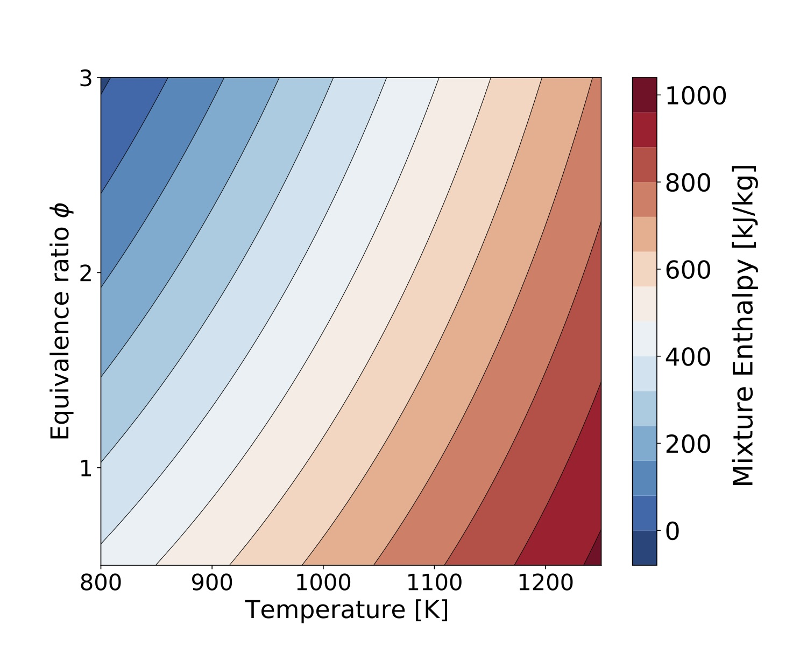
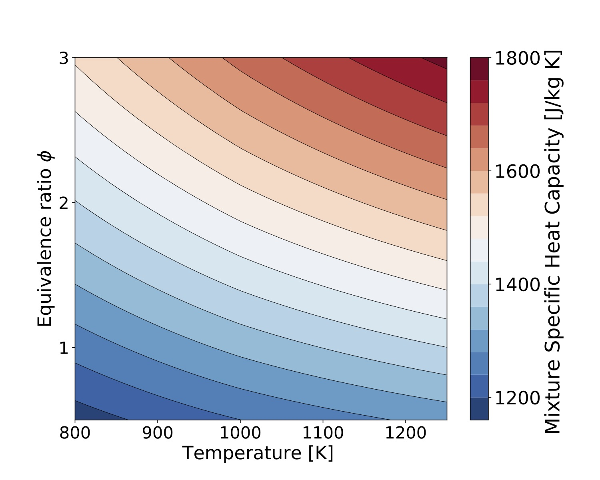
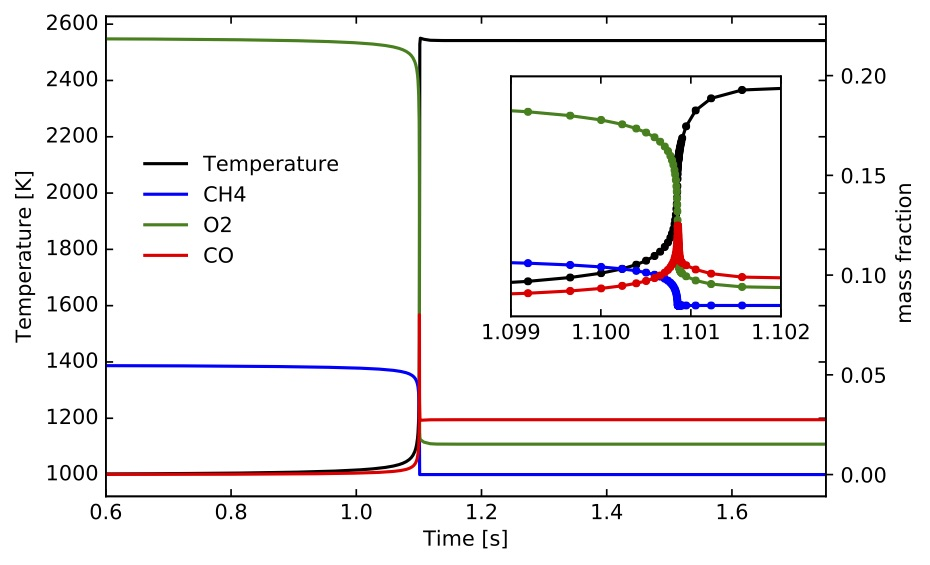
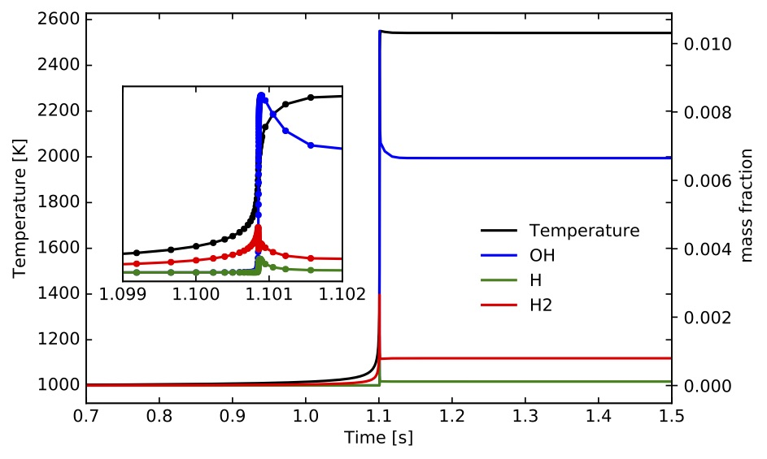
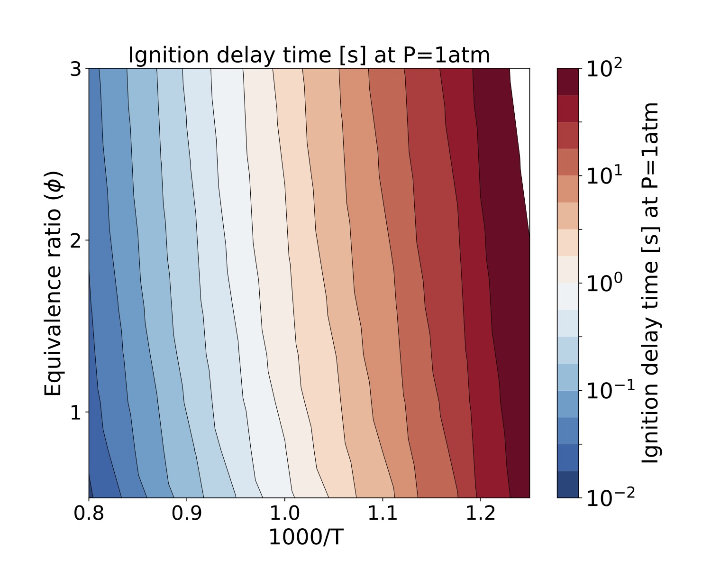
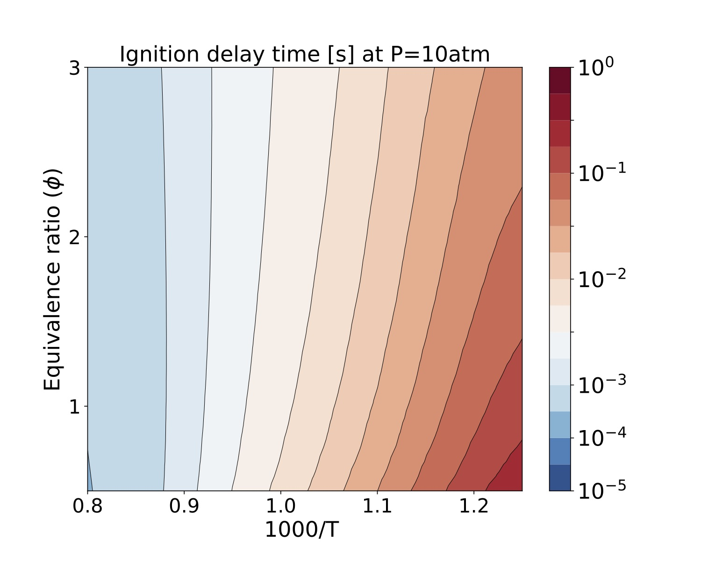
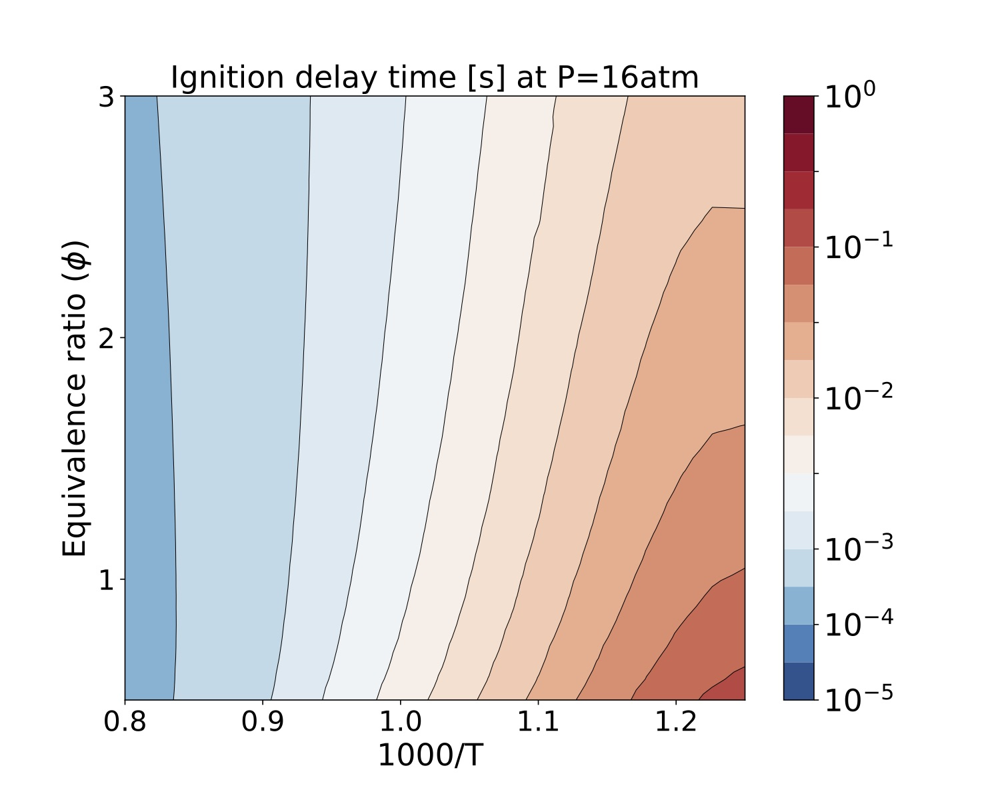
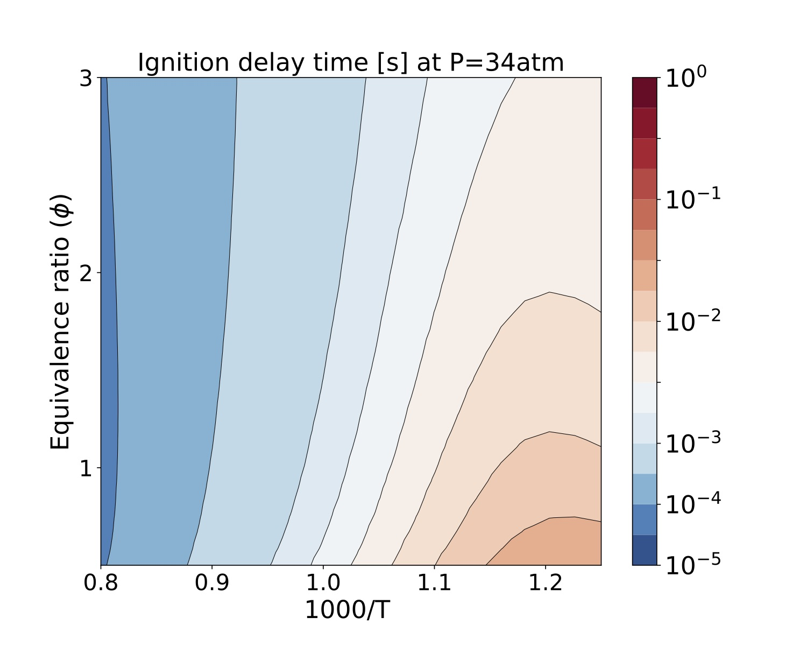

# TChem - A Software Toolkit for the Analysis of Complex Kinetic Models

1\.  [Introduction](#introduction)  
1.1\.  [Citing](#citing)  
1.2\.  [Nomenclature](#nomenclature)  
2\.  [Building TChem](#buildingtchem)  
2.1\.  [Download Libraries](#downloadlibraries)  
2.2\.  [Building Libraries and Configuring TChem](#buildinglibrariesandconfiguringtchem)  
2.2.1\.  [Kokkos](#kokkos)  
2.2.2\.  [KokkosKernels](#kokkoskernels)  
2.2.3\.  [GTEST](#gtest)  
2.2.4\.  [TChem](#tchem)  
3\.  [Input Files](#inputfiles)  
3.1\.  [Reaction Mechanism Input File](#reactionmechanisminputfile)  
3.2\.  [Thermal Property Data (therm.dat)](#thermalpropertydatatherm.dat)  
3.3\.  [Input State Vectors  (sample.dat)](#inputstatevectorssample.dat)  
3.4\.  [Surface Reaction Mechanism Input File and Thermal Property Data](#surfacereactionmechanisminputfileandthermalpropertydata)  
3.5\.  [Input Site Fraction (inputSurf.dat)](#inputsitefractioninputsurf.dat)  
4\.  [Thermodynamic Properties](#thermodynamicproperties)  
4.1\.  [Mass-Molar Conversions](#mass-molarconversions)  
4.2\.  [Equation of State](#equationofstate)  
4.3\.  [Gas-Phase Properties](#gas-phaseproperties)  
4.4\.  [Examples](#examples)  
4.5\.  [Surface Species Properties](#surfacespeciesproperties)  
5\.  [Reaction Rates](#reactionrates)  
5.1\.  [Gas-Phase Chemistry](#gas-phasechemistry)  
5.1.1\.  [Forward and Reverse Rate Constants](#forwardandreverserateconstants)  
5.1.2\.  [Concentration of the "Third-Body"](#concentrationofthe"third-body")  
5.1.3\.  [Pressure-dependent Reactions](#pressure-dependentreactions)  
5.1.4\.  [Note on Units for Net Production rates](#noteonunitsfornetproductionrates)  
5.1.5\.  [Example](#example)  
5.2\.  [Surface Chemistry](#surfacechemistry)  
5.2.1\.  [Forward and Reverse Rate Constants](#forwardandreverserateconstants-1)  
5.3\.  [Sticking Coefficients](#stickingcoefficients)  
5.3.1\.  [Note on Units for surface production rates](#noteonunitsforsurfaceproductionrates)  
5.3.2\.  [Example](#example-1)  
6\.  [Reactors](#reactors)  
6.1\.  [Time Integration](#timeintegration)  
6.1.1\.  [TrBDF2](#trbdf2)  
6.1.2\.  [Timestep Adaptivity](#timestepadaptivity)  
6.1.3\.  [Interface to Time Integrator](#interfacetotimeintegrator)  
6.2\.  [Homogenous Batch Reactors](#homogenousbatchreactors)  
6.2.1\.  [Problem Definition](#problemdefinition)  
6.2.2\.  [Jacobian Formulation](#jacobianformulation)  
6.2.2.1\.  [Evaluation of $\tilde{J}$ Components](#evaluationof$\tilde{j}$components)  
6.2.2.1.1\.  [Efficient Evaluation of the $\tilde{J}$ Terms](#efficientevaluationofthe$\tilde{j}$terms)  
6.2.2.2\.  [Evaluation of $J$ Components](#evaluationof$j$components)  
6.2.3\.  [Running the 0D Ignition Utility](#runningthe0dignitionutility)  
6.2.4\.  [Ignition Delay Time Parameter Study for IsoOctane](#ignitiondelaytimeparameterstudyforisooctane)  
6.3\.  [Plug Flow Reactor (PFR) Problem with Gas and Surfaces Reactions](#plugflowreactorpfrproblemwithgasandsurfacesreactions)  
6.3.1\.  [Problem Definition](#problemdefinition-1)  
6.3.2\.  [Jacobian Formulation](#jacobianformulation-1)  
6.3.3\.  [Running the Plug Flow Reactor with Surface Reactions Utility](#runningtheplugflowreactorwithsurfacereactionsutility)  
6.3.4\.  [Initial Condition for PFR Problem](#initialconditionforpfrproblem)  
7\.  [Application Programming Interface](#applicationprogramminginterface)  
7.1\.  [C++](#c++)  
7.1.1\.  [Function List](#functionlist)  
7.1.1.1\.  [SpecificHeatCapacityPerMass](#specificheatcapacitypermass)  
7.1.1.2\.  [SpecificHeatCapacityConsVolumePerMass](#specificheatcapacityconsvolumepermass)  
7.1.1.3\.  [EnthalpyMass](#enthalpymass)  
7.1.1.4\.  [EntropyMass](#entropymass)  
7.1.1.5\.  [InternalEnergyMass](#internalenergymass)  
7.1.1.6\.  [NetProductionRatesPerMass](#netproductionratespermass)  
7.1.1.7\.  [NetProductionRatesPerMole](#netproductionratespermole)  
7.1.1.8\.  [NetProductionRateSurfacePerMass](#netproductionratesurfacepermass)  
7.1.1.9\.  [NetProductionRateSurfacePerMole](#netproductionratesurfacepermole)  
7.1.1.10\.  [Ignition 0D](#ignition0d)  
7.1.1.11\.  [PlugFlowReactor](#plugflowreactor)  
7.1.1.12\.  [SimpleSurface](#simplesurface)  
7.1.1.13\.  [InitialConditionSurface](#initialconditionsurface)  
7.1.1.14\.  [RateOfProgress](#rateofprogress)  
7.1.1.15\.  [SourceTerm](#sourceterm)  
7.1.1.16\.  [Smatrix](#smatrix)  
7.1.1.17\.  [IgnitionZeroDNumJacobian](#ignitionzerodnumjacobian)  
7.1.1.18\.  [JacobianReduced](#jacobianreduced)  
7.1.1.19\.  [PlugFlowReactorRHS](#plugflowreactorrhs)  
8\.  [On-going and Future Works](#on-goingandfutureworks)  
9\.  [Acknowledgement](#acknowledgement)  

<a name="introduction"></a>

## 1\. Introduction

TChem is an open source software library for solving complex computational chemistry problems and analyzing detailed chemical kinetic models. The software provides support for
* the support of complex kinetic models for gas-phase and surface chemistry,
* thermodynamic properties based on NASA polynomials,
* species production/consumption rates,
* stable time integrator for solving stiff time ordinary differential equations,
* reactor models such as homogenous gas-phase ignition (with analytical Jacobians), continuously stirred tank reactor, plug-flow reactor.


This toolkit builds upon earlier versions that were written in C and featured tools for gas-phase chemistry only. The current version of the software was completely refactored in C++, uses an object-oriented programming model, and adopts [Kokkos](https://github.com/kokkos) as its portability layer to make it ready for the next generation computing architectures i.e., multi/many core computing platforms with GPU accelerators. We have expanded the range of kinetic models to include surface chemistry and have added examples pertaining to Continuously Stirred Tank Reactors (CSTR) and Plug Flow Reactor (PFR) models to complement the homogenous ignition examples present in the earlier versions. To exploit the massive parallelism available from modern computing platforms, the current software interface is designed to evaluate samples in parallel, which enables large scale parametric studies, e.g. for sensitivity analysis and model calibration.


<a name="citing"></a>

### 1.1\. Citing

* Kyungjoo Kim, Oscar Diaz-Ibarra, Cosmin Safta, and Habib Najm, TChem v2.0 - A Software Toolkit for the Analysis of Complex Kinetic Models, Sandia National Laboratories, SAND 2020-10762, 2020.*

<a name="nomenclature"></a>

### 1.2\. Nomenclature

In the table below, $ro$ stands for reaction order, for the forward and reverse paths, respectively.

Symbol|Description|Units
--|--|--
$N_{spec}$ | Number of species | -
$N_{reac}$ | Number of reactions | -
$N_{spec}^g$ | number of gas-phase species |  -
$N_{spec}^s$ | number of surface species   |  -
$N_{spec}^{s,n}$ | number of surface species in phase $n$ |  -
$\rho$ | gas-phase density | kg/m$^3$
$P$ | thermodynamic pressure | Pa
$T$ | Temperature | K
$C_p$| Heat capacity at constant pressure| J/(K.kmol) |
$C_{p,k}$ |  for species $k$| J/(K.kmol) |
$c_{p}$ |   specific| J/(K.kg) |
$c_{p,k}$ |  specific, for species $k$| J/(K.kg) |
$H$ | Molar enthalpy of a mixture | J/kmol
$S$ | Molar entropy of a mixture | J/(kmol.K)
$Y_k$ | Mass fraction of species $k$ | -
$X_k$ | Mole fraction of species $k$ | -
$C_{p,k}$ | Heat capacity at constant pressure for species $k$ | J/(kmol.K)
$H_{k}$ | Molar enthalpy of $k$ species | J/kmol
$H_{k}$ | for species $k$ | J/kmol|
$h_{p}$ |  specific| J/kg|
$h_{p,k}$ |  specific, for species $k$| J/kg|
$S_{k}$ | Molar entropy of $k$ species | J/(kmol.K)
$S_{k}$ |  for species $k$| J/(K.kmol)|
$s$ |  specific| J/(K.kg)|
$s_{k}$ |  specific, for species $k$| J/(K.kg)|
$G_{k}$ | Gibbs free energy of $k$ species | J/kmol
$G_{k}$ | for species $k$ | J/kmol|
$g$ |  specific| J/kg|
$g_{k}$ |  specific, for species $k$| J/kg|
$\mathfrak{X}_k$ | Molar concentration of species $k$ | kmol/m$^3$
$Y_k$ |  mass fraction of species $k$  | -|
$X_k$ |  mole fraction of species $k$  | -|
$Z_k$ |  site fraction of species $k$  | -|
$Z_k^{(n)}$ | for species $k$ in phase $n$ | -|
$\Gamma_n$ | surface site density of phase $n$ | kmol/m$^2$|
$\sigma_{k}(n)$ |site occupancy by species $k$ in phase $n$| -|
$W$ | mixture molecular weight | kg/kmol|
$W_{k}$ | for species $k$ | kg/kmol|
$R$ | universal gas constant | J/(kmol.K)|
$k_{fi}$ | Forward rate constant of $i$ reaction | $\frac{(\textrm{kmol/m}^3)^{(1-ro)}}{\textrm{s}}$
$k_{ri}$ | Reverse rate constant of $i$ reaction | $\frac{(\textrm{kmol/m}^3)^{(1-ro)}}{\textrm{s}}$
$R$ | Universal gas constant | J/(kmol.K) |
$\dot{q}_{i}$ | Rate of progress of $i$ reaction | kmol/(m$^3$.s)
$\gamma_{i}$| sticking coefficient for reaction $i$ | $\frac{(\textrm{kmol/m}^3)^{(1-ro)}}{\textrm{s}}$|
$\dot{\omega}_{k}$ | Production rate of $k$ species | kmol/(m$^3$.s)
$\dot{s}_{k}$ | surface molar production rate of species $k$ | kmol/(m$^2$.s)|
<a name="buildingtchem"></a>

## 2\. Building TChem

TChem is designed and implemented using Kokkos (a performance portable parallel programming model) and it requires Kokkos and KokkosKernels. For testing, we use GTEST infrastructure. Additionally, it can use OpenBLAS or Intel MKL (more precisely we use CBLAS and LAPACKE interface from those libraries).

For convenience, we explain how to build the TChem code using the following environment variable that a user can modify according to their working environments.

```
/// repositories
export TCHEM_REPOSITORY_PATH=/where/you/clone/tchem/git/repo
export KOKKOS_REPOSITORY_PATH=/where/you/clone/kokkos/git/repo
export KOKKOSKERNELS_REPOSITORY_PATH=/where/you/clone/kokkoskernels/git/repo
export GTEST_REPOSITORY_PATH=/where/you/clone/gtest/git/repo

/// build directories
export TCHEM_BUILD_PATH=/where/you/build/tchem
export KOKKOS_BUILD_PATH=/where/you/build/kokkos
export KOKKOSKERNELS_BUILD_PATH=/where/you/build/kokkoskernels
export GTEST_BUILD_PATH=/where/you/build/gtest

/// install directories
export TCHEM_INSTALL_PATH=/where/you/install/tchem
export KOKKOS_INSTALL_PATH=/where/you/install/kokkos
export KOKKOSKERNELS_INSTALL_PATH=/where/you/install/kokkoskernels
export GTEST_INSTALL_PATH=/where/you/install/gtest
export OPENBLAS_INSTALL_PATH=/where/you/install/openblas
export LAPACKE_INSTALL_PATH=/where/you/install/lapacke
```

<a name="downloadlibraries"></a>

### 2.1\. Download Libraries

Clone Kokkos, KokkosKernels and TChem repositories. Note that we use the develop branch of Kokkos and KokkosKernels.

```
git clone getz.ca.sandia.gov:/home/gitroot/TChem++ ${TCHEM_REPOSITORY_PATH};
git clone https://github.com/kokkos/kokkos.git ${KOKKOS_REPOSITORY_PATH};
cd ${KOKKOS_REPOSITORY_PATH}; git checkout --track origin/develop;
git clone https://github.com/kokkos/kokkos-kernels.git ${KOKKOSKERNELS_REPOSITORY_PATH};
cd ${KOKKOSKERNELS_REPOSITORY_PATH}; git checkout --track origin/develop;
git clone https://github.com/google/googletest.git ${GTEST_REPOSITORY_PATH}
```

Here, we compile and install the TPLs separately; then, compile TChem against those installed TPLs.

<a name="buildinglibrariesandconfiguringtchem"></a>

### 2.2\. Building Libraries and Configuring TChem

<a name="kokkos"></a>

#### 2.2.1\. Kokkos

This example build Kokkos on Intel Sandybridge architectures and install it to ``${KOKKOS_INSTALL_PATH}``. For more details, see [Kokkos github pages](https://github.com/kokkos/kokkos).

```
cd ${KOKKOS_BUILD_PATH}
cmake \
    -D CMAKE_INSTALL_PREFIX="${KOKKOS_INSTALL_PATH}" \
    -D CMAKE_CXX_COMPILER="${CXX}"  \
    -D Kokkos_ENABLE_SERIAL=ON \
    -D Kokkos_ENABLE_OPENMP=ON \
    -D Kokkos_ENABLE_DEPRECATED_CODE=OFF \
    -D Kokkos_ARCH_SNB=ON \
    ${KOKKOS_REPOSITORY_PATH}
make -j install
```

To compile for NVIDIA GPUs, one can customize the following cmake script. Note that we use Kokkos ``nvcc_wrapper`` as its compiler. The architecture flag indicates that the host architecture is Intel SandyBridge and the GPU architecture is Volta 70 generation. With Kokkko 3.1, the CUDA architecture flag is optional (the script automatically detects a correct CUDA arch flag).
```
cd ${KOKKOS_BUILD_PATH}
cmake \
    -D CMAKE_INSTALL_PREFIX="${KOKKOS_INSTALL_PATH}" \
    -D CMAKE_CXX_COMPILER="${KOKKOS_REPOSITORY_PATH}/bin/nvcc_wrapper"  \
    -D Kokkos_ENABLE_SERIAL=ON \
    -D Kokkos_ENABLE_OPENMP=ON \
    -D Kokkos_ENABLE_CUDA:BOOL=ON \
    -D Kokkos_ENABLE_CUDA_UVM:BOOL=OFF \
    -D Kokkos_ENABLE_CUDA_LAMBDA:BOOL=ON \
    -D Kokkos_ENABLE_DEPRECATED_CODE=OFF \
    -D Kokkos_ARCH_VOLTA70=ON \
    -D Kokkos_ARCH_SNB=ON \
    ${KOKKOS_REPOSITORY_PATH}
make -j install
```

<a name="kokkoskernels"></a>

#### 2.2.2\. KokkosKernels

Compiling KokkosKernels follows Kokkos configuration of which information is available at ``${KOKKOS_INSTALL_PATH}``.

```
cd ${KOKKOSKERNELS_BUILD_PATH}
cmake \
    -D CMAKE_INSTALL_PREFIX="${KOKKOSKERNELS_INSTALL_PATH}" \
    -D CMAKE_CXX_COMPILER="${CXX}"  \
    -D CMAKE_CXX_FLAGS="-g"  \
    -D KokkosKernels_INST_LAYOUTRIGHT:BOOL=ON \
    -D Kokkos_DIR="${KOKKOS_INSTALL_PATH}/lib64/cmake/Kokkos" \
    -D KokkosKernels_ENABLE_TPL_LAPACKE:BOOL=ON \
    -D KokkosKernels_ENABLE_TPL_CBLAS:BOOL=ON \
    -D CBLAS_INCLUDE_DIRS="/opt/local/include" \
    ${KOKKOSKERNELS_REPOSITORY_PATH}
make -j install
```

For GPUs, the compiler is changed with ``nvcc_wrapper`` by adding ``-D CMAKE_CXX_COMPILER="${KOKKOS_INSTALL_PATH}/bin/nvcc_wrapper"``.

<a name="gtest"></a>

#### 2.2.3\. GTEST

We use GTEST as our testing infrastructure. With the following cmake script, the GTEST can be compiled and installed.

```
cd ${GTEST_BUILD_PATH}
cmake \
    -D CMAKE_INSTALL_PREFIX="${GTEST_INSTALL_PATH}" \
    -D CMAKE_CXX_COMPILER="${CXX}"  \
    ${GTEST_REPOSITORY_PATH}
make -j install
```

<a name="tchem"></a>

#### 2.2.4\. TChem

The following example cmake script compiles TChem on host linking with the libraries described in the above e.g., kokkos, kokkoskernels, gtest and openblas. The openblas and lapacke libraries are required on a host device providing an optimized version of dense linear algebra library. With an Intel compiler, one can replace these libraries with Intel MKL by adding an option ``TCHEM_ENABLE_MKL=ON`` instead of using openblas and lapacke. On Mac OSX, we use the openblas library managed by **macports**. This version of openblas has different header names and we need to distinguish this version of the code from others which are typically used in linux distributions. To discern the two version of the code, cmake looks for ``cblas_openblas.h`` to tell that the installed version is from MacPort. This mechanism can be broken if MacPort openblas is changed later. The macport openblas version include lapacke interface and one can remove ``LAPACKE_INSTALL_PATH`` from the configure script.
```
cd ${TCHEM_BUILD_PATH}
cmake \
    -D CMAKE_INSTALL_PREFIX="${TCHEM_INSTALL_PATH}" \
    -D CMAKE_CXX_COMPILER="${CXX}" \
    -D CMAKE_BUILD_TYPE=RELEASE \
    -D TCHEM_ENABLE_VERBOSE=OFF \
    -D TCHEM_ENABLE_KOKKOS=ON \
    -D TCHEM_ENABLE_KOKKOSKERNELS=ON \
    -D TCHEM_ENABLE_TEST=ON \
    -D TCHEM_ENABLE_EXAMPLE=ON \
    -D KOKKOS_INSTALL_PATH="${KOKKOS_INSTALL_PATH}" \
    -D KOKKOSKERNELS_INSTALL_PATH="${KOKKOSKERNELS_INSTALL_PATH}" \
    -D OPENBLAS_INSTALL_PATH="${OPENBLAS_INSTALL_PATH}" \
    -D LAPACKE_INSTALL_PATH="${LAPACKE_INSTALL_PATH}" \
    -D GTEST_INSTALL_PATH="${GTEST_INSTALL_PATH}" \
    ${TCHEM_SRC_PATH}
make -j install
```
For GPUs, we can use the above cmake script replacing the compiler with ``nvcc_wrapper`` by adding ``-D CMAKE_CXX_COMPILER="${KOKKOS_INSTALL_PATH}/bin/nvcc_wrapper"``.
<a name="inputfiles"></a>

## 3\. Input Files

TChem requires several input files to prescribe the modeling choices. For a gas-phase system the user provides (1) the reaction mechanisms and (2) thermal properties. Alternatively, these can be provided inside the same file with appropriate keyword selection. For the homogenous 0D ignition utility an additional file specifies the input state vectors and other modeling choices. For surface chemistry calculations, the surface chemistry model and the corresponding thermal properties can be specified in separate files or, similarly to the gas-phase chemistry case, in the same file, with appropriate keywords. Three more files are needed for the model problems with both gas and surface interface. In additional to the surface chemistry and thermodynamic properties' files, the parameters that specify the model problem are provided in a separate file.

<a name="reactionmechanisminputfile"></a>

### 3.1\. Reaction Mechanism Input File

TChem uses a type Chemkin Software input file. A complete description can be found in "Chemkin-II: A Fortran Chemical Kinetics Package for the Analysis of Gas-Phase Chemical Kinetics,' R. J. Kee, F. M. Rupley, and J. A. Miller, Sandia Report, SAND89-8009B (1995)." [(link)](https://www.osti.gov/biblio/5681118)

<a name="thermalpropertydatatherm.dat"></a>

### 3.2\. Thermal Property Data (therm.dat)

TChem currently employs the 7-coefficient NASA polynomials. The format for the data input follows specifications in Table I in McBride *et al* (1993).

* Bonnie J McBride, Sanford Gordon, Martin A. Reno, ``Coefficients for Calculating Thermodynamic and Transport Properties of Individual Species,'' NASA Technical Memorandum 4513 (1993).

Support for 9-coefficient NASA polynomials is expected in the next TChem release.

<a name="inputstatevectorssample.dat"></a>

### 3.3\. Input State Vectors  (sample.dat)
The format of the sample.dat file is:
````
T P SPECIES_NAME1 SPECIES_NAME2 ... SPECIES_NAMEN
T#1 P#1 Y1#1 Y2#1 ... YN#1 (sample #1)
T#2 P#2 Y1#2 Y2#2 ... YN#2 (sample #2)
...
...
...
T#N P#N Y1#N Y2#N ... YN#N (sample #N)
````   
Here T is the temperature [K], P is the pressure [Pa] and SPECIES_NAME1 is the name of the first gas species from the reaction mechanism input file. Y1#1 is the mass fraction of SPECIES_NAME1 in sample #1. The sum of the mass fractions on each row has to be equal to one since TChem does not normalize mass fractions. New samples can be created by adding rows to the input file. The excerpt below illustrates a setup for an example with 8 samples using a mixture of CH$_4$, O$_2$, N$_2$, and Ar:

````
T P CH4 O2 N2 AR
800 101325 1.48e-01 1.97e-01 6.43e-01 1.14e-02
800 101325 2.82e-02 2.25e-01 7.34e-01 1.30e-02
800 4559625 1.48e-01 1.97e-01 6.43e-01 1.14e-02
800 4559625 2.82e-02 2.25e-01 7.34e-01 1.30e-02
1250 101325 1.48e-01 1.97e-01 6.43e-01 1.14e-02
1250 101325 2.82e-02 2.25e-01 7.34e-01 1.30e-02
1250 4559625 1.48e-01 1.97e-01 6.43e-01 1.14e-02
1250 4559625 2.82e-02 2.25e-01 7.34e-01 1.30e-02
````
The eight samples in the above example correspond to the corners of a cube in a 3D parameter space with temperatures between 800 K and 1250 K, pressures between 1 atm to 45 atm, and equivalence ratios ($\phi$) for methane/air mixtures between 0.5 to 3.

<a name="surfacereactionmechanisminputfileandthermalpropertydata"></a>

### 3.4\. Surface Reaction Mechanism Input File and Thermal Property Data

TChem uses a the specifications in Coltrin *et al* (1996) for the input file for the surface reaction mechanism and thermodynamic properties. [(link)](https://www.osti.gov/biblio/481906-surface-chemkin-iii-fortran-package-analyzing-heterogeneous-chemical-kinetics-solid-surface-gas-phase-interface)

* Michael E. Coltrin, Robert J. Kee, Fran M. Rupley, Ellen Meeks, ``Surface Chemkin-III: A FORTRAN Package for Analyzing Heterogenous Chemical Kinetics at a Solid-surface--Gas-phase Interface,'' SANDIA Report SAND96-8217 (1996).

<a name="inputsitefractioninputsurf.dat"></a>

### 3.5\. Input Site Fraction (inputSurf.dat)
The format of the inputSurf.dat file is:
````
SURF_SPECIES_NAME_1 SURF_SPECIES_NAME_2 ... SURF_SPECIES_NAME_N
Z1#1 Z2#1 ... ZN#1 (sample #1)
Z1#2 Z2#2 ... ZN#2 (sample #2)
...
...
...
Z1#M Z2#M ... ZN#M (sample #M)
````  
where SURF_SPECIES_NAME1 is name of the first surface species from the chemSur.inp file and Z1#1 is the site fraction of this species for sample #1, and so forth.
<a name="thermodynamicproperties"></a>

## 4\. Thermodynamic Properties

We first present conversion formulas and the gas-phase equation of state, followed by a description of molar and mass-based expression for several thermodynamic properties.

<a name="mass-molarconversions"></a>

### 4.1\. Mass-Molar Conversions

The molar mass of the mixture, $W$ is computed as
$$
W=\sum_{k=1}^{N_{spec}} X_k W_k
=1\Bigg/\left(\sum_{k=1}^{N_{spec}} \frac{Y_k}{W_k}\right)
$$
where $X_k$ and $Y_k$ are the mole and mass fractions, respectively, of species $k$, and $W_k$ is the molecular weight of species $k$. Mass and mole fractions can be computed from each other as
$$
X_k=Y_k W/W_k,\,\, Y_k=X_kW_k/W
$$
The the molar concentration of species $k$ is given by $\mathfrak{X}_k=\rho Y_k/W_k=\rho X_k/W$, and the molar concentration of the mixture is given by
$$
\sum_{k=1}^{N_{spec}}\mathfrak{X}_k=\rho/W
$$


For problems that include heterogenous chemistry, the site fractions $Z_k$ describe the composition of species on the surface. The number of surface phases is denoted by $N_{phase}$ and the site fractions are normalized with respect to each phase.
$$
  \sum_{k=1}^{N_{spec}^{s,n}}Z_k^{(n)}=1,\,\,\, \mathrm{for }n=1,\ldots N_{phase}.
$$

Here, $N_{spec}^{s,n}$ is the number of species on surface phase $n$. TChem currently handles $1$ surface phase only, $N_{phase}=1$. The surface concentration of surface species $k$ is given by

$$
  \mathfrak{X}_k=Z_k^{(n)} \Gamma_n\big/\sigma_k(n)
$$

where $\Gamma_n$ is the surface site density of surface phase $n$ and $\sigma_k(n)$ is the site occupancy number for species $k$. $\sigma_k(n)$ represents the number of sites in phase $n$ occupied by species $k$.


<a name="equationofstate"></a>

### 4.2\. Equation of State    

The ideal gas equation of state is used throughout the library,
$$
P=\rho\frac{R}{\sum_{k=1}^{N_{spec}} X_kW_k}T=\rho R\left(\sum_{k=1}^{N_{spec}}\frac{Y_k}{ W_k}\right)T=\rho\frac{R}{W}T=\left(\sum_{k=1}^{N_{spec}}\mathfrak{X}_k\right)R T
$$
where $P$ is the thermodynamic pressure, $W$ and $W_k$ are the molecular weights of the mixture and of species $k$, respectively, $T$ is the temperature, and $\mathfrak{X}_k$ is the molar concentration of species $k$.


<a name="gas-phaseproperties"></a>

### 4.3\. Gas-Phase Properties

The standard-state thermodynamic properties for a thermally perfect gas are computed based on NASA polynomials \cite{McBride:1993}. The molar heat capacity at constant pressure for species $k$ is computed as
$$
\frac{C_{p,k}}{R}=a_{0,k}+T(a_{1,k}+T(a_{2,k}+T\left(a_{3,k}+a_{4,k}T
\right)))
$$
where $R$ the universal gas constant. The molar enthalpy is computed as
$$
\frac{{H}_k}{R}=\int_{T_0}^T C_{p,k}dT+H_{k,T_0}
=T \left(a_{0,k}+T\left(\frac{a_{1,k}}{2}+T\left(\frac{a_{2,k}}{3}
+T\left(\frac{a_{3,k}}{4}+\frac{a_{4,k}}{5}T\right)\right)\right)\right)+a_{5,k}
$$

The molar entropy is given by
$$
\frac{S_k^0}{R}=\int_{T_0}^T\frac{C_{p,k}}{T}dT+S_{k,T_0}
=a_{0,k}\ln T+T\left(a_{1,k}+T\left(\frac{a_{2,k}}{2}
+T\left(\frac{a_{3,k}}{3}+\frac{a_{4,k}}{4}T\right)\right)\right)+a_{6,k}
$$
The temperature units are Kelvin in the polynomial expressions above. Other thermodynamics properties are computed based on the polynomial fits above. The molar heat capacity at constant volume $C_{v,k}$, the internal energy $U_{k}$, and the Gibbs free energy $G_{k}$:
$$
C_{v,k}=C_{p,k}-R,\,\,\,U_{k}=H_{k} - R T,\,\,\, G_k^0 = H_k-T S_{k}^0
$$

The mixture properties in molar units are given by
$$
C_p= \sum_{k=1} ^{N_{spec}} X_k C_{p,k},\,\,\,C_v= \sum_{k=1} ^{N_{spec}} X_k C_{v,k},\,\,\,
H= \sum_{k=1} ^{N_{spec}} X_k {H}_k,\,\,\, U= \sum_{k=1} ^{N_{spec}} X_k {U}_k
$$
where $X_k$ the mole fraction of species $k$. The entropy and Gibbs free energy for species $k$ account for the entropy of mixing and thermodynamic pressure
$$
S_k=S_k^0-R\ln (X_k\frac{P}{P_{atm}}),\,\,\, G_k=S_k-T S_k
$$
The mixture values for these properties are computed as above
$$
S=\sum_{k=1}^{N_{spec}} X_k S_k,\,\,\,G=\sum_{k=1}^{N_{spec}} X_k G_k
$$

The specific thermodynamic properties in mass units are obtained by dividing the above expression by the species molecular weight, $W_k$,
$$
c_{p,k}= C_{p,k}/W_k,\,\,\,c_{v,k}=C_{v,k}/W_k,\,\,\,h_k=H_k/W_k,\,\,\,u_k=U_k/W_k,\,\,\,
s_k^0= S_k^0/W_k,\,\,\,
g_k^0=G_k^0/W_k
$$
and
$$
s_k= S_k/W_k,\,\,\,g_k=G_k/W_k
$$
For the thermodynamic properties in mass units the mixture properties are given by
$$
c_p= \sum_{k=1}^{N_{spec}} Y_k c_{p,k},\,\,\, c_v=\sum_{k=1}^{N_{spec}} Y_k c_{v,k},\,\,\,
h=\sum_{k=1}^{N_{spec}} Y_k{h}_k,\,\,\, u=\sum_{k=1}^{N_{spec}} Y_k u_k,\,\,\,
s=\sum_{k=1}^{N_{spec}} Y_k s_k,\,\,\,g=\sum_{k=1} ^{N_{spec}} Y_k g_k
$$
where $Y_k$ the mass fraction of species $k$.

The mixture properties in mass units can also be evaluated from the equivalent molar properties as
$$
c_p=C_p/W,\,\,\,c_v=C_v/W,\,\,\,h_k=H/W,\,\,\,u=U/W,\,\,\,
s=S/W,\,\,\,g=G/W
$$
where $W$ is the molecular weight of the mixture.
<a name="examples"></a>

### 4.4\. Examples

A example to compute $c_{p}$ and $h$ in mass base is at "example/TChem_ThermalProperties.cpp". Enthalpy per species and the mixture enthalpy are computed with this [function call](#cxx-api-EnthalpyMass). Heat capacity per species and mixture with this [function call](#cxx-api-SpecificHeatCapacityPerMass). This example can be used in bath mode, and several sample are compute in one run. The next two figures were compute with 40000 samples changing temperature and equivalent ratio for methane/air mixtures.


Figure. Mixture Enthalpy compute with gri3.0 mechanism.


Figure.  Mixutre Specific Heat Capacity $C_p$ compute with gri3.0 mechanism.


<a name="surfacespeciesproperties"></a>

### 4.5\. Surface Species Properties

The thermal properties of the surface species are computed with the same equation used by the gas phase describe above.

<!-- ## Examples -->
<a name="reactionrates"></a>

## 5\. Reaction Rates

In this chapter we present reaction rate expressions for gas-phase reactions in [Section](#gas-phasechemistry) and for surface species or between surface and gas-phase species in [Section](#surface chemistry).


<a name="gas-phasechemistry"></a>

### 5.1\. [Gas-Phase Chemistry](#cxx-api-ReactionRates)

The production rate for species $k$ in molar units is written as
$$
\dot{\omega}_k=\sum_{i=1}^{N_{reac}}\nu_{ki}q_i,\,\,\, \nu_{ki}=\nu''_{ki}-\nu'_{ki},
$$
where $N_{reac}$ is the number of reactions and $\nu'_{ki}$ and $\nu''_{ki}$ are the stoichiometric coefficients of species $k$ in reaction $i$ for the reactant and product side of the reaction, respectively. The rate-of-progress of reaction $i$ is $q_i=\mathcal{C}_i\mathcal{R}_i$, with

$\mathcal{C}_i$|Reaction Type
--|--|--
$1$ | basic reaction
$\mathfrak{X}_i$ | 3-rd body enhanced, no pressure dependence
$\frac{\Pr_i}{1+\Pr_i}F_i$ | unimolecular/recombination fall-off reactions
$\frac{1}{1+\Pr_i}F_i$ | chemically activated bimolecular reactions

and
$$\mathcal{R}_i={k_f}_i\prod_{j=1}^{N_{spec}}\mathfrak{X}_j^{\nu'_{ji}}-
{k_r}_i\prod_{j=1}^{N_{spec}}\mathfrak{X}_j^{\nu''_{ji}}$$

The above expressions are detailed below.

<a name="forwardandreverserateconstants"></a>

#### 5.1.1\. Forward and Reverse Rate Constants

The forward rate constant has typically an Arrhenius expression,
$$
{k_f}_i=A_iT^{\beta_i}\exp\left(-\frac{E_i}{RT}\right),
$$
where $A_i$, $\beta_i$, and $E_i$ are the pre-exponential factor, temperature exponent, and activation energy, respectively, for reaction $i$. For reactions with reverse Arrhenius parameters specified, the reverse rate constant ${k_r}_i$ is computed similar to ${k_f}_i$. If the reverse Arrhenius parameters are not specified, ${k_r}_i$ is computed as
$$
{k_r}_i={k_f}_i/{K_c}_i,
$$
where ${K_c}_i$ is the equilibrium constant (in concentration units) for reaction $i$
$$
{K_c}_i=\left(\frac{P_{atm}}{RT}\right)^{\sum_{k=1}^{N_{spec}}\nu_{ki}}{K_p}_i,\,\,\,
{K_p}_i=\exp\left(\sum_{k=1}^{N_{spec}}\nu_{ki}\left(\frac{S_k}{R}-\frac{H_k}{RT}\right)\right).
$$
When computing the equilibrium constant, the atmospheric pressure, $P_{atm}=1$atm, and the universal gas constant $R$ are converted to cgs units, dynes/cm$^2$ and erg/(mol.K), respectively.

Note: If a reaction is irreversible, $k_r=0$.

<a name="concentrationofthe"third-body""></a>

#### 5.1.2\. Concentration of the "Third-Body"   

If the expression "+M" is present in the reaction string, some of the species might have custom efficiencies for their contribution in the mixture. For these reactions, the mixture concentration is computed as


$$
\mathfrak{X}_i=\sum_{j=1}^{N_{spec}}\alpha_{ij}\mathfrak{X}_j,
$$
where $\alpha_{ij}$ is the efficiency of species $j$ in reaction $i$ and $\mathfrak{X}_j$ is the concentration of species $j$. $\alpha_{ij}$ coefficients are set to 1 unless specified in the kinetic model description.

<a name="pressure-dependentreactions"></a>

#### 5.1.3\. Pressure-dependent Reactions

* Reduced pressure $\mathrm{Pr}_i$. If expression "(+M)" is used to describe a reaction, then $\mathrm{Pr}_i=\frac{{k_0}_i}{{k_\infty}_i}\mathfrak{X}_i$.
* For reactions that contain expressions like "(+$\Upsilon_m$)" ($\Upsilon_m$ is the name of species $m$), the reduced pressure is computed as $\mathrm{Pr}_i=\frac{{k_0}_i}{{k_\infty}_i}\mathfrak{X}_m$.

For *unimolecular/recombination fall-off reactions* the Arrhenius parameters for the high-pressure limit rate constant $k_\infty$ are given on the reaction line, while the parameters for the low-pressure limit rate constant $k_0$ are given on the auxiliary reaction line that contains the keyword **LOW**. For *chemically activated bimolecular reactions* the parameters for $k_0$ are given on the reaction line while the parameters for $k_\infty$ are given on the auxiliary reaction line that contains the keyword **HIGH**.

The following expressions are employed to compute the $F_i$:
$F_i$|Reaction Type
--|--
$1$ | Lindemann reaction
$F_{cent}^{1/\left(1+(A/B)^2\right)}$ | Troe reaction
$dT^e\bigl(a\exp\left(-\frac{b}{T}\right)+\exp\left(-\frac{T}{c}\right)\bigr)^X$ | SRI reaction

* For the Troe form, $F_{cent}$, $A$, and $B$ are
$$
F_{cent} = (1-a)\exp\left(-\frac{T}{T^{***}}\right)+a\exp\left(-\frac{T}{T^{*}}\right)
+\exp\left(-\frac{T^{**}}{T}\right),
$$
$$
A=\log_{10} \mathrm{Pr}_i-0.67\log_{10} F_{cent}-0.4,\,\,\, B=0.806-1.1762\log_{10} F_{cent} -0.14\log_{10}\mathrm{Pr}_i
$$
Parameters $a$, $T^{***}$, $T^{*}$, and $T^{**}$ are provided (in this order) in the kinetic model description for each Troe-type reaction. If $T^{**}$ is omitted, only the first two terms are used to compute $F_{cent}$.
* For the SRI form exponent $X$ is computed as
$$X=\left(1+\left(\log_{10}\Pr_i\right)^2\right)^{-1}.$$
Parameters $a$, $b$, $c$, $d$, and $e$ are provided in the kinetic model description for each SRI-type reaction. If $d$ and $e$ are omitted, these parameters are set to $d=1$ and $e=0$.

Miller~\cite{PLOGprinceton} has developed an alternative expressionfor the pressure dependence for pressure fall-off reactions that cannot be fitted with a single Arrhenius rate expression. This approach employs linear interpolation of $\log {k_f}_i$ as a function of pressure for reaction $i$ as follows
$$
\log {k_f}_i(T) = \log {k_f}_{i,l}(T)+(\log p-\log p_l)\frac{\log {k_f}_{i,l+1}(T)-\log {k_f}_{i,l}(T)}{\log p_{l+1}-\log p_l}
$$
Here, ${k_f}_{i,l}(T)=A_{i,l}T^{\beta_{i,l}}\exp\left(-\frac{E_{i,l}}{R T}\right)$ is the Arrhenius rate corresponding to pressure $p_l$. For $p<p_1$ the Arrhenius rate is set to ${k_f}_i={k_f}_{i,1}$, and similar for $p>p_{N_i}$ where $N_i$ is the number of pressures for which the Arrhenius factors are provided, for reaction $i$. This formulation can be combined with 3$^{\mathrm{rd}}$ body information, e.g. $\mathcal{C}_i=\mathfrak{X}_i$.

<a name="noteonunitsfornetproductionrates"></a>

#### 5.1.4\. Note on Units for Net Production rates

In most cases, the kinetic models input files contain parameters that are based on *calories, cm, moles, kelvin, seconds*. The mixture temperature and species molar concentrations are necessary to compute the reaction rate. Molar concentrations are computed as above are in [kmol/m$^3$]. For the purpose of reaction rate evaluation, the concentrations are transformed to [mol/cm$^3$]. The resulting reaction rates and species production rates are in [mol/(cm$^3$.s)]. In the last step these are converted to SI units [kg/(m$^3$.s)].

<a name="example"></a>

#### 5.1.5\. Example

The production rate for species $k$ in mass units (kg/m$^3$/s) ($\dot{\omega}_k W_k$) is computed with the [function call](#cxx-api-ReactionRates) and in mole units ($\dot{\omega}_k$ kmol/m$^3$/s) with [function call](#cxx-api-ReactionRatesMole). A example is located at src/example/TChem_NetProductionRatesPerMass.cpp. This example computes the production rate in mass units for any type of gas reaction mechanism.

<a name="surfacechemistry"></a>

### 5.2\. [Surface Chemistry](#cxx-api-ReactionRatesSurface)

The production rate for gas and surface species $k$ in molar/$m^2$ units is written as

$$
\dot{s}_k=\sum_{i=1}^{N_{reac}}\nu_{ki}q_i,\,\,\, \nu_{ki}=\nu''_{ki}-\nu'_{ki},
$$

where $N_{reac}$ is the number of reactions on the surface phase and $\nu'_{ki}$ and $\nu''_{ki}$ are the stoichiometric coefficients of species $k$ in reaction $i$ for the reactant and product side of the reaction, respectively.

The rate of progress $q_i$ of the $ith$ surface reaction is equal to:

$$q_i={k_f}_i\prod_{j=1}^{N_{spec}}\mathfrak{X}_j^{\nu'_{ji}}-
{k_r}_i\prod_{j=1}^{N_{spec}}\mathfrak{X}_j^{\nu''_{ji}}$$


Where $\mathfrak{X}_j$ is the concentration of the species $j$. If the species $j$ is a gas species, this is the molar concentration ($\mathfrak{X}_j=\frac{Y_j \rho}{W_j}$). If, on the other hand, the species $j$ is a surface species, it the surface molar concentration computed by $\mathfrak{X}=\frac{Z_k\Gamma_n}{\sigma_{j,n}}$ is . $Z_j$ is site fraction, $\Gamma_n$ is density of surface site of the phase $n$, and $\sigma_{j,n}$ is the site occupancy number (We assume $\sigma_{j,n}=1$ ).

<a name="forwardandreverserateconstants-1"></a>

#### 5.2.1\. Forward and Reverse Rate Constants

The forward rate constant is computed as we describe in the gas section. If parameters are not specified for reverse rate, this rate is computed with equilibrium constant defined by:

$$k_{r,i}=\frac{k_{f,i}}{K_{c,i}}$$

The equilibrium constant for the surface reaction $i$ is computed as

$$K_{c,i} = K_{p,i} \Big( \frac{p^o}{RT} \Big)^{\sum_k=1 ^{Kg}\nu_{ki}} \prod_{n=N_s^f}^{N_s^l} (\Gamma_n^o)^{\Delta \sigma_(n,i)} $$  

Here, $N_{spec}^g$ and $N_{spec}^s$ represent the number of gas-phase and surface species, respectively, and $p^o=1$atm. TChem currently assumes the surface site density $\Gamma_n$ for all phases to be constant. The equilibrium constant in pressure units is computed as

$$K_{p,i} = \exp\left(\frac{\Delta S^o_i}{R} -  \frac{\Delta H^o_i}{RT} \right)$$

based on entropy and enthalpy changes from reactants to products (including gas-phase and surface species). The net change for surface of the site occupancy number for phase $n$ for reaction $i$ is given by

$$ \Delta \sigma_(n,i)=\sum_{k=1}^{N_{spec}^{s,n}}\nu_{ki}\sigma_k(n)$$

<a name="stickingcoefficients"></a>

### 5.3\. Sticking Coefficients

The reaction rate for some surface reactions are described in terms of the probability that a collision results in a reaction. For these reaction, the forward rate is computed as

$$k_{r,i} =\frac{\gamma_i}{(\Gamma_{Tot})^m} \sqrt{\frac{RT}{2 \pi W}}  A_iT^{\beta_i}\exp\left(-\frac{E_i}{RT}\right)  $$

where $\gamma_i$ is the sticking coefficient, $W$ is the molecular weight of the gas-phase mixture, $R$ is the universal gas constant, $\Gamma_{tot}$ is the total surface site concentration over all phases, and $m$ is the sum of stoichiometric coefficients for all surface species in reaction $i$.

<a name="noteonunitsforsurfaceproductionrates"></a>

#### 5.3.1\. Note on Units for surface production rates

The units of the surface and gas species concentration presented above are in units of kmol/m$^2$ (surface species) or kmol/$m^3$ (gas species). To match the units of the kinetic model and compute the rate constants, we transformed the concentration units to mol/cm$^3$ or mol/cm$^2$. The resulting rate constant has units of mol/cm$^2$. In the last step these are converted to SI units [kg/(m$^2$.s)].

<a name="example-1"></a>

#### 5.3.2\. Example

The production rate for species $k$ in mass units (kg/m$^2$/s) ($\dot{s}_k W_k$) is computed with the [function call](#cxx-api-ReactionRatesSurface), in molar units ( $\dot{s}_k$ kmole/m$^2$/s) with [function call](#cxx-api-ReactionRatesSurfaceMole). A example is located at src/example/TChem_NetProductionSurfacePerMass.cpp. In this example, we compute the production rates of gas phase and also the production rate of the surface phase in mass units.

<a name="reactors"></a>

## 6\. Reactors


We present the setup for canonical examples that are available through TChem. All models presented in this section are setup to be run in parallel, possibly exploiting several layers of parallelism available on the platform of choice. We start with a description of a 2-nd order backward differentiation formula (BDF2) time stepping algorithm in [Section](#timeintegration). BDF2 was implemented via Kokkos and takes advantage of parallel threads available through the Kokkos interface. We then present results for homogenous batch reactors in [Section](#0dignition), and the plug-flow reactor, in [Section](#plugflowreactorpfrproblemwithgasandsurfacesreactions).

<a name="timeintegration"></a>

### 6.1\. Time Integration

For solving a stiff time ODEs, a time step size is limited by a stability condition rather than a truncation error. To obtain a reliable solution, we use a stable time integration method i.e., 2nd order Trapezoidal Backward Difference Formula (TrBDF2). The TrBDF2 scheme is a composite single step method. The method is 2nd order accurate and $L$-stable.

* R. E. Bank, W. M. Coughran, W. Fichtner, E. H. Grosse, D. J. Rose & R. K. Smith Transient simulation of silicon devices and circuits. IEEE Trans. Comput. Aided Des. CAD-4, 436-451, 1985.

<a name="trbdf2"></a>

#### 6.1.1\. TrBDF2

For example, we consider a following system of time Ordinary Differential Equations (ODEs).
$$
\frac{du_{i}}{dt} = f_{i}(u,t)
$$
As its name states, the method advances the solution from $t_{n}$ to an intermediate time $t_{n+\gamma} = t_{n} + \gamma \Delta t$ by applying the Trapezoidal rule.
$$
u_{n+\gamma} - \gamma \frac{\Delta t}{2} f_{n+\gamma} = u_{n} + \gamma \frac{\Delta t}{2} f_{n}
$$
Next, it uses BDF2 to march the solution from $t_{n+\gamma}$ to $t_{n+1} = t_{n} + \Delta t$ as follows.
$$
u_{n+1} - \frac{1-\gamma}{2-\gamma} \Delta t f_{n+1} = \frac{1}{\gamma(2-\gamma)}u_{n+\gamma} - \frac{(1-\gamma)^2}{\gamma(2-\gamma)} u_{n}
$$
We solve the above non-linear equations iteratively using the Newton method. The Newton equation of the first Trapezoidal step is described:
$$
\left[] I - \gamma \frac{\Delta}{2} \left(\frac{\partial f}{\partial u}\right)^{(k)}\right]\delta u^{(k)} = -(u_{n+\gamma}^{(k)} - u_{n}) + \gamma \frac{\Delta t}{2}(f_{n+\gamma}^{(k)}+f_{n})
$$  
Then, the Newton equation of the BDF2 is described as follows.
$$
\left[I-\frac{1-\gamma}{2-\gamma} \Delta t \left(\frac{\partial f}{\partial u}\right)^{(k)}\right]\delta u^{(k)} =
-\left(u_{n+1}^{(k)} - \frac{1}{\gamma(2-\gamma)} u_{n+\gamma}+\frac{(1-\gamma)^2}{\gamma(2-\gamma)}u_{n}\right) + \frac{1-\gamma}{2-\gamma}\Delta t f_{n+1}^{(k)}
$$
Here, we denote a Jacobian as $J_{prob} = \frac{\partial f}{\partial u}$. The modified Jacobian's used for solving the Newton equations of the above Trapezoidal rule and the BDF2 are given as follows
$$
A_{tr} = I - \gamma \frac{\Delta t}{2} J_{prob} \qquad
A_{bdf} = I - \frac{1-\gamma}{2-\gamma}\Delta t J_{prob}
$$
while their right hand sides are defined as
$$
b_{tr} = -(u_{n+\gamma}^{(k)} - u_{n}) + \gamma \frac{\Delta t}{2}(f_{n+\gamma}^{(k)}+f_{n}) \\
b_{bdf} = -\left(u_{n+1}^{(k)} - \frac{1}{\gamma(2-\gamma)} u_{n+\gamma}+\frac{(1-\gamma)^2}{\gamma(2-\gamma)}u_{n}\right) + \frac{1-\gamma}{2-\gamma}\Delta t f_{n+1}^{(k)}
$$
In this way, a Newton solver can iteratively solves a problem $A(u) \delta u = b(u)$ with updating $u += \delta u$.

The timestep size $\Delta t$ can be adapted within a range $(\Delta t_{min}, \Delta t_{max})$ using a local error estimator.
$$
\text{error} \approx 2 k_{\gamma} \Delta t \left( \frac{1}{\gamma} f_{n} = \frac{1}{\gamma(1-\gamma)}f_{n+\gamma} + \frac{1}{1-\gamma} f_{n+1}\right) \quad \text{where} \quad  
k_{\gamma} = \frac{-3 \gamma^2 + 4 \gamma - 2}{12(2-\gamma)}
$$
This error is minimized when using a $\gamma = 2- \sqrt{2}$.


<a name="timestepadaptivity"></a>

#### 6.1.2\. Timestep Adaptivity

TChem uses weighted root-mean-square (WRMS) norms evaluating the estimated error. This approach is used in [Sundial package](https://computing.llnl.gov/sites/default/files/public/ida_guide.pdf). A weighting factor is computed as
$$
w_i = 1/\left( \text{rtol}_i | u_i | + \text{atol}_i \right)
$$
and the normalized error norm is computed as follows.
$$
\text{norm} = \left( \sum_i^m \left( \text{err}_i*w_i \right)^2 \right)/m
$$
This error norm close to 1 is considered as *small* and we increase the time step size and if the error norm is bigger than 10, the time step size decreases by half.

<a name="interfacetotimeintegrator"></a>

#### 6.1.3\. Interface to Time Integrator

Our time integrator advance times for each sample independently in a parallel for. A namespace ``Impl`` is used to define a code interface for an individual sample.
```
TChem::Impl::TimeIntegrator::team_invoke_detail(
  /// kokkos team thread communicator
  const MemberType& member,
  /// abstract problem generator computing J_{prob} and f
  const ProblemType& problem,
  /// control parameters
  const ordinal_type& max_num_newton_iterations,
  const ordinal_type& max_num_time_iterations,
  /// absolute and relative tolerence size 2 array
  const RealType1DViewType& tol_newton,
  /// a vector of absolute and relative tolerence size Nspec x 2
  const RealType2DViewType& tol_time,
  /// \Delta t input, min, max
  const real_type& dt_in,
  const real_type& dt_min,
  const real_type& dt_max,
  /// time begin and end
  const real_type& t_beg,
  const real_type& t_end,
  /// input state vector at time begin
  const RealType1DViewType& vals,
  /// output for a restarting purpose: time, delta t, state vector
  const RealType0DViewType& t_out,
  const RealType0DViewType& dt_out,
  const RealType1DViewType& vals_out,
  const WorkViewType& work) {
  /// A pseudo code is illustrated here to describe the workflow

  /// This object is used to estimate the local errors
  TrBDF2<problem_type> trbdf2(problem);
  /// A_{tr} and b_{tr} are computed using the problem provided J_{prob} and f
  TrBDF2_Part1<problem_type> trbdf2_part1(problem);
  /// A_{bdf} and b_{bdf} are computed using the problem provided J_{prob} and f
  TrBDF2_Part2<problem_type> trbdf2_part2(problem);

  for (ordinal_type iter=0;iter<max_num_time_iterations && dt != zero;++iter) {
    /// evaluate function f_n
    problem.computeFunction(member, u_n, f_n);

    /// trbdf_part1 provides A_{tr} and b_{tr} solving A_{tr} du = b_{tr}
    /// and update u_gamma += du iteratively until it converges
    TChem::Impl::NewtonSolver(member, trbdf_part1, u_gamma, du);

    /// evaluate function f_gamma
    problem.computeFunction(member, u_gamma, f_gamma);

    /// trbdf_part2 provides A_{bdf} and b_{bdf} solving A_{bdf} du = b_{bdf}
    /// and update u_np += du iteratively until it converges
    TChem::Impl::NewtonSolver(member, trbdf_part2, u_np, du);

    /// evaluate function f_np
    problem.computeFunction(member, u_np, f_np);

    /// adjust time step
    trbdf2.computeTimeStepSize(member,
      dt_min, dt_max, tol_time, f_n, f_gamma, f_np, /// input for error evaluation
      dt); /// output

    /// account for the time end
    dt = ((t + dt) > t_end) ? t_end - t : dt;      
  }

  /// store current time step and state vectors for a restarting purpose
```  
This ``TimeIntegrator`` code requires for a user to provide a problem object. A problem class should include the following interface in order to be used with the time integrator.
```
template<typename KineticModelConstDataType>
struct MyProblem {
  ordinal_type getNumberOfTimeODEs();
  ordinal_type getNumberOfConstraints();
  /// the number of equations should be sum of number of time ODEs and number of constraints
  ordinal_type getNumberOfEquations();

  /// temporal workspace necessary for this problem class
  ordinal_type getWorkSpaceSize();

  /// x is initialized in the first Newton iteration
  void computeInitValues(const MemberType& member,
                         const RealType1DViewType& x) const;

  /// compute f(x)
  void computeFunction(const MemberType& member,
                       const RealType1DViewType& x,
                       const RealType1DViewType& f) const;

  /// compute J_{prob} at x                       
  void computeJacobian(const MemberType& member,
                       const RealType1DViewType& x,
                       const RealType2DViewType& J) const;
};
```
<a name="homogenousbatchreactors"></a>

### 6.2\. [Homogenous Batch Reactors](#cxx-api-IgnitionZeroD)

<a name="problemdefinition"></a>

#### 6.2.1\. Problem Definition

In this example we consider a transient zero-dimensional constant-pressure problem where temperature $T$ and species mass fractions for $N_{spec}$ gas-phase species are resolved in a batch reactor. In this problem an initial condition is set and a time integration solver will evolve the solution until a time provided by the user.

For an open batch reactor the system of ODEs solved by TChem are given by:
* ***Energy equation***
$$
\frac{dT}{dt}= -\frac{1}{\rho c_p}\sum_{k=1}^{N_{spec}}\dot{\omega_{k}} W_k h_k = S_T
$$
* ***Species equation***
$$
\frac{dY_k}{dt}=\frac{1}{\rho}\dot{\omega_{k}}W_k=S_{Y_k},\,\,\,k=1\ldots N_{spec}
$$

where $\rho$ is the density, $c_p$ is the specific heat at constant pressure for the mixture, $\dot{w_{k}}$ is the molar production rate of species $k$, $W_k$ is its molecular weight, and $h_k$ is the specific enthalpy.

<a name="jacobianformulation"></a>

#### 6.2.2\. Jacobian Formulation

Efficient integration and accurate analysis of the stiff system of ODEs shown above requires the Jacobian matrix of the *rhs* vector. In this section we will derive the Jacobian matrix components.

Let
$$
\Phi=\left\{T,Y_1,Y_2,\ldots,Y_{N_{spec}}\right\}^T
$$
by the denote the variables in the *lhs* of the 0D system and let
$$
\tilde{\Phi}=\left\{\rho,P,T,Y_1,Y_2,\ldots,Y_{N_{spec}}\right\}^T
$$
be the extended state vector. The 0D system can be written in compact form as
$$
\frac{d\Phi}{dt}=f(\Phi)\,\,\,\mathrm{and}\,\,\,\frac{d\tilde{\Phi}}{dt}=\tilde{f}(\tilde{\Phi})
$$
where $f=\{S_T,S_{Y_1},\ldots S_{Y_{N_{spec}}}\}^T$ and $\tilde{f}=\{S_\rho,S_P,S_T,S_{Y_1},\ldots S_{Y_{N_{spec}}}\}^T$. The thermodynamic pressure $P$ was introduced for completeness. For open batch reactors $P$ is constant and $S_P\equiv 0$. The source term $S_\rho$ is computed considering the ideal gas equation of state
$$
P=\rho R \sum \frac{Y_i}{W_i} T
$$
with P=const and using the expressions above for $S_T$ and $S_{Y_k}$,
$$
S_\rho=-W\sum_{k=1}^{N_{spec}}\dot{\omega_k}+\frac{1}{c_p T}\sum_{k=1}^{N_{spec}}\dot{\omega_{k}} W_k h_k
$$

Let $\tilde{J}$ and $J$ be the Jacobian matrices corresponding to $\tilde{f}(\tilde{\Phi})$ and $f(\Phi)$, respectively. Chain-rule differentiation leads to
$$
\frac{\partial f_u}{\partial v}=\frac{\partial \tilde{f}_u}{\partial v}+\frac{\partial \tilde{f}_u}{\partial \rho}\frac{\partial \rho}{\partial v}
$$
Note that each component $u$ of $\Phi$ is also a component of $\tilde{\Phi}$ and the corresponding *rhs* components are also the same, $f_u(\Phi)=\tilde{f}_u(\tilde{\Phi})$.

<a name="evaluationof$\tilde{j}$components"></a>

##### 6.2.2.1\. Evaluation of $\tilde{J}$ Components

We first identify the dependencies on the elements of $\tilde{\Phi}$ for each of the components of $\tilde{f}$

* $\tilde{f}_1=S_\rho$. We postpone the discussion for this component.

* $\tilde{f}_2=S_P=0$

* $\tilde{f}_3=S_T$. $S_T$ is defined above. Here we highlight its dependencies on the elements of $\tilde{\Phi}$
$$
c_p=\sum_{k=1}^{N_{spec}} Y_k{c_p}_k(T),\,\,\, h_k=h_k(T),\,\,\,\text{ and }\,\,\, \dot{\omega}_k=\dot{\omega}_k(T,\mathfrak{X}_1,\mathfrak{X}_2,\ldots,\mathfrak{X}_{N_{spec}}),
$$
where $\mathfrak{X}_k$ is the molar concentration of species $k$, $\mathfrak{X}_k=\rho Y_k/W_k$.
$$
\tilde{J}_{3,1}=\frac{\partial\tilde{f}_3}{\partial\rho}=\frac{1}{\rho c_p}\sum h_k\left(\frac{\dot{\omega}_k}{\rho}-\frac{\partial\dot{\omega}_k}{\partial\rho}\right),\,\,\,
\tilde{J}_{3,2}=0,\\
\tilde{J}_{3,3}=\frac{\partial\tilde{f}_3}{\partial T}
=\frac{1}{\rho c_p^2}\frac{d c_p}{d T}\sum h_k\dot{\omega}_k
-\frac{1}{\rho c_p}\sum {c_p}_k \dot{\omega}_k-\frac{1}{\rho c_p}\sum h_k\frac{\partial\dot{\omega}_k}{\partial T},\\
\tilde{J}_{3,3+j}= \frac{\partial\tilde{f}_3}{\partial Y_j}=\frac{1}{\rho c_p^2}{c_p}_j\sum h_k\dot{\omega}_k
-\frac{1}{\rho c_p}\sum h_k\frac{\partial\dot{\omega}_k}{\partial Y_j},\,\,\, j=1,2,\ldots,{N_{spec}}
$$

* $\tilde{f}_{3+k}=S_{Y_k}$
$$
\tilde{J}_{3+k,1}=\frac{\partial\tilde{f}_{3+k}}{\partial\rho}= \frac{W_k}{\rho}\left(\frac{\partial\dot{\omega}_k}{\partial\rho}-\frac{\dot{\omega}_k}{\rho}\right),\,\,\,
\tilde{J}_{3+k,2}=\frac{\partial\tilde{f}_{3+k}}{\partial P}\equiv 0,\\
\tilde{J}_{3+k,3}=\frac{\partial\tilde{f}_{3+k}}{\partial T}=\frac{W_k}{\rho}\frac{\partial\dot{\omega}_k}{\partial T},\,\,\,
\tilde{J}_{3+k,3+j}=\frac{\partial\tilde{f}_{3+k}}{\partial Y_j}=\frac{W_k}{\rho}\frac{\partial\dot{\omega}_k}{\partial Y_j},\,\,\, j,k=1,2,\ldots,{N_{spec}}
$$

The values for heat capacities and their derivatives are computed based on the NASA polynomial fits as
$$
\frac{\partial c_p}{\partial Y_k}= {c_p}_k,\,\,\,
\frac{\partial c_p}{\partial T}= \sum Y_k \frac{d{c_p}_k}{dT},\,\,\,
\frac{d{c_p}_k}{dT}=R_k\Bigl(a_{1,k}+T\bigl(2a_{2,k}+T\left(3a_{3,k}+4a_{4,k}T\right)\bigr)\Bigr)
$$
The partial derivatives of the species production rates,   $\dot{\omega}_k(T,\mathfrak{X}_1,\mathfrak{X}_2,\ldots)$, are computed as
as
$$
\left.\frac{\partial\dot{\omega}_k}{\partial\rho}\right\vert_{T,Y}=\sum_{l=1}^{N_{spec}}\frac{\partial\dot{\omega}_k}{\partial\mathfrak{X}_l}\frac{\partial\mathfrak{X}_l}{\partial\rho}
+\frac{\partial\dot{\omega}_k}{\partial T}\underbrace{\frac{\partial T}{\partial\rho}}_{0}+\underbrace{\frac{\partial\dot{\omega}_k}{\partial\rho}}_{0}\frac{\partial\rho}{\partial\rho}
=\sum_{l=1}^{N_{spec}}\frac{Y_l}{W_l}\frac{\partial\dot{\omega}_k}{\partial\mathfrak{X}_l},\\
\left.\frac{\partial\dot{\omega}_k}{\partial Y_j}\right\vert_{\rho,T,Y_{\neq j}}
=\sum_{l=1}^{N_{spec}}\frac{\partial\dot{\omega}_k}{\partial\mathfrak{X}_l}\frac{\partial\mathfrak{X}_l}{\partial Y_j}
+\frac{\partial\dot{\omega}_k}{\partial T}\underbrace{\frac{\partial T}{\partial Y_j}}_{0}+\frac{\partial\dot{\omega}_k}{\partial\rho}\underbrace{\frac{\partial\rho}{\partial Y_j}}_{0}
=\frac{\rho}{W_j}\frac{\partial\dot{\omega}_k}{\partial\mathfrak{X}_j}
$$

The steps for the calculation of $\frac{\partial\dot{\omega}_k}{\partial T}$ and $\frac{\partial\dot{\omega}_k}{\partial\mathfrak{X}_l}$ are itemized below

* Derivatives of production rate $\dot{\omega}_k$ of species $k$
$$
\dot{\omega}_k=\sum_{i=1}^{N_{reac}}\nu_{ki}q_i \Rightarrow
\frac{\partial\dot{\omega}_k}{\partial T}=\sum_{i=1}^{N_{reac}}\nu_{ki}\frac{\partial q_i}{\partial T},\,\,\,
\frac{\partial\dot{\omega}_k}{\partial\mathfrak{X}_l}=\sum_{i=1}^{N_{reac}}\nu_{ki}\frac{\partial q_i}{\partial\mathfrak{X}_l}
$$

* Derivatives of rate-of-progress variable $q_i$ of reaction $i$
$$
q_i=\mathcal{C}_i\mathcal{R}_i \Rightarrow \frac{\partial q_i}{\partial T} = \frac{\partial\mathcal{C}_i}{\partial T}\mathcal{R}_i+\mathcal{C}_i\frac{\partial\mathcal{R}_i}{\partial T},\,\,\,
\frac{\partial q_i}{\partial\mathfrak{X}_l} = \frac{\partial\mathcal{C}_i}{\partial \mathfrak{X}_l}\mathcal{R}_i+\mathcal{C}_i\frac{\partial\mathcal{R}_i}{\partial\mathfrak{X}_l}
$$

* Derivatives of $\mathcal{C}_i$

    + Basic reactions $\mathcal{C}_i = 1$: $\frac{\partial\mathcal{C}_i}{\partial T}\equiv \frac{\partial\mathcal{C}_i}{\partial\mathfrak{X}_l}\equiv 0$

    + 3-rd body-enhanced reactions $\mathcal{C}_i = \mathfrak{X}_i$: $\frac{\partial\mathcal{C}_i}{\partial T}\equiv 0$, $\frac{\partial\mathcal{C}_i}{\partial\mathfrak{X}_l}=\alpha_{il}$

    + Unimolecular/recombination fall-off reactions $\mathcal{C}_i = \frac{\Pr_i}{1+\Pr_i}F_i$
$$
\frac{\partial\mathcal{C}_i}{\partial T}=\frac{1}{\left(1+\Pr_i\right)^2}\frac{\partial\Pr_i}{\partial T}F_i+\frac{\Pr_i}{1+\Pr_i}\frac{\partial F_i}{\partial T} \\
\frac{\partial\mathcal{C}_i}{\partial\mathfrak{X}_l}=\frac{1}{\left(1+\Pr_i\right)^2}\frac{\partial\Pr_i}{\partial\mathfrak{X}_l}F_i+\frac{\Pr_i}{1+\Pr_i}\frac{\partial F_i}{\partial\mathfrak{X}_l}
$$

        - $\Pr_i=\frac{{k_0}_i}{{k_\infty}_i}\mathfrak{X}_i \Rightarrow \frac{\partial\Pr_i}{\partial T}=\frac{{k'_0}_i{k_\infty}_i-{k_0}_i{k'_\infty}_i}{{k_\infty^2}_i}\mathfrak{X}_i,\,\,\,
\frac{\partial\Pr_i}{\partial\mathfrak{X}_l}=\frac{{k_0}_i}{{k_\infty}_i}\alpha_{il}$.

        - $\Pr_i=\frac{{k_0}_i}{{k_\infty}_i}\mathfrak{X}_m \Rightarrow
\frac{\partial\Pr_i}{\partial T}=\frac{{k'_0}_i{k_\infty}_i-{k_0}_i{k'_\infty}_i}{{k_\infty^2}_i}\mathfrak{X}_m,\,\,\,
\frac{\partial\Pr_i}{\partial\mathfrak{X}_l}=\frac{{k_0}_i}{{k_\infty}_i}\delta_{lm}$, where $\delta_{lm}$ is Kroenecker delta symbol.

        - For Lindemann form $F_i=1 \Rightarrow \frac{\partial F_i}{\partial T}\equiv \frac{\partial F_i}{\partial\mathfrak{X}_l}\equiv 0$.

        - For Troe form
$$
\frac{\partial F_i}{\partial T}=\frac{\partial F_i}{\partial F_{cent}}\frac{\partial F_{cent}}{\partial T}+\frac{\partial F_i}{\partial \Pr_i}\frac{\partial \Pr_i}{\partial T},\\
\frac{\partial F_i}{\partial\mathfrak{X}_l}=\frac{\partial F_i}{\partial F_{cent}}\underbrace{\frac{\partial F_{cent}}{\partial\mathfrak{X}_l}}_{0}+\frac{\partial Fi}{\partial\Pr_i}\frac{\partial\Pr_i}{\partial\mathfrak{X}_l}
=\frac{\partial F_i}{\partial\Pr_i}\frac{\partial\Pr_i}{\partial\mathfrak{X}_l}\\
\frac{\partial F_i}{\partial F_{cent}}=\frac{F}{F_{cent}\left(1+\left(\frac{A}{B}\right)^2\right)}
-F\ln F_{cent}\left(\frac{2A}{B^3}\right)
\frac{A_FB-B_FA}{\left(1+\left(\frac{A}{B}\right)^2\right)^2}\\
\frac{\partial F_i}{\partial\Pr_i}=F\ln F_{cent}\left(\frac{2A}{B^3}\right)
\frac{A_{\Pr}B-B_{\Pr}A}{\left(1+\left(\frac{A}{B}\right)^2\right)^2}
$$
where
$$
A_F=\frac{\partial A}{\partial F_{cent}}=-\frac{0.67}{F_{cent}\ln 10},\,\,\,
B_F=\frac{\partial B}{\partial F_{cent}}=-\frac{1.1762}{F_{cent}\ln 10} \\
A_{\Pr}=\frac{\partial A}{\partial \Pr_i}=\frac{1}{\Pr_i \ln 10},\,\,\,
B_{\Pr}=\frac{\partial B}{\partial \Pr_i}=-\frac{0.14}{\Pr_i\ln 10} \\
\frac{\partial F_{cent}}{\partial T}=-\frac{1-a}{T^{***}}\exp\left(-\frac{T}{T^{***}}\right)
-\frac{a}{T^*}\exp\left(-\frac{T}{T^{*}}\right)+\frac{T^{**}}{T^2}\exp\left(-\frac{T^{**}}{T}\right)
$$

        - For SRI form
$$
\frac{\partial F_i}{\partial T} = F\Biggl(\frac{e}{T}+\frac{\partial X}{\partial\Pr_i}\frac{\partial\Pr_i}{\partial T}\ln\left(a\exp\left(-\frac{b}{T}\right)
+\exp\left(-\frac{T}{c}\right)\right)\Biggr.
+\Biggl.X\frac{\frac{ab}{T^2}\exp\left(-\frac{b}{T}\right)-\frac{1}{c}\exp\left(-\frac{T}{c}\right)}
{a\exp\left(-\frac{b}{T}\right)+\exp\left(-\frac{T}{c}\right)}\Biggr) \\
\frac{\partial F_i}{\partial\mathfrak{X}_l} = F\ln\left(a\exp\left(-\frac{b}{T}\right)+\exp\left(-\frac{T}{c}\right)\right)
\frac{\partial X}{\partial \Pr_i}\frac{\partial\Pr_i}{\partial\mathfrak{X}_l}\\
\frac{\partial X}{\partial\Pr_i} =-X^2\frac{2\log_10 \Pr_i}{\Pr_i\ln 10}
$$

    + Chemically activated bimolecular reactions: $\mathcal{C}_i = \frac{1}{1+\Pr_i}F_i$
$$
\frac{\partial\mathcal{C}_i}{\partial T}=-\frac{1}{\left(1+\Pr_i\right)^2}\frac{\partial\Pr_i}{\partial T}F_i+\frac{1}{1+\Pr_i}\frac{\partial F_i}{\partial T} \\
\frac{\partial\mathcal{C}_i}{\partial\mathfrak{X}_l}=-\frac{1}{\left(1+\Pr_i\right)^2}\frac{\partial\Pr_i}{\partial\mathfrak{X}_l}F_i+\frac{1}{1+\Pr_i}\frac{\partial F_i}{\partial\mathfrak{X}_l}
$$
Partial derivatives of $\Pr_i$ and $F_i$ are computed similar to the ones above.

* Derivatives of $\mathcal{R}_i$
$$
\frac{\partial \mathcal{R}_i}{\partial T}={k'_f}_i\prod_{j=1}^{N_{spec}}\mathfrak{X}_j^{\nu'_{ji}}-
{k'_r}_i\prod_{j=1}^{N_{spec}}\mathfrak{X}_j^{\nu''_{ji}} \\
\frac{\partial\mathcal{R}_i}{\partial\mathfrak{X}_l}=\frac{{k_f}_i\nu'_{li}\prod_{j=1}^{N_{spec}}\mathfrak{X}_j^{\nu'_{ji}}}{\mathfrak{X}_l}
-\frac{{k_r}_i\nu''_{li}\prod_{j=1}^{N_{spec}}\mathfrak{X}_j^{\nu''_{ji}}}{\mathfrak{X}_l}
$$

    + ${k_f}_i=A_iT^{\beta_i}\exp\left(-\frac{E_i}{R T}\right)
=A_i\exp\left(\beta_i\ln T-\frac{{T_a}_i}{T}\right)$, where ${T_a}_i=E_i/R$. The derivative with respect to temperature can be calculated as ${k'_f}_i=\frac{{k_f}_i}{T}\left(\beta_i+\frac{{T_a}_i}{T}\right)$

    + if reverse Arrhenius parameters are provided, ${k'_r}_i$ is computed similar to above. If ${k_r}_i$ is computed based on ${k_f}_i$ and the equilibrium constant ${K_c}_i$, then its derivative is computed as
$$
{k_r}_i=\frac{{k_f}_i}{{K_c}_i}\Rightarrow
{k'_r}_i=\frac{{k'_f}_i {K_c}_i-{k_f}_i {K_c}'_i}{{K_c}_i^2}=
\frac{\frac{{k_f}_i}{T}\left(\beta_i+\frac{{T_a}_i}{T}\right)}{{K_c}_i}
-\frac{{k_f}_i}{{K_c}_i}\frac{{K_c} '_i}{{K_c}_i}\\
={k_r}_i\left(\frac{1}{T}\left(\beta_i+\frac{{T_a}_i}{T}\right)-\frac{{K_c} '_i}{{K_c}_i}\right).
$$
Since ${K_c}_i=\left(\frac{p_{atm}}{\Re}\right)^{\sum_{k=1}^{N_{spec}}\nu_{ki}}
\exp\left(\sum_{k=1}^{N_{spec}}\nu_{ki}g_k\right)\Rightarrow
\frac{{K_c}'_i}{{K_c}_i}=\sum_{k=1}^{N_{spec}}\nu_{ki}g'_k$. It follows that
$$
{k'_r}_i = {k_r}_i\left(\frac{1}{T}\left(\beta_i+\frac{{T_a}_i}{T}\right)-\sum_{k=1}^{N_{spec}}\nu_{ki}g'_k\right)
$$
where $g'_k$ is computed based on NASA polynomial fits as
$$
g'_k=\frac{1}{T}\left(a_{0,k}-1+\frac{a_{5,k}}{T}\right)+\frac{a_{1,k}}{2}
+T\left(\frac{a_{2,k}}{3}+T\left(\frac{a_{3,k}}{4}+\frac{a_{4,k}}{5}T\right)\right)
$$

<a name="efficientevaluationofthe$\tilde{j}$terms"></a>

######  6.2.2.1.1\. Efficient Evaluation of the $\tilde{J}$ Terms

* Step 1:
$$
\tilde{J}_{3+k,2}\equiv 0,\\
\tilde{J}_{3+k,3}=\frac{W_k}{\rho}\frac{\partial\dot{\omega}_k}{\partial T}=\frac{W_k}{\rho}\left[\sum_{j=1}^{N_{reac}}\nu_{kj}\frac{\partial\mathcal{C}_j}{\partial T}
\left({\mathcal{R}_f}_j-{\mathcal{R}_r}_j\right)+\sum_{j=1}^{N_{reac}}\nu_{kj}\mathcal{C}_j\left({\mathcal{R}_f}_j\frac{{k'_f}_j}{{k_f}_j}
-{\mathcal{R}_r}_j\frac{{k'_r}_j}{{k_r}_j}\right)\right],\\
\tilde{J}_{3+k,3+i}=\frac{W_k}{\rho}\frac{\partial\dot{\omega}_k}{\partial Y_i}=\frac{\partial\dot{\omega}_k}{\partial\mathfrak{X}_i}
=\frac{W_k}{W_i}\left[\sum_{j=1}^{N_{reac}}\nu_{kj}\frac{\partial\mathcal{C}_k}{\partial\mathfrak{X}_i}
\left({\mathcal{R}_f}_j-{\mathcal{R}_r}_j\right)+\sum_{j=1}^{N_{reac}}\nu_{kj}\mathcal{C}_j
\frac{{\mathcal{R}_f}_j\nu'_{kj}-{\mathcal{R}_r}_j\nu''_{kj}}{\mathfrak{X}_i}\right],\\
i=1,2,\ldots,{N_{spec}}
$$
Here ${\mathcal{R_f}}_j$ and ${\mathcal{R}_r}_j$ are the forward and reverse parts, respectively of $\mathcal{R}_j$:
$$
{\mathcal{R}_f}_j={k_f}_j\prod_{i=1}^{N_{spec}}\mathfrak{X}_i^{\nu'_{ij}},\,\,\,
{\mathcal{R}_r}_j={k_r}_j\prod_{i=1}^{N_{spec}}\mathfrak{X}_i^{\nu''_{ij}}
$$

* Step 2: Once $\tilde{J}_{3+k,3+i}$ are evaluated for all $i$, then $\tilde{J}_{3+k,1}$ is computed as
$$
\tilde{J}_{3+k,1}=\frac{W_k}{\rho}\left(\frac{\partial\dot{\omega}_k}{\partial\rho}-\frac{\dot{\omega}_k}{\rho}\right)
=\frac{W_k}{\rho}\left(-\frac{\dot{\omega}_k}{\rho}+\sum_{i=1}^{N_{spec}}Y_i\frac{\partial\dot{\omega}_k}{\partial\mathfrak{X}_i}\right)
=\frac{1}{\rho}\left(-\frac{W_k\dot{\omega}_k}{\rho}+\sum_{i=1}^{N_{spec}}Y_i\tilde{J}_{3+k,3+i}\right)
$$

* Step 3:
$$
\tilde{J}_{3,1}=\frac{1}{\rho c_p}\sum_{i=1}^{N_{spec}} W_i h_i\left(\frac{\dot{\omega}_i}{\rho}-\frac{\partial\dot{\omega}_i}{\partial\rho}\right)
=-\frac{1}{c_p}\sum_{i=1}^{N_{spec}} h_i \tilde{J}_{3+i,1},\,\,\,
\tilde{J}_{3,2}\equiv 0 \\
\tilde{J}_{3,3}=\frac{1}{\rho c_p}\left[\frac{1}{c_p}\frac{\partial c_p}{\partial T}\sum_{i=1}^{N_{spec} } W_i h_i\dot{\omega}_i
-\sum_{i=1}^{N_{spec}} W_i {c_p}_i \dot{\omega}_i\right]-\frac{1}{\rho c_p}\sum_{i=1}^{N_{spec}} W_i h_i\frac{\partial\dot{\omega_i}}{\partial T} \\
=\frac{1}{\rho c_p}\left[\frac{1}{c_p}\frac{c_p}{T}\sum_{i=1}^{N_{spec}} W_i h_i\dot{\omega}_i
-\sum_{i=1}^{N_{spec}} W_i {c_p}_i \dot{\omega}_i\right]-\frac{1}{c_p}
\sum_{i=1}^{N_{spec}} h_i\tilde{J}_{3+i,3}
$$

<a name="evaluationof$j$components"></a>

##### 6.2.2.2\. Evaluation of $J$ Components

* *Temperature equation*
$$
J_{1,1}=\tilde{J}_{3,3}+\tilde{J}_{3,1}\frac{\partial\rho}{\partial T},\,\,\,
J_{1,1+k}=\tilde{J}_{3,3+k}+\tilde{J}_{3,1}\frac{\partial \rho}{\partial Y_k}
$$

* *Species equations*
$$
J_{i,1}  =\tilde{J}_{1+i,3}+\tilde{J}_{i+1,1}\frac{\partial\rho}{\partial T}, \\
J_{i,1+k}=\tilde{J}_{i+1,3+k}+\tilde{J}_{i+1,1}\frac{\partial\rho}{\partial Y_k},\,\,\, k=1,2,\ldots,{N_{spec}}
$$
For $P=const$ density is a dependent variable, calculated based on
the ideal gas equation of state:
$$
\rho=\frac{P}{R T\sum_{k=1}^{N_{spec}}\frac{Y_k}{W_k}}
$$
The partial derivaties of density with respect to the independent variables are computed as
$$
\frac{\partial\rho}{\partial P} = \frac{\rho}{P},\,\,\, \frac{\partial\rho}{\partial T} =-\frac{\rho}{T},\,\,\,
\frac{\partial\rho}{\partial Y_k}=-\frac{\rho W}{W_k}.
$$

<a name="runningthe0dignitionutility"></a>

#### 6.2.3\. Running the 0D Ignition Utility
The executable to run this example is installed at "TCHEM_INSTALL_PATH/example/",  and the input parameters are (./TChem_IgnitionZeroDSA.x --help) :

````
options:
 --OnlyComputeIgnDelayTime     bool      If true, simulation will end when Temperature is equal to T_threshold
                                         (default: --OnlyComputeIgnDelayTime=false)
 --T_threshold                 double    Temp threshold in ignition delay time
                                         (default: --T_threshold=1.5e+03)
 --atol-newton                 double    Absolute tolerence used in newton solver
                                         (default: --atol-newton=1.0e-10)
 --chemfile                    string    Chem file name e.g., chem.inp
                                         (default: --chemfile=chem.inp)
 --dtmax                       double    Maximum time step size
                                         (default: --dtmax=1.00e-01)
 --dtmin                       double    Minimum time step size
                                         (default: --dtmin=1.00e-08)
 --echo-command-line           bool      Echo the command-line but continue as normal
 --help                        bool      Print this help message
 --inputsPath                  string    path to input files e.g., data/inputs
                                         (default: --inputsPath=data/ignition-zero-d/CO/)
 --max-newton-iterations       int       Maximum number of newton iterations
                                         (default: --max-newton-iterations=100)
 --max-time-iterations         int       Maximum number of time iterations
                                         (default: --max-time-iterations=1000)
 --output_frequency            int       save data at this iterations
                                         (default: --output_frequency=-1)
 --rtol-newton                 double    Relative tolerance used in newton solver
                                         (default: --rtol-newton=1.0e-06)
 --samplefile                  string    Input state file name e.g.,input.dat
                                         (default: --samplefile=sample.dat)
 --tbeg                        double    Time begin
                                         (default: --tbeg=0.0)
 --team-size                   int       User defined team size
                                         (default: --team-size=-1)
 --tend                        double    Time end
                                         (default: --tend=1.0)
 --thermfile                   string    Therm file namee.g., therm.dat
                                         (default: --thermfile=therm.dat)
 --time-iterations-per-interval int       Number of time iterations per interval to store qoi
                                         (default: --time-iterations-per-interval=10)
 --tol-time                    double    Tolerance used for adaptive time stepping
                                         (default: --tol-time=1.0e-04)
 --use_prefixPath              bool      If true, input file are at the prefix path
                                         (default: --use_prefixPath=true)
 --vector-size                 int       User defined vector size
                                         (default: --vector-size=-1)
 --verbose                     bool      If true, printout the first Jacobian values
                                         (default: --verbose=true)
Description:
 This example computes the solution of an ignition problem
````

* ***GRIMech 3.0 model***

We can create a bash scripts to provide inputs to TChem. For example the following script runs an ignition problem with the GRIMech 3.0 model:

````
exec=../../TChem_IgnitionZeroDSA.x
inputs=../../data/ignition-zero-d/gri3.0/
save=1
dtmin=1e-8
dtmax=1e-3
tend=2
max_time_iterations=260
max_newton_iterations=20
atol_newton=1e-12
rtol_newton=1e-6
tol_time=1e-6

$exec --inputsPath=$inputs --tol-time=$tol_time --atol-newton=$atol_newton --rtol-newton=$rtol_newton --dtmin=$dtmin --max-newton-iterations=$max_newton_iterations --output_frequency=$save --dtmax=$dtmax --tend=$tend --max-time-iterations=$max_time_iterations
````

In the above bash script the "inputs" variables is the path to where the inputs files are located in this case (\verb|TCHEM_INSTALL_PATH/example/data/ignition-zero-d/gri3.0|). In this directory, the gas reaction mechanism is defined in "chem.inp" and the thermal properties in "therm.dat". Additionally, "sample.dat" contains the initial conditions for the simulation.

The parameters "dtmin" and "dtmax" control the size of the time steps in the solver. The decision on increase or decrease time step depends on the parameter "tol\_time". This parameter controls the error in each time iteration, thus, a bigger value will allow the solver to increase the time step while a smaller value will result in smaller time steps. The time-stepping will end when the time reaches "tend". The simulation will also end when the number of time steps reache  "max\_time\_iterations".  The absolute and relative tolerances in the Newton solver in each iteration are set with "atol\_newton" and "rtol\_newton", respectively, and the maximum number of Newton solver iterations is set with "max\_newton\_iterations".

The user can specify how often a solution is saved with the parameter "save". Thus, a solution will be saved at every iteration for this case. The default value of this input is $-1$, which means no output will be saved. The simulation results are saved in "IgnSolution.dat", with the following format:


````
iter     t       dt      Density[kg/m3]          Pressure[Pascal]        Temperature[K] SPECIES1 ... SPECIESN  
````  
where MF\_SPECIES1 respresents the mass fraction of species \#1, and so forth. Finally, we provide two methods to compute the ignition delay time. In the first approach, we save the time where the gas temperature reaches a threshold temperature. This temperature is set by default to $1500$K. In the second approach, save the location of the inflection point for the temperature profile as a function of time, also equivalent to the time when the second derivative of temperature with respect to time is zero. The result of these two methods are saved in files "IgnitionDelayTimeTthreshold.dat" and "IgnitionDelayTime.dat", respectively.


* **GRIMech 3.0 Results**
 The results presented below are obtained by running "TCHEM_INSTALL_PATH/example/TChem_IgnitionZeroDSA.x" with an initial temperature of $1000$K, pressure of $1$atm and a stoichiometric equivalence ratio ($\phi$) for methane/air mixtures. The input files are located at "TCHEM_INSTALL_PATH/example/data/ignition-zero-d/gri3.0/" and selected parameters were presented above. The outputs of the simulation were saved every iteration in "IgnSolution.dat". Time profiles for temperature and mass fractions for selected species are presented the following figures.






The ignition delay time values based on the two alternative computations discussed above are $1.100791$s and $1.100854$s, respectively. The scripts to setup and run this example and the jupyter-notebook used to create these figures can be found under "TCHEM_INSTALL_PATH/example/runs/gri3.0_IgnitionZeroD".

* **GRIMech 3.0 results parametric study**

The following figure shows the ignition delay time as a function of the initial temperature and equivalence ratio values. These results are based on settings provided in "TCHEM_INSTALL_PATH/example/runs/gri3.0_IgnDelay" and correspond to 100 samples. "TChem\_IgnitionZeroDSA.x" runs these samples in parallel. The wall-time is between $200-300s$ on a 3.1GHz Intel Core i7 cpu.

We also provide a jupyter-notebook to produce the sample file "sample.dat" and to generate the figure presented above.


Figure. Ignition delay times [s] at P=1 atm for several CH$_4$/air equivalence ratio $\phi$ and initial temperature values. Results are based on the GRI-Mech v3.0 kinetic model.


<a name="ignitiondelaytimeparameterstudyforisooctane"></a>

#### 6.2.4\. Ignition Delay Time Parameter Study for IsoOctane


We present a parameter study for several equivalence ratio, pressure, and initial temperature values for iso-Octane/air mixtures. The iso-Octane reaction mechanism used in this study consists of 874 species and 3796 elementary reactions~\cite{W. J. Pitz M. Mehl, H. J. Curran and C. K. Westbrook ref 5 }. We selected four pressure values, $\{10,16,34,45\}$ [atm]. For each case we ran a number of simulations that span a grid of $30$ initial conditions each for the equivalence ratio and temperature resulting in 900 samples for each pressure value. Each sample was run on a test bed with a Dual-Socket Intel Xeon Platinum architecture.


The data produced by this example is located at "TCHEM_INSTALL_PATH/example/runs/isoOctane_IgnDelay". Because of the time to produce a result we save the data in a hdf5 format in "isoOctaneIgnDelayBlake.hdf5".
The following figures show ignition delay times results for the conditions specified above. These figures were generated with the jupyter notebook shared in the results directory.



Figure.  Ignition delay times [s] at 10atm for several equivalence ratio (vertical axes) and temperature (hori- zontal axes) values for iso-Octane/air mixtures


Figure.  Ignition delay times [s] at  16atm  for several equivalence ratio (vertical axes) and temperature (hori- zontal axes) values for iso-Octane/air mixtures


Figure.  Ignition delay times [s] at  34atm  for several equivalence ratio (vertical axes) and temperature (hori- zontal axes) values for iso-Octane/air mixtures


Figure.  Ignition delay times [s] at  45 atm  for several equivalence ratio (vertical axes) and temperature (hori- zontal axes) values for iso-Octane/air mixtures
<a name="plugflowreactorpfrproblemwithgasandsurfacesreactions"></a>

### 6.3\. [Plug Flow Reactor (PFR) Problem with Gas and Surfaces Reactions](#cxx-api-PlugFlowReactor)

<a name="problemdefinition-1"></a>

#### 6.3.1\. Problem Definition

The plug flow reactor (PFR) example employs both gas-phase and surface species. The PFR is assumed to be in steady state, therefore a system of differential-algebraic equations (DAE) must be resolved. The ODE part of the problem correspond to the solution of energy, momentum, total mass and species mass balance. The  algebraic constraint arises from the assumption that the PFR problem is a steady-state problem. Thus, the surface composition on the wall must be stationary.

The equations for the species mass fractions $Y_k$, temperature $T$, axial velocity $u$, and continuity (represented  by density $\rho$) resolved by TChem were derived from Ref. \cite{ Chemically Reacting Flow: Theory, Modeling, and Simulation, Second Edition. Robert J. Kee, Michael E. Coltrin, Peter Glarborg, Huayang Zhu.}


* ***Species equation (eq 9.6 Robert J. Kee )***
$$
\frac{ d  Y_k }{dz}  =  \frac{1 }{\rho u}\dot{w_{k}}W_k + \frac{ P_r^{'} }{\rho u A_c} \dot{s}_kW_k - \frac{ P_r^{'}}{\rho u A_c}Y_k \sum_{k=1}^{Kg} \dot{s}_kW_k
$$

* ***Energy equation (eq 9.76 Robert J. Kee )***
$$
\frac{dT}{dz} =  - \frac{1}{\rho u c_p}  \sum_{k=1}^{Kg} \dot{w_{k}} W_k h_k - \frac{P_r^{'}}{ \rho u A_c c_p}\sum_{k=1}^{Kg}\dot{s}_kW_k h_k
$$

* ***Momentum equation***
$$
\frac{ d  u }{dz} =  -\gamma \frac{ P_r^{'} }{\rho A_c} \sum_{k=1}^{Kg}\dot{s}_kW_k   - \frac{ R }{u m}\big ( \frac{ 1 }{\bar{W}} \frac{dT}{dz} +    T \sum _{k=1}^{Kg} \frac{d Y_k}{ dz}\frac{1}{W_k} \big )
$$

Where $\gamma=\frac{1+\frac{p}{\rho u^2} }{1-\frac{p}{\rho u^2}}$ and $m=1 - \frac{p}{\rho u^2}$.

* ***Continuity equation***

$$
\frac{d \rho }{ dz} =  \frac{P_r^{'}}{u A_c} \sum_{k=1}^{Kg} \dot{s}_kW_k   - \frac{\rho}{u } \frac{du}{dz}
$$

where $\gamma=\frac{1+\frac{p}{\rho u^2} }{1-\frac{p}{\rho u^2}}$, $m=1 - \frac{p}{\rho u^2}$, $A_c$ is the surface area, $P_r$' is the surface chemistry parameter. In the equations above $\dot{s}_k$ represents the surface chemistry production rate for a gas-phase species $k$.

* ***Algebraic constraint***
$$
\dot{s}_k = 0 \quad  k \text{ correspond to surfaces species }
$$

Here $N_{spec}^s$ represent all surface species.

The number of ODEs is equal to the number of gas-phases species with three additional equations for thermodynamic temperature, continuity and momentum.  The number of constraints is equal to the number of surfaces species. This PFR formulation assumes that surface reactions are taking place on the channel wall and gas-phase reactions inside the channel. Wall friction and heat transfer at the wall are neglected in this example.

<a name="jacobianformulation-1"></a>

#### 6.3.2\. Jacobian Formulation

The current implementation uses a numerical jacobian based on forward finite differences.

<a name="runningtheplugflowreactorwithsurfacereactionsutility"></a>

#### 6.3.3\. Running the Plug Flow Reactor with Surface Reactions Utility


The executable for this example is installed under "TCHEM_INSTALL_PATH/example". The inputs for this example are obtained through.
```
Usage: ./TChem_PlugFlowReactor.x [options]
  options:
  --Area                        double    Cross-sectional Area
                                          (default: --Area=5.3e-04)
  --Pcat                        double    Chemically active perimeter,
                                          (default: --Pcat=2.6e-02)
  --atol-newton                 double    Absolute tolerance used in newton solver
                                          (default: --atol-newton=1.e-12)
  --batchsize                   int       Batchsize the same state vector described in state file is cloned
                                          (default: --batchsize=1)
  --chemSurffile                string    Chem file name e.g., chemSurf.inp
                                          (default: --chemSurffile=chemSurf.inp)
  --chemfile                    string    Chem file name e.g., chem.inp
                                          (default: --chemfile=chem.inp)
  --dzmax                       double    Maximum dz step size
                                          (default: --dzmax=1.0e-06)
  --dzmin                       double    Minimum dz step size
                                          (default: --dzmin=1.0e-10)
  --echo-command-line           bool      Echo the command-line but continue as normal
  --help                        bool      Print this help message
  --initial_condition           bool      If true, use a newton solver to obtain initial condition of the constraint
                                          (default: --initial_condition=True)
  --inputSurffile               string    Input state file name e.g., inputSurfGas.dat
                                          (default: --inputSurffile=inputSurf.dat)
  --inputVelocityfile           string    Input state file name e.g., inputVelocity.dat
                                          (default: --inputVelocityfile=inputVelocity.dat)
  --max-newton-iterations       int       Maximum number of newton iterations
                                          (default: --max-newton-iterations=100)
  --max-z-iterations         int       Maximum number of z iterations
                                          (default: --max-z-iterations=4000)
  --output_frequency            int       save data at this iterations
                                          (default: --output_frequency=-1)
  --prefixPath                  string    prefixPath e.g.,inputs/
                                          (default: --prefixPath=data/plug-flow-reactor/X/)
  --rtol-newton                 double    Relative tolerance used in newton solver
                                          (default: --rtol-newton=1.0e-06)
  --samplefile                  string    Input state file name e.g., input.dat
                                          (default: --samplefile=sample.dat)
  --zbeg                        double    Position begin
                                          (default: --zbeg=0)
  --team-size                   int       User defined team size
                                          (default: --team-size=-1)
  --zend                        double    Position  end
                                          (default: --zend=2.5e-02)
  --thermSurffile               string    Therm file name e.g.,thermSurf.dat
                                          (default: --thermSurffile=thermSurf.dat)
  --thermfile                   string    Therm file name e.g., therm.dat
                                          (default: --thermfile=therm.dat)
  --time-iterations-per-intervalint       Number of time iterations per interval to store qoi
                                          (default: --time-iterations-per-interval=10)
  --tol-z                    double    Tolerance used for adaptive z stepping
                                          (default: --tol-z=1.0e-04)
  --transient_initial_condition bool      If true, use a transient solver to obtain initial condition of the constraint
                                          (default: --transient_initial_condition=false)
  --use_prefixPath              bool      If true, input file are at the prefix path
                                          (default: --use_prefixPath=true)
  --vector-size                 int       User defined vector size
                                          (default: --vector-size=-1)
  --verbose                     bool      If true, printout the first Jacobian values
                                          (default: --verbose=true)
Description:
  This example computes Temperature, density, mass fraction and site fraction for a plug flow reactor
```

The following shell script sets the input parameters and runs the PFR example

```
exec=$TCHEM_INSTALL_PATH/example/TChem_PlugFlowReactor.x
inputs=$TCHEM_INSTALL_PATH/example/data/plug-flow-reactor/CH4-PTnogas/
Area=0.00053
Pcat=0.025977239243415308
dzmin=1e-12
dzmax=1e-5
zend=0.025
tol_z=1e-8
max_z_iterations=310
max_newton_iterations=20
atol_newton=1e-12
rtol_newton=1e-8
save=1
transient_initial_condition=false
initial_condition=true

$exec --prefixPath=$inputs --initial_condition=$initial_condition --transient_initial_condition=$transient_initial_condition --Area=$Area  --Pcat=$Pcat --tol-z=$tol_z --atol-newton=$atol_newton --rtol-newton=$rtol_newton --dzmin=$dzmin --max-newton-iterations=$max_newton_iterations --output_frequency=$save --dzmax=$dzmax --zend=$zend --max-time-iterations=$max_z_iterations
```

We ran the example  in the install directory "TCHEM_INSTALL_PATH/example/runs/PlugFlowReactor/CH4-PTnogas". Thus, all the paths are relative to this directory. This script will run the executable "TCHEM_INSTALL_PATH/example/TChem_PlugFlowReactor.x" with the input files located at "TCHEM_INSTALL_PATH/example/data/plug-flow-reactor/CH4-PTnogas/". These files correspond to the gas-phase and surface reaction mechanisms ("chem.inp" and "chemSurf.inp") and their corresponding thermo files ("therm.dat" and "thermSurf.dat").  The operating condition at the inlet of the reactor, i.e. the gas composition, in "sample.dat", and the initial guess for the site fractions, in "inputSurf.dat", are also required. The format and description of these files are presented in [Section](#inputfiles). The gas velocity at the inlet is provided in "inputVelocity.dat".


The  "Area" [$m^2$] is the cross area of the channel and  "Pcat" [$m$] is the chemical active perimeter of the PFR. The step size is controled by  "dzmin",  "dzmax", and "tol_z", the simulation will end with the "z"(position) is equal to  "zend" or when it reaches the  "max_z_iterations'.  The relative and absolute tolerance in the Newton solver are set through "atol_newton" and "rtol_newton". The description of the  integration method can be found in [Section](#timeintegration). The "save" parameter sets the output frequency, in this case equal to $1$, which means the information will be saved every stepin "PFRSolution.dat". The following header is saved in the output file


````
iter     t       dt      Density[kg/m3]          Pressure[Pascal]        Temperature[K] SPECIES1 (Mass Fraction) ... SPECIESN (Mass Fraction)  SURFACE_SPECIES1 (Site Fraction) ... SURFACE_SPECIESN (Site Fraction) Velocity[m/s]  
````

The inputs "transient_initial_condition" and "initial_condition" allow us to pick a method to compute an initial condition that satisfies the system of DAE equation as described in [Section](#initialconditionforpfrproblem). In this case, the simulation will use a Newton solver to find an initial surface site fraction to meet the constraint presented above.


***Results***
The gas-phase and surface mechanisms used in this example represents the catalytic combustion of methane on platinum and was developed by [Blondal and co-workers](https://pubs.acs.org/doi/10.1021/acs.iecr.9b01464). These mechanisms have 15 gas species, 20 surface species, 47 surface reactions and no gas-phase reactions. The total number of ODEs is $18$ and there are $20$ constrains.  One simulation took about 12s to complete on a MacBook Pro with a 3.1GHz Intel Core i7 processor. Time profiles for temperature, density, velocity, mass fractions and site fractions for selected species are presented in the following figures.  Scripts and jupyter notebooks for this example are located under "TCHEM_INSTALL_PATH/example/runs/PlugFlowReactor/CH4-PTnogas".


Figure. Gas Temperature (left axis), velocity and density (both on right axis) along the PFR.   


Figure. Mass fraction of $\mathrm{CH}_4$, $\mathrm{OH}$ and $\mathrm{CH}_3\mathrm{OH}$.   


Figure. Mass fractions for $\mathrm{O}_2$, $\mathrm{HCO}$ and $\mathrm{CH}_3\mathrm{OO}$


Figure. Site fractions for $\mathrm{X}$ (empty space), $\mathrm{CH_4X}$ and $\mathrm{OHX}$.


Figure. Site fractions for $\mathrm{OX}$, $\mathrm{CHX}$, $\mathrm{CHOX}$.

***Parametric study***
The executable "TCHEM_INSTALL_PATH/example/TChem_PlugFlowReactor.x" can be also used with more than one sample. In this example, we ran it with eight samples. The inputs for this run are located at "TCHEM_INSTALL_PATH/example/data/plug-flow-reactor/CH4-PTnogas_SA". A script and a jupyter-notebook to reproduce this example are placed under "TCHEM_INSTALL_PATH/example/runs/PlugFlowReactor/CH4-PTnogas_SA".

These samples correspond to combination of values for the molar fraction of  $CH_4$, $\{0.04,0.08\}$, inlet gas temperature, $\{800,9000\}$ [K], and velocity, $\{0.0019,0.0038\}$ [m/s]. The bash script to run this problem is listed below

The bash script to run this problem is :

````
exec=$TCHEM_INSTALL_PATH/example/TChem_PlugFlowReactor.x
use_prefixPath=false
inputs=$TCHEM_INSTALL_PATH/example/data/plug-flow-reactor/CH4-PTnogas/
inputs_conditions=inputs/

chemfile=$inputs"chem.inp"
thermfile=$inputs"therm.dat"
chemSurffile=$inputs"chemSurf.inp"
thermSurffile=$inputs"thermSurf.dat"
samplefile=$inputs_conditions"sample.dat"
inputSurffile=$inputs_conditions"inputSurf.dat"
inputVelocityfile=$inputs_conditions"inputVelocity.dat"

save=1
dzmin=1e-12
dzmax=1e-5
zend=0.025
max_newton_iterations=100
max_z_iterations=2000
atol_newton=1e-12
rtol_newton=1e-8
tol_z=1e-8
Area=0.00053
Pcat=0.025977239243415308
transient_initial_condition=true
initial_condition=false

$exec --use_prefixPath=$use_prefixPath --chemfile=$chemfile --thermfile=$thermfile --chemSurffile=$chemSurffile --thermSurffile=$thermSurffile --samplefile=$samplefile --inputSurffile=$inputSurffile --inputVelocityfile=$inputVelocityfile --initial_condition=$initial_condition --transient_initial_condition=$transient_initial_condition --Area=$Area  --Pcat=$Pcat --tol-z=$tol_z --atol-newton=$atol_newton --rtol-newton=$rtol_newton --dzmin=$dzmin --max-newton-iterations=$max_newton_iterations --output_frequency=$save --dzmax=$dzmax --zend=$zend --max-time-iterations=$max_z_iterations
````

In the above script we did not use a prefix path ("use_prefixPath=false") instead we provided the name of the inputs files: "chemfile", "thermfile",  "chemSurffile", "thermSurffile", "samplefile", "inputSurffile", "inputVelocityfile". The files for the reaction mechanism ("chem.inp" and "chemSurf.inp") and the thermo files ("therm.dat" and "thermSurf.dat") are located under "TCHEM_INSTALL_PATH/example/data/plug-flow-reactor/CH4-PTnogas/". The files with the inlet conditions ("sample.dat", "inputSurf.dat" and"inputVelocity.dat") are located in the "input" directory, located under the run directory. One can set a different path for the input files with the command-line option "use_prefixPath". Additionally, one can also use the option "transient_initial_condition=true", to activate the transient solver to find initial condition for the [PFR](#initialconditionforpfrproblem).

The following figures show temperature, gas-phase species mass fractions and surface species site fractions corresponding to the example presented above.


Figure. Gas temperature for 8 sample.


Figure. Mass fraction $O_2$ for 8 sample.


Figure. Mass fraction $CH_4$ for 8 sample.


Figure. Mass fraction $CO$ for 8 sample.


Figure. Mass fraction $OH$ for 8 sample.


Figure. Site fraction $X$ for 8 sample.


Figure. Site fraction $OX$ for 8 sample.


Figure. Site fraction $CH_4X$ for 8 sample.

<a name="initialconditionforpfrproblem"></a>

#### 6.3.4\. Initial Condition for PFR Problem
The initial condition for the PFR problem must satisfy the algebraic constraint in the DAE system. Thus, an appropriate initial condition must be provided. To solve this problem, TChem first solves a system that accounts for the constraint only. The gas-phase species mass fractions and temperature are kept constant. The constraint component can be solved either by evolving an equivalent time-dependent formulation to steady-state or by directly solving the non-linear problem directly. a steady state or a time dependent formulation. In one method, the following equation is resolved in time until the system reaches stable state. In the second method, a newton solver is used to directly resolver the constraint part($\dot{s}_k=0$).

$$ \frac{dZ_k}{dt}= \frac{\dot{s}_k}{\Gamma} \quad  k \text{ correspond to surfaces species } $$

 In the [first method](#cxx-api-SimpleSurface), the ODE system is solved until reaches steady state. This is presented at "TCHEM_REPOSITORY_PATH/src/example/TChem_SimpleSurface.cpp". The following figure shows three surface species, the other species have values lower than 1e-4. This result shows the time to reach stable state is only of 1e-4 s. In the PFR example presented above, this option can be used setting  "transient_initial_condition=true" and  "initial_condition=false".


 
 Figure.Site fractions for $\mathrm{X}$ (empty space), $\mathrm{OX}$ and $\mathrm{COX}$. We start this simulation with an empty surface ($\mathrm{X}=1$).


The example produces an output file ("InitialConditionPFR.dat") with the last iteration. This file can be used in the PFR problem as the"inputSurf.dat" file. The inputs for this example are located at "TCHEM_INSTALL_PATH/example/runs/InitialConditionPFR".

In the [second method](#cxx-api-InitialConditionSurface), we used a newton solver to find a solution to the constraint.  One code example of this alternative is presented at "TCHEM_REPOSITORY_PATH/src/example/TChem_InitialCondSurface.cpp". In the PFR example presented above, the default option is"initial_condition=true", if both option are set true, the code will execute the transient initial condition first and then the newton initial condition.

<a name="applicationprogramminginterface"></a>

## 7\. Application Programming Interface

<a name="c++"></a>

### 7.1\. C++

TChem provides two types of interface so called ``runHostBatch`` and ``runDeviceBatch`` for solving many problem instances in parallel. The ``runHostBatch`` use ``Kokkos::DefaultHostExecutionSpace`` and give data lives on host memory. On the other hand, ``runDeviceBatch`` dispatch works to ``Kokkos::DefaultExecutionSpace`` which is configured in Kokkos. In general, the default execution space is configured as OpenMP or Cuda upon its availability. When we use Cuda device, data should be transferred to the device memory using ``Kokkos::deep_copy``. An example in the below illustrates how to compute reaction rates of many samples. It reads kinetic model data and a collection of input state vectors. As the data files are available on the host memory, the input data is copied to the device memory. After computation is done, one can copy the device memory to the host memory to print the output.

```
###include "TChem_Util.hpp"
###include "TChem_ReactionRates.hpp"
###include "TChem_KineticModelData.hpp"

using ordinal_type = TChem::ordinal_type;
using real_type = TChem::real_type;
using real_type_1d_view = TChem::real_type_1d_view;
using real_type_2d_view = TChem::real_type_2d_view;

int main() {
  std::string chemFile("chem.inp");
  std::string thermFile("therm.dat");
  std::string periodictableFile("periodictable.dat");
  std::string inputFile("input.dat");
  std::string outputFile("omega.dat");

  Kokkos::initialize(argc, argv);
  {
    /// kinetic model is constructed and an object is constructed on host
    TChem::KineticModelData kmd(chemFile, thermFile, periodictableFile);

    /// kinetic model data is transferred to the device memory
    const auto kmcd = kmd.createConstData<TChem::exec_space>();

    /// input file includes the number of samples and the size of the state vector
    ordinal_type nBatch, stateVectorSize;
    TChem::readNumberOfSamplesAndStateVectorSize(inputFile, nBatch, stateVectorSize);

    /// create a 2d array storing the state vectors
    real_type_2d_view state("StateVector", nBatch, stateVectorSize);
    auto state_host = Kokkos::create_mirror_view(state);

    /// read the input file and store them into the host array
    TChem::readStateVectors(inputFile, state_host);
    /// if execution space is host execution space, this deep copy is a soft copy
    Kokkos::deep_copy(state, state_host);

    /// output: reaction rates (omega)
    real_type_2d_view omega("ReactionRates", nBatch, kmcd.nSpec);

    /// create a parallel policy with workspace
    /// for better performance, team size must be tuned instead of using AUTO
    Kokkos::TeamPolicy<TChem::exec_space>
      policy(TChem::exec_space(), nBatch, Kokkos::AUTO());
    const ordinal_type level = 1;
    const ordinal_type per_team_extent = TChem::ReactionRates::getWorkSpaceSize(kmcd);
    const ordinal_type per_team_scratch  =
      TChem::Scratch<real_type_1d_view>::shmem_size(per_team_extent);
    policy.set_scratch_size(level, Kokkos::PerTeam(per_team_scratch));

    /// computes net production rates
    TChem::NetProductionRatePerMass::runDeviceBatch
      (policy,
       state,
       omega,
       kmcd);
    TChem::exec_space().fence();

    /// optionally, one can move the omega to host memory
    auto omega_host = Kokkos::create_mirror_view(omega);
    Kokkos::deep_copy(omega_host, omega);

    /// one may want to print omega_host
    for (ordinal_type s=0;s<nBatch;++s) {
      std::cout << "Sample ID = " << s << std::endl;
      for (ordinal_type k=0;k<kmcd.nSpec;++k)
         std::cout << omega_host(s, k) << std::endl;
    }
  }
  Kokkos::finalize();

  return 0;
}
```

This pattern can be applied for the other similar functions.
* [SpecificHeatCapacityPerMass](cxx-api-SpecificHeatCapacityPerMass)
* [EnthalpyMass](cxx-api-EnthalpyMass)
* [ReactionRates](cxx-api-ReactionRates)


Time ODE and DAE systems require a different workflow from the above example. It needs a time advance object including the range of time integration, time step sizes, newton solver tolerence, etc. The following example shows parameters that a user can set for their own problems.
```
###include "TChem_Util.hpp"
###include "TChem_KineticModelData.hpp"
###include "TChem_IgnitionZeroD.hpp"

using ordinal_type = TChem::ordinal_type;
using real_type = TChem::real_type;
using time_advance_type = TChem::time_advance_type;

using real_type_0d_view = TChem::real_type_0d_view;
using real_type_1d_view = TChem::real_type_1d_view;
using real_type_2d_view = TChem::real_type_2d_view;

using time_advance_type_0d_view = TChem::time_advance_type_0d_view;
using time_advance_type_1d_view = TChem::time_advance_type_1d_view;

using real_type_0d_view_host = TChem::real_type_0d_view_host;
using real_type_1d_view_host = TChem::real_type_1d_view_host;
using real_type_2d_view_host = TChem::real_type_2d_view_host;

using time_advance_type_0d_view_host = TChem::time_advance_type_0d_view_host;
using time_advance_type_1d_view_host = TChem::time_advance_type_1d_view_host;

int main(int argc, char *argv[]) {
  /// input files
  std::string chemFile("chem.inp");
  std::string thermFile("therm.dat");
  std::string periodictableFile("periodictable.dat");
  std::string inputFile("input.dat");

  /// time stepping parameters
  /// the range of time begin and end
  real_type tbeg(0), tend(1);  
  /// min and max time step size
  real_type dtmin(1e-11), dtmax(1e-6);
  /// maximum number of time iterations computed in a single kernels launch
  ordinal_type num_time_iterations_per_interval(1);
  /// adaptive time stepping tolerance which is compared with the error estimator
  real_type tol_time(1e-8);
  /// new ton solver absolute and relative tolerence
  real_type atol_newton(1e-8), rtol_newton(1e-5);
  /// max number of newton iterations
  ordinal_Type max_num_newton_iterations(100);
  /// max number of time ODE kernel launch
  ordinal_type max_num_time_iterations(1e3);

  Kokkos::initialize(argc, argv);
  {
    /// kinetic model is constructed and an object is constructed on host
    TChem::KineticModelData kmd(chemFile, thermFile, periodictableFile);

    /// kinetic model data is transferred to the device memory
    const auto kmcd = kmd.createConstData<TChem::exec_space>();

    /// input file includes the number of samples and the size of the state vector
    ordinal_type nBatch, stateVectorSize;
    TChem::readNumberOfSamplesAndStateVectorSize(inputFile, nBatch, stateVectorSize);

    /// create a 2d array storing the state vectors
    real_type_2d_view state("StateVector", nBatch, stateVectorSize);
    auto state_host = Kokkos::create_mirror_view(state);

    /// read the input file and store them into the host array
    TChem::readStateVectors(inputFile, state_host);
    /// if execution space is host execution space, this deep copy is a soft copy
    Kokkos::deep_copy(state, state_host);

    /// create time advance objects
    time_advance_type tadv_default;
    tadv_default._tbeg = tbeg;
    tadv_default._tend = tend;
    tadv_default._dt = dtmin;
    tadv_default._dtmin = dtmin;
    tadv_default._dtmax = dtmax;
    tadv_default._tol_time = tol_time;
    tadv_default._atol_newton = atol_newton;
    tadv_default._rtol_newton = rtol_newton;
    tadv_default._max_num_newton_iterations = max_num_newton_iterations;
    tadv_default._num_time_iterations_per_interval = num_time_iterations_per_interval;

    /// each sample is time-integrated independently
    time_advance_type_1d_view tadv("tadv", nBatch);
    Kokkos::deep_copy(tadv, tadv_default);

    /// for print the time evolution of species, we need a host mirror view
    auto tadv_host = Kokkos::create_mirror_view(tadv);
    auto state_host = Kokkos::create_mirror_view(state);

    /// create a parallel execution policy with workspace
    Kokkos::TeamPolicy<TChem::exec_space>
      policy(TChem::exec_space(), nBatch, Kokkos::AUTO());
    const ordinal_type level = 1;
    const ordinal_type per_team_extent = TChem::IgnitionZeroD::getWorkSpaceSize(kmcd);
    const ordinal_type per_team_scratch  =
      TChem::Scratch<real_type_1d_view>::shmem_size(per_team_extent);
    policy.set_scratch_size(level, Kokkos::PerTeam(per_team_scratch));

    for (; iter < max_num_time_iterations && tsum <= tend; ++iter) {
      /// in each kernel launch, it computes the number of time iterations per
      /// interval
      TChem::IgnitionZeroD::runDeviceBatch
        (policy,
         tadv, state, /// input
         t, dt, state, /// output
         kmcd);
      Kokkos::fence();

      /// terminate this loop when all samples reach the time end
      tsum = zero;
      Kokkos::parallel_reduce(
        Kokkos::RangePolicy<TChem::exec_space>(0, nBatch),
        KOKKOS_LAMBDA(const ordinal_type &i, real_type &update) {
          tadv(i)._tbeg = t(i);
          tadv(i)._dt = dt(i);
          update += t(i);
        },
        tsum);
      Kokkos::fence();
      tsum /= nBatch;

      /// to store or print the state vectors, the data must be transferred to
      /// host memory
      Kokkos::deep_copy(tadv_host, tadv);
      Kokkos::deep_copy(state_host, state);
      UserDefinedPrintStateVector(tadv_host, state_host);
    }
  }
  Kokkos::finalize();
}
```
A similar pattern can be applied for the following functions.
* [IgnitionZeroD](cxx-api-IgnitionZeroD)
* [PlugFlowReactor](cxx-api-PlugFlowReactor)

<a name="functionlist"></a>

#### 7.1.1\. Function List

This section lists all top-level function interface. Here, so-called top-level interface means that the function launches a parallel kernel with a given parallel execution policy.

<a name="cxx-api-SpecificHeatCapacityPerMass"></a>
<a name="specificheatcapacitypermass"></a>

##### 7.1.1.1\. SpecificHeatCapacityPerMass
```
/// Specific heat capacity per mass
/// ===============================
///   [in] policy - Kokkos parallel execution policy; league size must be nBatch
///   [in] state - rank 2d array sized by nBatch x stateVectorSize
///   [out] CpMass - rank 2d array sized by nBatch x nSpec storing Cp per species
///   [out] CpMixMass - rank 1d array sized by nBatch
///   [in] kmcd -  a const object of kinetic model storing in device memory
###inclue "TChem_SpecificHeatCapacityPerMass.hpp"
TChem::SpecificHeatCapacityPerMass::runDeviceBatch
  (const team_policy_type &policy,
   const real_type_2d_view &state,
   const real_type_2d_view &CpMass,
   const real_type_1d_view &CpMixMass,
   cosnt KineticModelConstDataDevice &kmcd);
```

<a name="cxx-api-SpecificHeatCapacityConsVolumePerMass"></a>
<a name="specificheatcapacityconsvolumepermass"></a>

##### 7.1.1.2\. SpecificHeatCapacityConsVolumePerMass
```
/// Specific heat capacity per mass
/// ===============================
///   [in] policy - Kokkos parallel execution policy; league size must be nBatch
///   [in] state - rank 2d array sized by nBatch x stateVectorSize
///   [out] CvMixMass - rank 1d array sized by nBatch
///   [in] kmcd -  a const object of kinetic model storing in device memory
###inclue "TChem_SpecificHeatCapacityPerMass.hpp"
TChem::SpecificHeatCapacityPerMass::runDeviceBatch
  (const team_policy_type &policy,
   const real_type_2d_view &state,
   const real_type_1d_view &CpMixMass,
   cosnt KineticModelConstDataDevice &kmcd);
```

<a name="cxx-api-EnthalpyMass"></a>
<a name="enthalpymass"></a>

##### 7.1.1.3\. EnthalpyMass
```
/// Enthalpy per mass
/// =================
///   [in] policy - Kokkos parallel execution policy; league size must be nBatch
///   [in] state - rank 2d array sized by nBatch x stateVectorSize
///   [out] EnthalpyMass - rank 2d array sized by nBatch x nSpec storing enthalpy per species
///   [out] EnthalpyMixMass - rank 1d array sized by nBatch
///   [in] kmcd -  a const object of kinetic model storing in device memory
###inclue "TChem_EnthalpyMass.hpp"
TChem::EnthalpyMass::runDeviceBatch
  (const team_policy_type &policy,
   const real_type_2d_view &state,
   const real_type_2d_view &EnthalpyMass,
   const real_type_1d_view &EnthalpyMixMass,
   cosnt KineticModelConstDataDevice &kmcd);
```

<a name="cxx-api-EntropyMass"></a>
<a name="entropymass"></a>

##### 7.1.1.4\. EntropyMass
```
/// Entropy per mass
/// =================
///   [in] policy - Kokkos parallel execution policy; league size must be nBatch
///   [in] state - rank 2d array sized by nBatch x stateVectorSize
///   [out] EntropyMass - rank 2d array sized by nBatch x nSpec storing enthalpy per species
///   [out] EntropyMixMass - rank 1d array sized by nBatch
///   [in] kmcd -  a const object of kinetic model storing in device memory
###inclue "TChem_EntropyMass.hpp"
TChem::EntropyMass::runDeviceBatch
  (const team_policy_type &policy,
   const real_type_2d_view &state,
   const real_type_2d_view &EntropyMass,
   const real_type_1d_view &EntropyMixMass,
   cosnt KineticModelConstDataDevice &kmcd);
```

<a name="cxx-api-InternalEnergyMass"></a>
<a name="internalenergymass"></a>

##### 7.1.1.5\. InternalEnergyMass
```
/// Internal Energy per mass
/// =================
///   [in] policy - Kokkos parallel execution policy; league size must be nBatch
///   [in] state - rank 2d array sized by nBatch x stateVectorSize
///   [out] InternalEnergyMass - rank 2d array sized by nBatch x nSpec storing enthalpy per species
///   [out] InternalEnergyMixMass - rank 1d array sized by nBatch
///   [in] kmcd -  a const object of kinetic model storing in device memory
###inclue "TChem_InternalEnergyMass.hpp"
TChem::InternalEnergyMass::runDeviceBatch
  (const team_policy_type &policy,
   const real_type_2d_view &state,
   const real_type_2d_view &InternalEnergyMass,
   const real_type_1d_view &InternalEnergyMixMass,
   cosnt KineticModelConstDataDevice &kmcd);
```

<a name="cxx-api-ReactionRates"></a>
<a name="netproductionratespermass"></a>

##### 7.1.1.6\. NetProductionRatesPerMass
```
/// Net Production Rates per mass
/// ==============
///   [in] policy - Kokkos parallel execution policy; league size must be nBatch
///   [in] state - rank 2d array sized by nBatch x stateVectorSize
///   [out] omega - rank 2d array sized by nBatch x nSpec storing reaction rates
///   [in] kmcd -  a const object of kinetic model storing in device memory
###inclue "TChem_NetProductionRatePerMass.hpp"
TChem::NetProductionRatePerMass::runDeviceBatch
  (const team_policy_type &policy,
   const real_type_2d_view &state,
   const real_type_2d_view &omega,
   const KineticModelConstDataDevice &kmcd);
```

<a name="cxx-api-ReactionRatesMole"></a>
<a name="netproductionratespermole"></a>

##### 7.1.1.7\. NetProductionRatesPerMole
```
/// Net Production Rates per mole
/// ==============
///   [in] policy - Kokkos parallel execution policy; league size must be nBatch
///   [in] state - rank 2d array sized by nBatch x stateVectorSize
///   [out] omega - rank 2d array sized by nBatch x nSpec storing reaction rates
///   [in] kmcd -  a const object of kinetic model storing in device memory
###inclue "TChem_NetProductionRatePerMole.hpp"
TChem::NetProductionRatePerMole::runDeviceBatch
  (const team_policy_type &policy,
   const real_type_2d_view &state,
   const real_type_2d_view &omega,
   cosnt KineticModelConstDataDevice &kmcd);
```

<a name="cxx-api-ReactionRatesSurface"></a>
<a name="netproductionratesurfacepermass"></a>

##### 7.1.1.8\. NetProductionRateSurfacePerMass
We need to update this interface in the code: OD
````
/// Net Production Rates Surface per mass
/// ==============
///   [in] policy - Kokkos parallel execution policy; league size must be nBatch
///   [in] state - rank 2d array sized by nBatch x stateVectorSize
///   [in] zSurf - rank 2d array sized by nBatch x nSpec(Surface)
///   [out] omega - rank 2d array sized by nBatch x nSpec(Gas) storing reaction rates gas species
///   [out] omegaSurf - rank 2d array sized by nBatch x nSpec(Surface) storing reaction rates surface species
///   [in] kmcd -  a const object of kinetic model storing in device memory(gas phase)
///   [in] kmcdSurf -  a const object of kinetic model storing in device memory (Surface phase)
TChem::NetProductionRateSurfacePerMass::runDeviceBatch
  (const real_type_2d_view &state,
   const real_type_2d_view &zSurf,
   const real_type_2d_view &omega,
   const real_type_2d_view &omegaSurf,
   const KineticModelConstDataDevice &kmcd,
   const KineticSurfModelConstDataDevice &kmcdSurf);

````

<a name="cxx-api-ReactionRatesSurfaceMole"></a>
<a name="netproductionratesurfacepermole"></a>

##### 7.1.1.9\. NetProductionRateSurfacePerMole
We need to update this interface in the code: OD
````
/// Net Production Rates Surface per mole
/// ==============
///   [in] policy - Kokkos parallel execution policy; league size must be nBatch
///   [in] state - rank 2d array sized by nBatch x stateVectorSize
///   [in] zSurf - rank 2d array sized by nBatch x nSpec(Surface)
///   [out] omega - rank 2d array sized by nBatch x nSpec(Gas) storing reaction rates gas species
///   [out] omegaSurf - rank 2d array sized by nBatch x nSpec(Surface) storing reaction rates surface species
///   [in] kmcd -  a const object of kinetic model storing in device memory(gas phase)
///   [in] kmcdSurf -  a const object of kinetic model storing in device memory (Surface phase)
TChem::NetProductionRateSurfacePerMole::runDeviceBatch
  (const real_type_2d_view &state,
   const real_type_2d_view &zSurf,
   const real_type_2d_view &omega,
   const real_type_2d_view &omegaSurf,
   const KineticModelConstDataDevice &kmcd,
   const KineticSurfModelConstDataDevice &kmcdSurf);

````

<a name="cxx-api-IgnitionZeroD"></a>
<a name="ignition0d"></a>

##### 7.1.1.10\. Ignition 0D
```
/// Ignition 0D
/// ===========
///   [in] policy - Kokkos parallel execution policy; league size must be nBatch
///   [in] tadv - rank 1d array sized by nBatch storing time stepping data structure
///   [in] state - rank 2d array sized by nBatch x stateVectorSize
///   [out] t_out - rank 1d array sized by nBatch storing time when exiting the function
///   [out] dt_out - rank 1d array sized by nBatch storing time step size when exiting the function
///   [out] state_out - rank 2d array sized by nBatch x stateVectorSize storing updated state vectors
///   [in] kmcd -  a const object of kinetic model storing in device memory
###inclue "TChem_IgnitionZeroD.hpp"
TChem::IgnitionZeroD::runDeviceBatch
  (const team_policy_type &policy,
   const time_advance_type_1d_view &tadv,
   const real_type_2d_view &state,
   const real_type_1d_view &t_out,
   const real_type_1d_view &dt_out,
   const real_type_2d_view &state_out,
   cosnt KineticModelConstDataDevice &kmcd);
```
<a name="cxx-api-PlugFlowReactor"></a>
<a name="plugflowreactor"></a>

##### 7.1.1.11\. PlugFlowReactor
```
/// Plug Flow Reactor
/// =================
///   [in] policy - Kokkos parallel execution policy; league size must be nBatch
///   [in] tadv - rank 1d array sized by nBatch storing time stepping data structure
///   [in] state - rank 2d array sized by nBatch x stateVectorSize
///   [in] zSurf - rank2d array by nBatch x number of surface specues
///   [in] velociy -rank1d array by nBatch
///   [out] t_out - rank 1d array sized by nBatch storing time when exiting the function
///   [out] dt_out - rank 1d array sized by nBatch storing time step size when exiting the function
///   [out] state_out - rank 2d array sized by nBatch x stateVectorSize storing updated state vectors
///   [out] z_out - rank2d array by nBatch x number of surface specues
///   [out] velocity_out -rank1d array by nBatch
///   [in] kmcd -  a const object of kinetic model storing in device memory
///   [in] kmcdSurf -  a const object of surface kinetic model storing in device memory
///   [in] area - cross-sectional area
///   [in] pcat - chemically active perimeter
###inclue "TChem_PlugFlowReactor.hpp"
TChem::PlugFlowReactor::runDeviceBatch
  (const team_policy_type &policy,
   const time_advance_type_1d_view &tadv,
   const real_type_2d_view &state,
   const real_type_2d_view &z_surf,
   const real_type_1d_view &velocity,
   const real_type_1d_view &t_out,
   const real_type_1d_view &dt_out,
   const real_type_2d_view &state_out,
   const real_type_2d_view &z_out,
   const real_type_1d_view &velocity_out,
   const KineticModelConstDataDevice &kmcd,
   const KineticSurfModelConstDataDevice &kmcdSurf,
   const real_type area,
   const real_type pcat);
```

<a name="cxx-api-SimpleSurface"></a>
<a name="simplesurface"></a>

##### 7.1.1.12\. SimpleSurface

```
/// Simple surface
/// =================
///   [in] policy - Kokkos parallel execution policy; league size must be nBatch
///   [in] tadv - rank 1d array sized by nBatch storing time stepping data structure
///   [in] state - rank 2d array sized by nBatch x stateVectorSize
///   [in] siteFraction - rank2d array by nBatch x number of surface species
///   [out] t - rank 1d array sized by nBatch storing time when exiting the function
///   [out] dt - rank 1d array sized by nBatch storing time step size when exiting the function
///   [out] siteFraction_out - rank2d array by nBatch x number of surface species
///   [in] kmcd -  a const object of kinetic model storing in device memory
///   [in] kmcdSurf -  a const object of surface kinetic model storing in device memory
###include "TChem_SimpleSurface.hpp"
TChem::SimpleSurface::runDeviceBatch
(const team_policy_type &policy,
 const time_advance_type_1d_view &tadv,
 const real_type_2d_view &state,
 const real_type_2d_view &siteFraction,
 const real_type_1d_view &t,
 const real_type_1d_view &dt,
 const real_type_2d_view  &siteFraction_out,
 const KineticModelConstDataDevice &kmcd,
 const KineticSurfModelConstDataDevice &kmcdSurf);

```

<a name="cxx-api-InitialConditionSurface"></a>
<a name="initialconditionsurface"></a>

##### 7.1.1.13\. InitialConditionSurface
```
/// InitialConditionSurface
/// =================
///   [in] policy - Kokkos parallel execution policy; league size must be nBatch
///   [in] state - rank 2d array sized by nBatch x stateVectorSize
///   [in] siteFraction - rank2d array by nBatch x number of surface species
///   [out] siteFraction_out - rank2d array by nBatch x number of surface species
///   [in] kmcd -  a const object of kinetic model storing in device memory
///   [in] kmcdSurf -  a const object of surface kinetic model storing in device memory
###include "TChem_InitialCondSurface.hpp"
TChem::InitialCondSurface::runDeviceBatch
(const team_policy_type &policy,
 const real_type_2d_view &state,
 const real_type_2d_view &siteFraction,
 const real_type_2d_view  &siteFraction_out,
 const KineticModelConstDataDevice &kmcd,
const KineticSurfModelConstDataDevice &kmcdSurf);
```

<a name="cxx-api-RateOfProgress"></a>
<a name="rateofprogress"></a>

##### 7.1.1.14\. RateOfProgress
```
/// RateOfProgress
/// =================
///   [in] nBatch - number of samples
///   [in] state - rank 2d array sized by nBatch x stateVectorSize
///   [out] RoPFor - rank2d array by nBatch x number of reaction in gas phase
///   [out] RoPFor - rank2d array by nBatch x number of reaction in gas phase
///   [in] kmcd -  a const object of kinetic model storing in device memory
###include "TChem_RateOfProgress.hpp"
TChem::RateOfProgress::runDeviceBatch
( const ordinal_type nBatch,
  const real_type_2d_view& state,
  const real_type_2d_view& RoPFor,
  const real_type_2d_view& RoPRev,
  const KineticModelConstDataDevice& kmcd);
```

<a name="cxx-api-SourceTerm"></a>
<a name="sourceterm"></a>

##### 7.1.1.15\. SourceTerm
```
/// SourceTerm
/// =================
///   [in] nBatch - number of samples
///   [in] state - rank 2d array sized by nBatch x stateVectorSize
///   [out] SourceTerm - rank2d array by nBatch x number of species + 1 (temperature)
///   [in] kmcd -  a const object of kinetic model storing in device memory
###include "TChem_SourceTerm.hpp"
  TChem::SourceTerm::runDeviceBatch
  (const ordinal_type nBatch,
  const real_type_2d_view& state,
  const real_type_2d_view& SourceTerm,
  const KineticModelConstDataDevice& kmcd);
```
<a name="cxx-api-Smatrix"></a>
<a name="smatrix"></a>

##### 7.1.1.16\. Smatrix
```
/// S Matrix
/// =================
///   [in] nBatch - number of samples
///   [in] state - rank 2d array sized by nBatch x stateVectorSize
///   [out] Smatrix - rank3d array by nBatch  x number of species + 1 x twice the number of reaction in gas phase
///   [in] kmcd -  a const object of kinetic model storing in device memory
###include "TChem_Smatrix.hpp"
TChem::Smatrix::runDeviceBatch
  (const ordinal_type nBatch,
   const real_type_2d_view& state,
   const real_type_3d_view& Smatrix,
   const KineticModelConstDataDevice& kmcd);
```

<a name="cxx-api-IgnitionZeroDNumJacobian"></a>
<a name="ignitionzerodnumjacobian"></a>

##### 7.1.1.17\. IgnitionZeroDNumJacobian
```
/// IgnitionZeroDNumJacobian
/// =================
///   [in] nBatch - number of samples
///   [in] state - rank 2d array sized by nBatch x stateVectorSize
///   [out] jac - rank 3d array by nBatch  x number of species + 1 x number of species + 1  
///   [out] fac - rank 2d array by nBatch  x number of species + 1
///   [in] kmcd -  a const object of kinetic model storing in device memory
###include "TChem_IgnitionZeroDNumJacobian.hpp"
TChem::IgnitionZeroDNumJacobian::runDeviceBatch
  (const ordinal_type nBatch,
  const real_type_2d_view& state,
  const real_type_3d_view& jac,
  const real_type_2d_view& fac,
  const KineticModelConstDataDevice& kmcd);
```       

<a name="cxx-api-JacobianReduced"></a>
<a name="jacobianreduced"></a>

##### 7.1.1.18\. JacobianReduced
```
/// JacobianReduced
/// =================
///   [in] nBatch - number of samples
///   [in] state - rank 2d array sized by nBatch x stateVectorSize
///   [out] Jacobian - rank 3d array by nBatch  x number of species + 1 x number of species + 1  
///   [in] kmcd -  a const object of kinetic model storing in device memory
###include "TChem_JacobianReduced.hpp"
TChem::JacobianReduced::runDeviceBatch
(const ordinal_type nBatch,
const real_type_2d_view& state,
const real_type_3d_view& Jacobian,
const KineticModelConstDataDevice& kmcd);
```
<a name="cxx-api-PlugFlowReactorRHS"></a>
<a name="plugflowreactorrhs"></a>

##### 7.1.1.19\. PlugFlowReactorRHS
```
/// Plug Flow Reactor RHS
/// =================
///   [in] nBatch - number of samples
///   [in] state - rank 2d array sized by nBatch x stateVectorSize
///   [in] zSurf - rank 2d array by nBatch x number of surface species
///   [in] velocity - rank 2d array sized by nBatch x stateVectorSize
///   [in] kmcd -  a const object of kinetic model storing in device memory
///   [in] kmcdSurf -  a const object of surface kinetic model storing in device memory

###include "TChem_PlugFlowReactorRHS.hpp"
TChem::PlugFlowReactorRHS::runDeviceBatch
(const ordinal_type nBatch,
 const real_type_2d_view& state,
 const real_type_2d_view& zSurf,
 const real_type_2d_view& velocity,
 const real_type_2d_view& rhs,
 const KineticModelConstDataDevice& kmcd,
 const KineticSurfModelConstDataDevice& kmcdSurf);
```    

<a name="on-goingandfutureworks"></a>

## 8\. On-going and Future Works

* YAML and HDF5 IO interface
* GPU performance optimization
* Exploring exponential time integrator 
<a name="acknowledgement"></a>

## 9\. Acknowledgement

This work is supported as part of the Computational Chemical Sciences Program funded by the U.S. Department of Energy, Office of Science, Basic Energy Sciences, Chemical Sciences, Geosciences and Biosciences Division.

Award number: 0000232253
