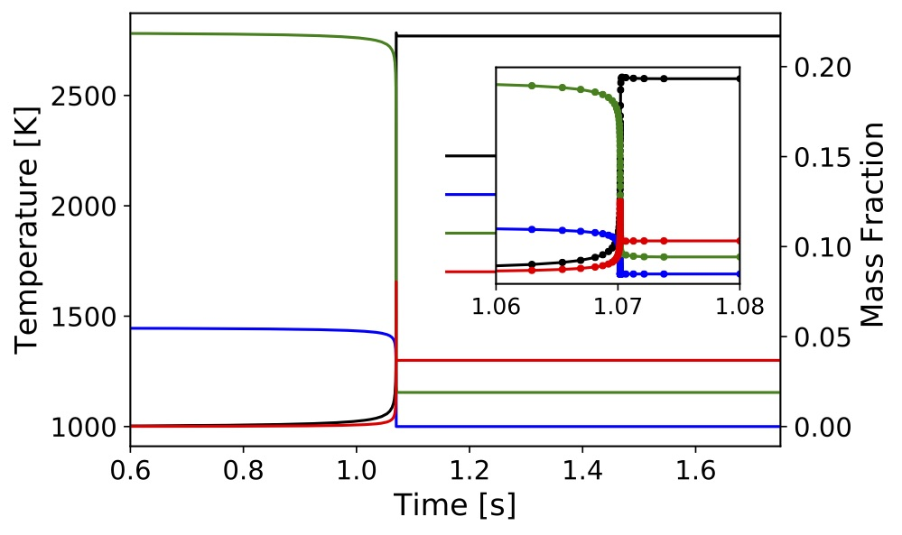
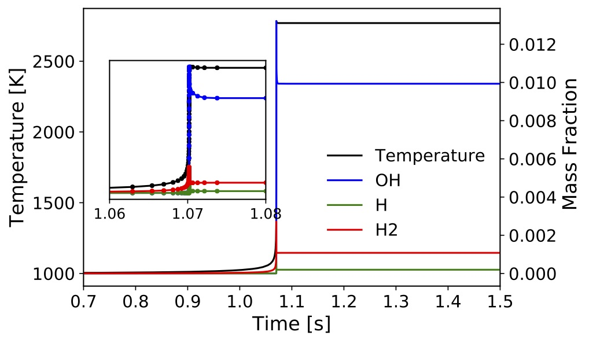

# [Homogeneous Constant-Volume Batch Reactors](#cxx-api-ConstantVolumeIgnitionZeroD)

<!-- ## Problem Definition -->

In this example we consider a transient zero-dimensional constant-volume problem where temperature $T$ and species mass fractions for $N_{spec}$ gas-phase species. The user provides the initial condition for the these variables along with a reference density and the model will be advanced in time for a duration also provided in the problem setup.

The system of ODEs solved by TChem are given by:

* ***Temperature equation***
$$
\frac{dT}{dt} = -\frac{\gamma}{\rho c_p}\sum_{k=1}^{N_{spec}}h_k\dot{\omega}_k
+(\gamma-1)\frac{T W}{\rho} \sum_{k=1}^{N_{spec}}\frac{\dot{\omega}_k}{W_k}
$$
* ***Species equation***
$$
\frac{dY_k}{dt} = \frac{\dot{\omega}_k}{\rho} W_k\,\,\,k=1\ldots N_{spec}
$$

where $\gamma = \frac{c_p}{c_v}$, $c_p$ is the specific heat at constant pressure for the mixture, $c_v$ is the specific heat at constant volume for the mixture, $c_p-c_v=R$, $\rho$ is the density (constant for this reactor model), $\dot{w_{k}}$ is the molar production rate of species $k$, $W_k$ is its molecular weight, and $h_k$ is the specific enthalpy. Further, $W=\frac{1}{\sum_{k=1}^{N_s}\frac{Y_k}{W_k}}$ is the mixture molecular weight.

## Jacobian of RHS
<!-- [comment]: # (KK: consider to bring this option summary at the beginning of the reactor section) -->
TChem uses either a numerical Jacobian based on a forward finite differences scheme or an analytical Jacobian based on automatic differentiation via the [SACADO library](https://docs.trilinos.org/dev/packages/sacado/doc/html/index.html). To select between numerical and analytical Jacobian, set the following cmake flag on TChem's configuration at compilation time.

```
-D TCHEM_ENABLE_SACADO_JACOBIAN_CONSTANT_VOLUME_IGNITION_REACTOR
```
The default value of this flag is "OFF", which means by default the numerical Jacobian is used by the ODE solver.  

## Running the Constant Volume Ignition Utility

The executable for this example is installed at ``TCHEM_INSTALL_PATH/example/``,  and the input parameters are given by (./TChem_IgnitionZeroD.x --help) :

```
options:
--atol-newton                 double    Absolute tolerance used in newton solver
                                        (default: --atol-newton=1.0e-10)
--chemfile                    string    Chem file name e.g., chem.inp
                                        (default: --chemfile=chem.inp)
--dtmax                       double    Maximum time step size
                                        (default: --dtmax=1.0e-01)
--dtmin                       double    Minimum time step size
                                        (default: --dtmin=1.0e-08)
--echo-command-line           bool      Echo the command-line but continue as normal
--help                        bool      Print this help message
--ignition-delay-time-file    string    Output of ignition delay time second using second-derivative method e.g., IgnitionDelayTime.dat
                                        (default: --ignition-delay-time-file=IgnitionDelayTime.dat)
--ignition-delay-time-w-threshold-temperature-file string    Output of ignition delay time second using threshold-temperature method  e.g., IgnitionDelayTimeTthreshold.dat
                                        (default: --ignition-delay-time-w-threshold-temperature-file=IgnitionDelayTimeTthreshold.dat)
--inputs-path                 string    path to input files e.g., data/inputs
                                        (default: --inputs-path=data/ignition-zero-d/CO/)
--jacobian-interval           int       Jacobians are evaluated once in this interval
                                        (default: --jacobian-interval=1)
--max-newton-iterations       int       Maximum number of newton iterations
                                        (default: --max-newton-iterations=100)
--max-time-iterations         int       Maximum number of time iterations
                                        (default: --max-time-iterations=1000)
--only-compute-ignition-delay-time bool      If true, simulation will end when Temperature is equal to the threshold temperature  
                                        (default: --only-compute-ignition-delay-time=false)
--output_frequency            int       save data at this iterations
                                        (default: --output_frequency=1)
--outputfile                  string    Output file name e.g., IgnSolution.dat
                                        (default: --outputfile=IgnSolution.dat)
--rtol-newton                 double    Relative tolerance used in newton solver
                                        (default: --rtol-newton=1.0e-06)
--run-constant-pressure       bool      if true code runs ignition zero d reactor; else code runs constant volume ignition reactor
                                        (default: --run-constant-pressure=true)
--samplefile                  string    Input state file name e.g.,input.dat
                                        (default: --samplefile=sample.dat)
--tbeg                        double    Time begin
                                        (default: --tbeg=0.0)
--team-size                   int       User defined team size
                                        (default: --team-size=-1)
--tend                        double    Time end
                                        (default: --tend=1.0)
--thermfile                   string    Therm file namee.g., therm.dat
                                        (default: --thermfile=therm.dat)
--threshold-temperature       double    threshold temperature in ignition delay time
                                        (default: --threshold-temperature=1.50e+03)
--time-iterations-per-intervalint       Number of time iterations per interval to store qoi
                                        (default: --time-iterations-per-interval=10)
--tol-time                    double    Tolerance used for adaptive time stepping
                                        (default: --tol-time=1.e-04)
--use_prefixPath              bool      If true, input file are at the prefix path
                                        (default: --use_prefixPath=true)
--vector-size                 int       User defined vector size
                                        (default: --vector-size=-1)
--verbose                     bool      If true, printout the first Jacobian values
                                        (default: --verbose=true)
Description:
This example computes the solution of a gas ignition 0D - problem
```
Note that we implement the [Homogeneous Constant-Pressure Batch Reactors](#homogeneousconstant-pressurebatchreactors) and Homogeneous Constant-Volume Batch Reactors in the same example code, TChem_IgnitionZeroD.cpp. We use the flag ``run-constant-pressure`` to choose which reactor to run. If this flag is set to ``true``, the program will integrate the Constant Pressure Homogeneous Batch Reactors. If this flag is set to ``false`` the Constant Volume Homogeneous Batch Reactors will be executed.

* ***GRIMech 3.0 Model***

We can create a bash scripts to provide inputs to TChem. For example the following script runs a constant-volume ignition problem with the GRIMech 3.0 model:

```
exec=$TCHEM_INSTALL_PATH/example/TChem_IgnitionZeroD.x
inputs=$TCHEM_INSTALL_PATH/example/data/ignition-zero-d/gri3.0

export OMP_PROC_BIND=spread
this="$exec --chemfile=$inputs/chem.inp \
            --thermfile=$inputs/therm.dat \
            --samplefile=$inputs/sample.dat \
            --outputfile=ConstVolumeIgnSolution.dat \
            --run-constant-pressure=false \
            --atol-newton=1e-18 \
            --rtol-newton=1e-8\
            --max-newton-iterations=20 \
            --tol-time=1e-6 \
            --dtmax=1e-3 \
            --dtmin=1e-20 \
            --tend=2 \
            --time-iterations-per-interval=10 \
            --max-time-iterations=260 \
            --ignition-delay-time-file=IgnitionDelayTime.dat \
            --ignition-delay-time-w-threshold-temperature-file=IgnitionDelayTimeTthreshold.dat
            --threshold-temperature=1500"

echo $this
eval $this
```

* **GRIMech 3.0 Results**

The results presented below are obtained by running ``TCHEM_INSTALL_PATH/example/TChem_IgnitionZeroD.x`` with an initial temperature of $1000$K, pressure of $1$ atm, and stoichiometric conditions (equivalence ratio $\phi=1$) for methane/air mixtures. The input files are located at "TCHEM_INSTALL_PATH/example/data/ignition-zero-d/gri3.0" and selected parameters were presented above. The inputs files and conditions are the same that we used in example of the [Homogeneous Constant-Pressure Batch Reactors](#homogeneousconstant-pressurebatchreactors).
 The simulation output was saved every iteration in "ConstVolumeIgnSolution.dat". Time profiles for temperature and mass fractions for selected species are presented in the figures below. To produce these results, we used a numerical Jacobian for the ODE solver.






The scripts to setup and run this example and the jupyter-notebook used to create these figures can be found under "TCHEM_INSTALL_PATH/example/runs/ConstantVolumeIgnition".
