# [Plug Flow Reactor (PFR) Problem with Gas and Surfaces Reactions](#cxx-api-PlugFlowReactor)

## Problem Definition

The plug flow reactor (PFR) example employs both gas-phase and surface species. The PFR is assumed to be in steady state, therefore a system of differential-algebraic equations (DAE) must be resolved. The ODE part of the problem correspond to the solution of energy, momentum, total mass and species mass balance. The  algebraic constraint arises from the assumption that the PFR problem is a steady-state problem. Thus, the surface composition on the wall must be stationary.

The equations for the species mass fractions $Y_k$, temperature $T$, axial velocity $u$, and continuity (represented  by density $\rho$) resolved by TChem were derived from Ref. \cite{ Chemically Reacting Flow: Theory, Modeling, and Simulation, Second Edition. Robert J. Kee, Michael E. Coltrin, Peter Glarborg, Huayang Zhu.}


* ***Species equation***
$$
\frac{ d  Y_k }{dz}  =  \frac{1 }{\rho u}\dot{w_{k}}W_k + \frac{ P_r^{'} }{\rho u A_c} \dot{s}_kW_k - \frac{ P_r^{'}}{\rho u A_c}Y_k \sum_{k=1}^{Kg} \dot{s}_kW_k
$$

* ***Energy equation***
$$
\frac{dT}{dz} =  - \frac{1}{\rho u c_p}  \sum_{k=1}^{Kg} \dot{w_{k}} W_k h_k - \frac{P_r^{'}}{ \rho u A_c c_p}\sum_{k=1}^{Kg}\dot{s}_kW_k h_k
$$

* ***Momentum equation***
$$
\frac{ d  u }{dz} =  -\gamma \frac{ P_r^{'} }{\rho A_c} \sum_{k=1}^{Kg}\dot{s}_kW_k   - \frac{ R }{u m}\big ( \frac{ 1 }{\bar{W}} \frac{dT}{dz} +    T \sum _{k=1}^{Kg} \frac{d Y_k}{ dz}\frac{1}{W_k} \big )
$$

Where $\gamma=\frac{1+\frac{p}{\rho u^2} }{1-\frac{p}{\rho u^2}}$ and $m=1 - \frac{p}{\rho u^2}$.

* ***Continuity equation***

$$
\frac{d \rho }{ dz} =  \frac{P_r^{'}}{u A_c} \sum_{k=1}^{Kg} \dot{s}_kW_k   - \frac{\rho}{u } \frac{du}{dz}
$$

where $\gamma=\frac{1+\frac{p}{\rho u^2} }{1-\frac{p}{\rho u^2}}$, $m=1 - \frac{p}{\rho u^2}$, $A_c$ is the surface area, $P_r$' is the surface chemistry parameter. In the equations above $\dot{s}_k$ represents the surface chemistry production rate for a gas-phase species $k$.

* ***Algebraic constraint***
$$
\dot{s}_k = 0 \quad  k \text{ correspond to surfaces species }
$$

Here $N_{spec}^s$ represent all surface species.

The number of ODEs is equal to the number of gas-phases species with three additional equations for thermodynamic temperature, continuity and momentum.  The number of constraints is equal to the number of surfaces species. This PFR formulation assumes that surface reactions are taking place on the channel wall and gas-phase reactions inside the channel. Wall friction and heat transfer at the wall are neglected in this example.

## Jacobian Formulation

The current implementation uses a numerical jacobian based on forward finite differences.

## Running the Plug Flow Reactor with Surface Reactions Utility


The executable for this example is installed under "TCHEM_INSTALL_PATH/example". The inputs for this example are obtained through.
```
Usage: ./TChem_PlugFlowReactor.x [options]
  options:
  --Area                        double    Cross-sectional Area
                                          (default: --Area=5.3e-04)
  --Pcat                        double    Chemically active perimeter,
                                          (default: --Pcat=2.6e-02)
  --atol-newton                 double    Absolute tolerance used in newton solver
                                          (default: --atol-newton=1.e-12)
  --batchsize                   int       Batchsize the same state vector described in state file is cloned
                                          (default: --batchsize=1)
  --chemSurffile                string    Chem file name e.g., chemSurf.inp
                                          (default: --chemSurffile=chemSurf.inp)
  --chemfile                    string    Chem file name e.g., chem.inp
                                          (default: --chemfile=chem.inp)
  --dzmax                       double    Maximum dz step size
                                          (default: --dzmax=1.0e-06)
  --dzmin                       double    Minimum dz step size
                                          (default: --dzmin=1.0e-10)
  --echo-command-line           bool      Echo the command-line but continue as normal
  --help                        bool      Print this help message
  --initial_condition           bool      If true, use a newton solver to obtain initial condition of the constraint
                                          (default: --initial_condition=True)
  --inputSurffile               string    Input state file name e.g., inputSurfGas.dat
                                          (default: --inputSurffile=inputSurf.dat)
  --inputVelocityfile           string    Input state file name e.g., inputVelocity.dat
                                          (default: --inputVelocityfile=inputVelocity.dat)
  --max-newton-iterations       int       Maximum number of newton iterations
                                          (default: --max-newton-iterations=100)
  --max-z-iterations         int       Maximum number of z iterations
                                          (default: --max-z-iterations=4000)
  --output_frequency            int       save data at this iterations
                                          (default: --output_frequency=-1)
  --prefixPath                  string    prefixPath e.g.,inputs/
                                          (default: --prefixPath=data/plug-flow-reactor/X/)
  --rtol-newton                 double    Relative tolerance used in newton solver
                                          (default: --rtol-newton=1.0e-06)
  --samplefile                  string    Input state file name e.g., input.dat
                                          (default: --samplefile=sample.dat)
  --zbeg                        double    Position begin
                                          (default: --zbeg=0)
  --team-size                   int       User defined team size
                                          (default: --team-size=-1)
  --zend                        double    Position  end
                                          (default: --zend=2.5e-02)
  --thermSurffile               string    Therm file name e.g.,thermSurf.dat
                                          (default: --thermSurffile=thermSurf.dat)
  --thermfile                   string    Therm file name e.g., therm.dat
                                          (default: --thermfile=therm.dat)
  --time-iterations-per-intervalint       Number of time iterations per interval to store qoi
                                          (default: --time-iterations-per-interval=10)
  --tol-z                    double    Tolerance used for adaptive z stepping
                                          (default: --tol-z=1.0e-04)
  --transient_initial_condition bool      If true, use a transient solver to obtain initial condition of the constraint
                                          (default: --transient_initial_condition=false)
  --use_prefixPath              bool      If true, input file are at the prefix path
                                          (default: --use_prefixPath=true)
  --vector-size                 int       User defined vector size
                                          (default: --vector-size=-1)
  --verbose                     bool      If true, printout the first Jacobian values
                                          (default: --verbose=true)
Description:
  This example computes Temperature, density, mass fraction and site fraction for a plug flow reactor
```

The following shell script sets the input parameters and runs the PFR example

```
exec=$TCHEM_INSTALL_PATH/example/TChem_PlugFlowReactor.x
inputs=$TCHEM_INSTALL_PATH/example/data/plug-flow-reactor/CH4-PTnogas/
Area=0.00053
Pcat=0.025977239243415308
dzmin=1e-12
dzmax=1e-5
zend=0.025
tol_z=1e-8
max_z_iterations=310
max_newton_iterations=20
atol_newton=1e-12
rtol_newton=1e-8
save=1
transient_initial_condition=false
initial_condition=true

$exec --prefixPath=$inputs --initial_condition=$initial_condition --transient_initial_condition=$transient_initial_condition --Area=$Area  --Pcat=$Pcat --tol-z=$tol_z --atol-newton=$atol_newton --rtol-newton=$rtol_newton --dzmin=$dzmin --max-newton-iterations=$max_newton_iterations --output_frequency=$save --dzmax=$dzmax --zend=$zend --max-time-iterations=$max_z_iterations
```

We ran the example  in the install directory "TCHEM_INSTALL_PATH/example/runs/PlugFlowReactor/CH4-PTnogas". Thus, all the paths are relative to this directory. This script will run the executable "TCHEM_INSTALL_PATH/example/TChem_PlugFlowReactor.x" with the input files located at "TCHEM_INSTALL_PATH/example/data/plug-flow-reactor/CH4-PTnogas/". These files correspond to the gas-phase and surface reaction mechanisms ("chem.inp" and "chemSurf.inp") and their corresponding thermo files ("therm.dat" and "thermSurf.dat").  The operating condition at the inlet of the reactor, i.e. the gas composition, in "sample.dat", and the initial guess for the site fractions, in "inputSurf.dat", are also required. The format and description of these files are presented in [Section](#inputfiles). The gas velocity at the inlet is provided in "inputVelocity.dat".


The  "Area" [$m^2$] is the cross area of the channel and  "Pcat" [$m$] is the chemical active perimeter of the PFR. The step size is controled by  "dzmin",  "dzmax", and "tol_z", the simulation will end with the "z"(position) is equal to  "zend" or when it reaches the  "max_z_iterations'.  The relative and absolute tolerance in the Newton solver are set through "atol_newton" and "rtol_newton". The description of the  integration method can be found in [Section](#timeintegration). The "save" parameter sets the output frequency, in this case equal to $1$, which means the information will be saved every stepin "PFRSolution.dat". The following header is saved in the output file


````
iter     t       dt      Density[kg/m3]          Pressure[Pascal]        Temperature[K] SPECIES1 (Mass Fraction) ... SPECIESN (Mass Fraction)  SURFACE_SPECIES1 (Site Fraction) ... SURFACE_SPECIESN (Site Fraction) Velocity[m/s]  
````

The inputs "transient_initial_condition" and "initial_condition" allow us to pick a method to compute an initial condition that satisfies the system of DAE equation as described in [Section](#initialconditionforpfrproblem). In this case, the simulation will use a Newton solver to find an initial surface site fraction to meet the constraint presented above.


***Results***
The gas-phase and surface mechanisms used in this example represents the catalytic combustion of methane on platinum and was developed by [Blondal and co-workers](https://pubs.acs.org/doi/10.1021/acs.iecr.9b01464). These mechanisms have 15 gas species, 20 surface species, 47 surface reactions and no gas-phase reactions. The total number of ODEs is $18$ and there are $20$ constrains.  One simulation took about 12s to complete on a MacBook Pro with a 3.1GHz Intel Core i7 processor. Time profiles for temperature, density, velocity, mass fractions and site fractions for selected species are presented in the following figures.  Scripts and jupyter notebooks for this example are located under "TCHEM_INSTALL_PATH/example/runs/PlugFlowReactor/CH4-PTnogas".


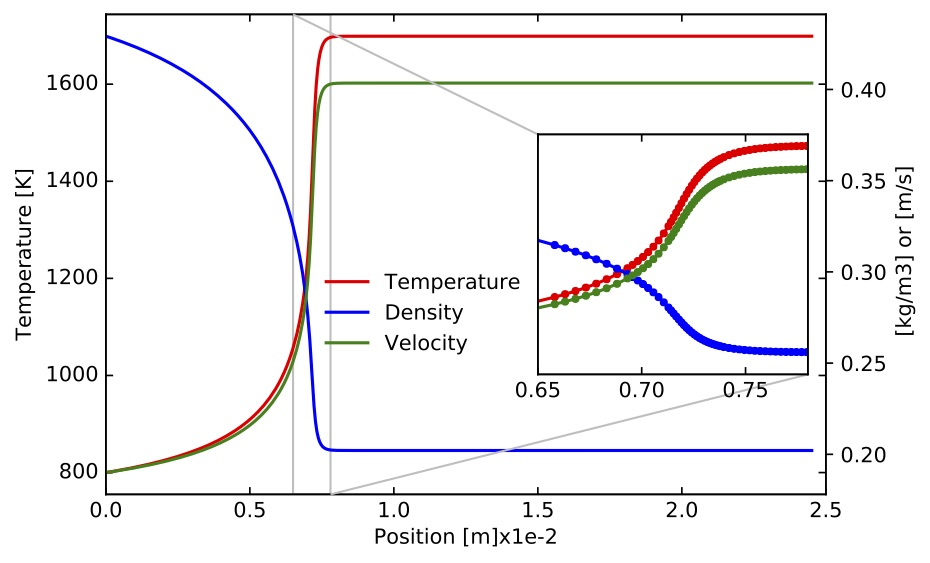
Figure. Gas Temperature (left axis), velocity and density (both on right axis) along the PFR.   

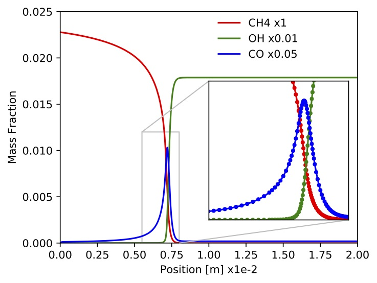
Figure. Mass fraction of $\mathrm{CH}_4$, $\mathrm{OH}$ and $\mathrm{CH}_3\mathrm{OH}$.   

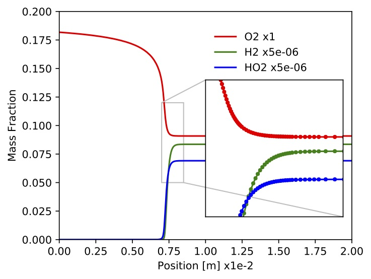
Figure. Mass fractions for $\mathrm{O}_2$, $\mathrm{HCO}$ and $\mathrm{CH}_3\mathrm{OO}$

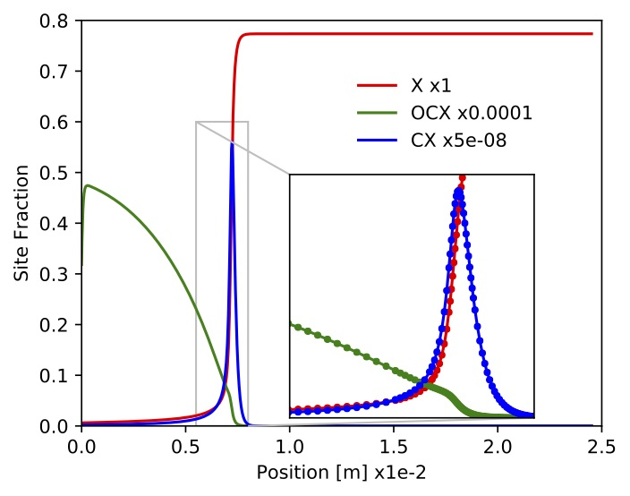
Figure. Site fractions for $\mathrm{X}$ (empty space), $\mathrm{CH_4X}$ and $\mathrm{OHX}$.

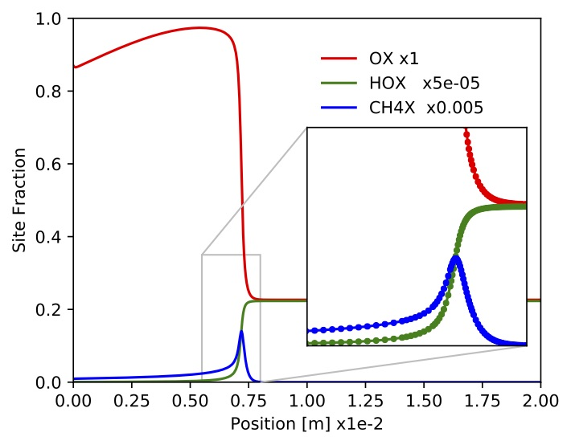
Figure. Site fractions for $\mathrm{OX}$, $\mathrm{CHX}$, $\mathrm{CHOX}$.

***Parametric study***
The executable "TCHEM_INSTALL_PATH/example/TChem_PlugFlowReactor.x" can be also used with more than one sample. In this example, we ran it with eight samples. The inputs for this run are located at "TCHEM_INSTALL_PATH/example/data/plug-flow-reactor/CH4-PTnogas_SA". A script and a jupyter-notebook to reproduce this example are placed under "TCHEM_INSTALL_PATH/example/runs/PlugFlowReactor/CH4-PTnogas_SA".

These samples correspond to combination of values for the molar fraction of  $CH_4$, $\{0.04,0.08\}$, inlet gas temperature, $\{800,9000\}$ [K], and velocity, $\{0.0019,0.0038\}$ [m/s]. The bash script to run this problem is listed below

The bash script to run this problem is :

````
exec=$TCHEM_INSTALL_PATH/example/TChem_PlugFlowReactor.x
use_prefixPath=false
inputs=$TCHEM_INSTALL_PATH/example/data/plug-flow-reactor/CH4-PTnogas/
inputs_conditions=inputs/

chemfile=$inputs"chem.inp"
thermfile=$inputs"therm.dat"
chemSurffile=$inputs"chemSurf.inp"
thermSurffile=$inputs"thermSurf.dat"
samplefile=$inputs_conditions"sample.dat"
inputSurffile=$inputs_conditions"inputSurf.dat"
inputVelocityfile=$inputs_conditions"inputVelocity.dat"

save=1
dzmin=1e-12
dzmax=1e-5
zend=0.025
max_newton_iterations=100
max_z_iterations=2000
atol_newton=1e-12
rtol_newton=1e-8
tol_z=1e-8
Area=0.00053
Pcat=0.025977239243415308
transient_initial_condition=true
initial_condition=false

$exec --use_prefixPath=$use_prefixPath --chemfile=$chemfile --thermfile=$thermfile --chemSurffile=$chemSurffile --thermSurffile=$thermSurffile --samplefile=$samplefile --inputSurffile=$inputSurffile --inputVelocityfile=$inputVelocityfile --initial_condition=$initial_condition --transient_initial_condition=$transient_initial_condition --Area=$Area  --Pcat=$Pcat --tol-z=$tol_z --atol-newton=$atol_newton --rtol-newton=$rtol_newton --dzmin=$dzmin --max-newton-iterations=$max_newton_iterations --output_frequency=$save --dzmax=$dzmax --zend=$zend --max-time-iterations=$max_z_iterations
````

In the above script we did not use a prefix path ("use_prefixPath=false") instead we provided the name of the inputs files: "chemfile", "thermfile",  "chemSurffile", "thermSurffile", "samplefile", "inputSurffile", "inputVelocityfile". The files for the reaction mechanism ("chem.inp" and "chemSurf.inp") and the thermo files ("therm.dat" and "thermSurf.dat") are located under "TCHEM_INSTALL_PATH/example/data/plug-flow-reactor/CH4-PTnogas/". The files with the inlet conditions ("sample.dat", "inputSurf.dat" and"inputVelocity.dat") are located in the "input" directory, located under the run directory. One can set a different path for the input files with the command-line option "use_prefixPath". Additionally, one can also use the option "transient_initial_condition=true", to activate the transient solver to find initial condition for the [PFR](#initialconditionforpfrproblem).

The following figures show temperature, gas-phase species mass fractions and surface species site fractions corresponding to the example presented above.

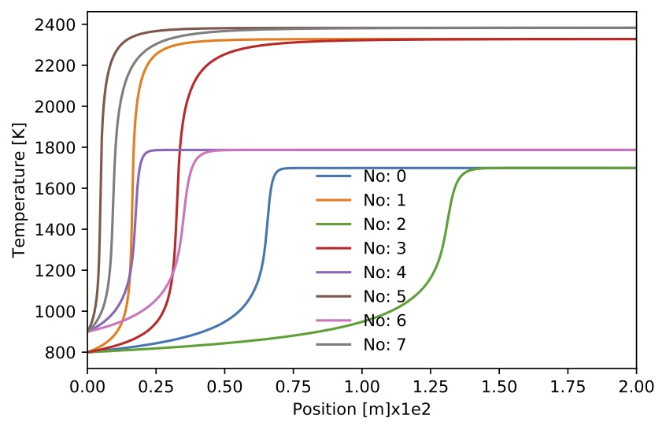
Figure. Gas temperature for 8 sample.

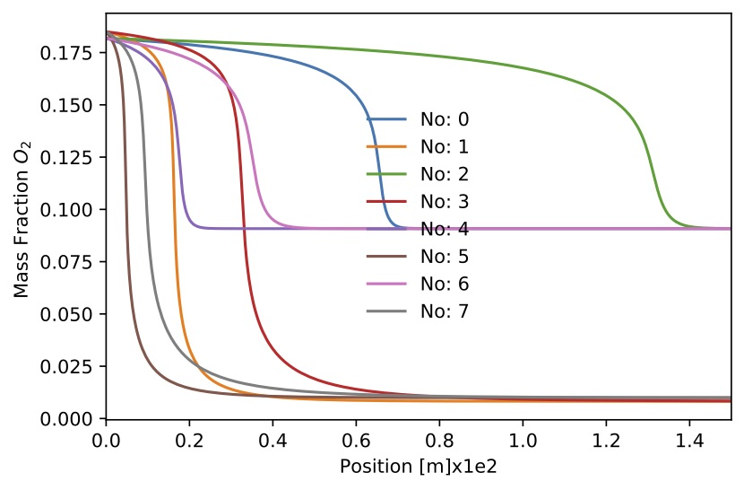
Figure. Mass fraction $O_2$ for 8 sample.


Figure. Mass fraction $CH_4$ for 8 sample.

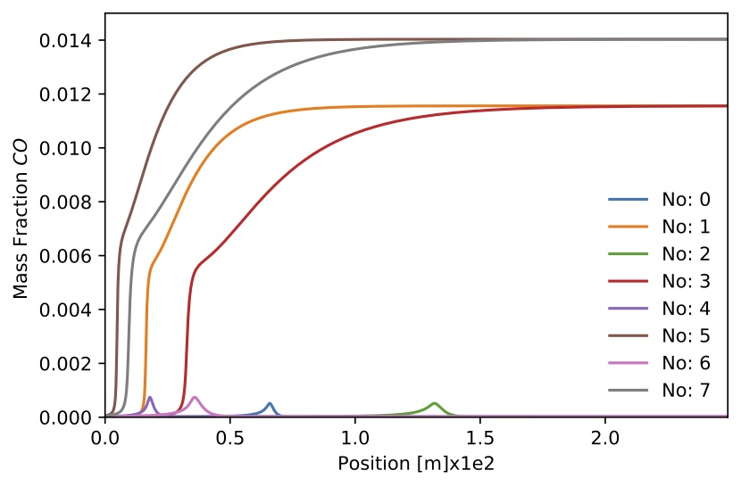
Figure. Mass fraction $CO$ for 8 sample.

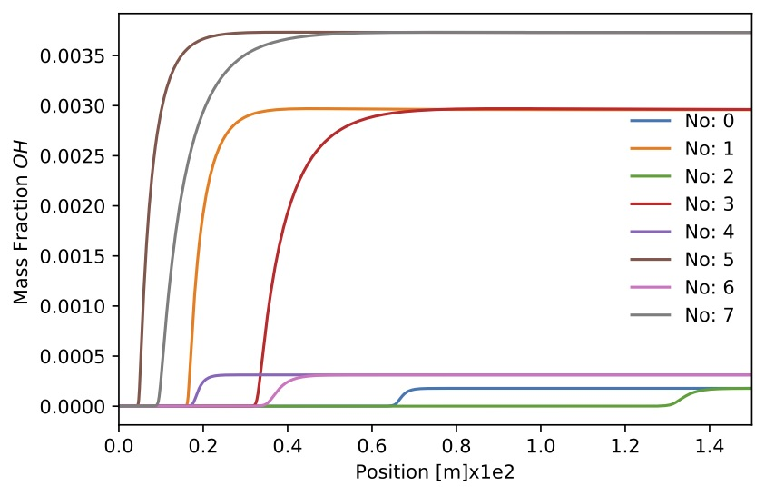
Figure. Mass fraction $OH$ for 8 sample.

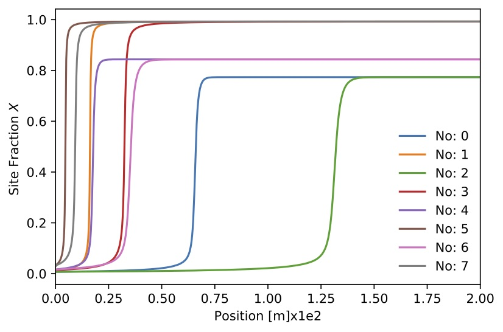
Figure. Site fraction $X$ for 8 sample.

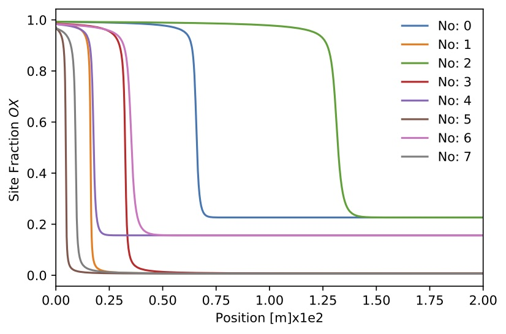
Figure. Site fraction $OX$ for 8 sample.

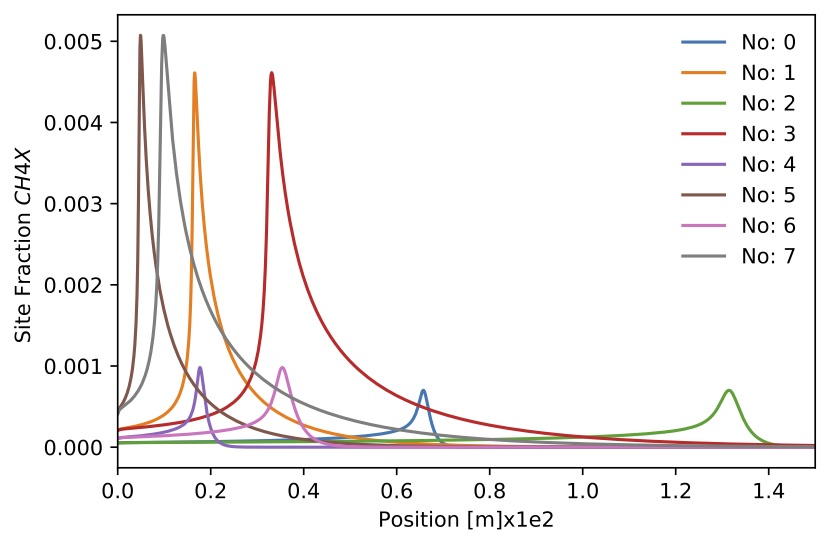
Figure. Site fraction $CH_4X$ for 8 sample.

## Initial Condition for PFR Problem
The initial condition for the PFR problem must satisfy the algebraic constraint in the DAE system. Thus, an appropriate initial condition must be provided. To solve this problem, TChem first solves a system that accounts for the constraint only. The gas-phase species mass fractions and temperature are kept constant. The constraint component can be solved either by evolving an equivalent time-dependent formulation to steady-state or by directly solving the non-linear problem directly. a steady state or a time dependent formulation. In one method, the following equation is resolved in time until the system reaches stable state. In the second method, a newton solver is used to directly resolver the constraint part($\dot{s}_k=0$).

$$ \frac{dZ_k}{dt}= \frac{\dot{s}_k}{\Gamma} \quad  k \text{ correspond to surfaces species } $$

 In the [first method](#cxx-api-SimpleSurface), the ODE system is solved until reaches steady state. This is presented at "TCHEM_REPOSITORY_PATH/src/example/TChem_SimpleSurface.cpp". The following figure shows three surface species, the other species have values lower than 1e-4. This result shows the time to reach stable state is only of 1e-4 s. In the PFR example presented above, this option can be used setting  "transient_initial_condition=true" and  "initial_condition=false".


 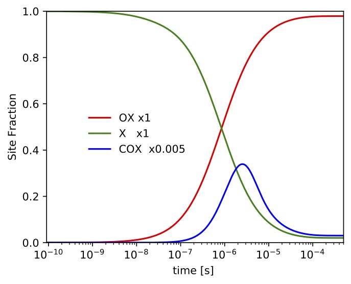
 Figure.Site fractions for $\mathrm{X}$ (empty space), $\mathrm{OX}$ and $\mathrm{COX}$. We start this simulation with an empty surface ($\mathrm{X}=1$).


The example produces an output file ("InitialConditionPFR.dat") with the last iteration. This file can be used in the PFR problem as the"inputSurf.dat" file. The inputs for this example are located at "TCHEM_INSTALL_PATH/example/runs/InitialConditionPFR".

In the [second method](#cxx-api-InitialConditionSurface), we used a newton solver to find a solution to the constraint.  One code example of this alternative is presented at "TCHEM_REPOSITORY_PATH/src/example/TChem_InitialCondSurface.cpp". In the PFR example presented above, the default option is"initial_condition=true", if both option are set true, the code will execute the transient initial condition first and then the newton initial condition.
