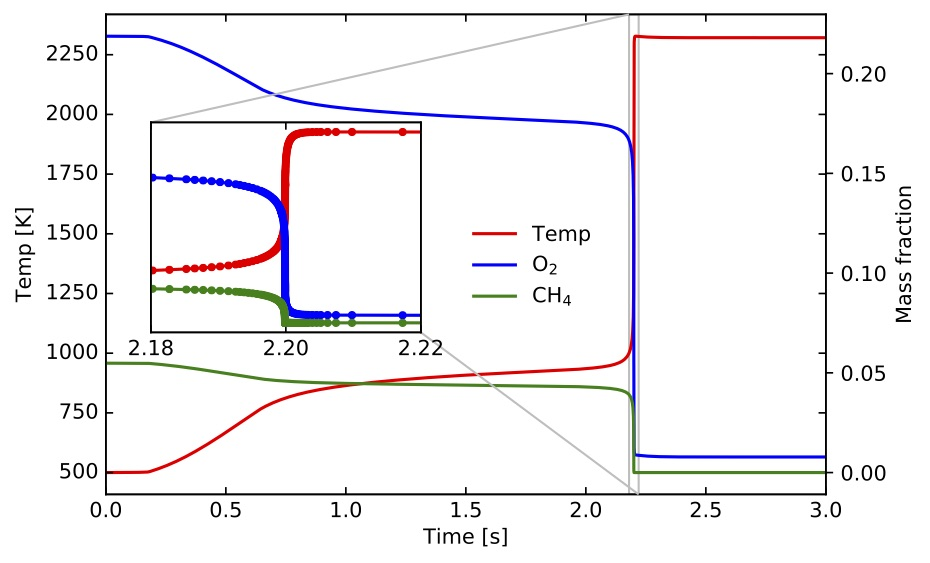
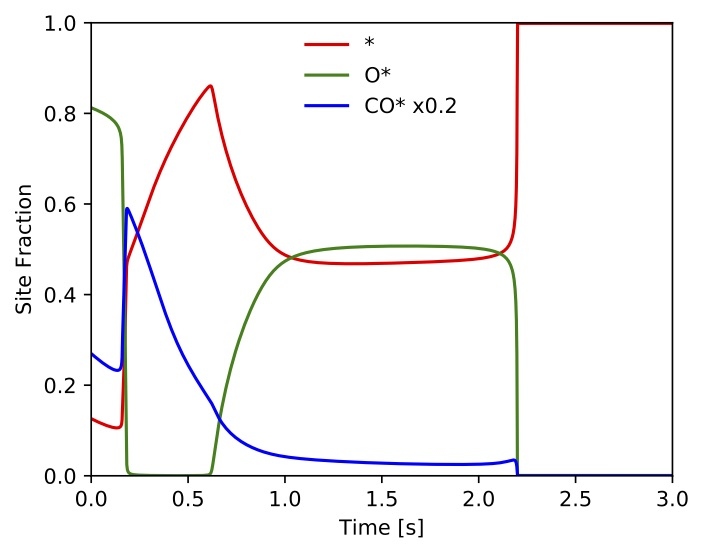

# [Transient continuous stirred tank reactor (T-CSTR)](#cxx-api-TransientContinuousStirredTankReactor)

<!-- ## Problem Definition -->

The TChem's T-CSTR reactor solves ODE equations for temperature, gas-phase species mass fractions, and surface-species site fraction. These equations are based on the formulation for transient stirred reactors from:

* Robert J. Kee, Michael E. Coltrin, Peter Glarborg, Huayang Zhu, "Chemically Reacting Flow: Theory, Modeling, and Simulation," Second Edition.

The ODE system of equations assume constant volume and pressure:

* ***Gas species equations***

$$
\rho V \frac{ d Y_k}{dt} =  \dot{m}_{0} (Y_{k,0} - Y_k) - Y_k A\sum_{e=1}^{K_g} \dot{s}_eW_e + A \dot{s}_kW_k +V \dot{w}_{k}W_k,  \quad k = 1, \cdots, K_g
$$

* ***Temperature equation***

$$
\frac{dT}{dt} =  - \frac{1}{c_p} \sum_{k=1}^{K_g} (h_k \frac{dY_k}{dt} )  +    \frac{1}{\rho V c_p} (\dot{m}_0(h_{0} - h)  - hA\sum_{e=1}^{K_g} \dot{s}_eW_e )
$$
* ***Surface species equations***
$$
\frac{d Z_{k-K_g} }{dt} = \frac{\dot{s}_k}{\Gamma},  \quad  k = K_g +1, \cdots, K_g+K_s
$$

where $t$ is time, $Y_k$ is the mass fraction of gas species $k$, $\dot{m}_0$ is the inlet mass flow rate, $Y_{k,0}$ is the inlet mass fraction of species $k$, $A$ is the reactor chemically-active area, V is the reactor volume, $K_g$ is the number of gas-phase species, $\dot{s}_k$ is the net production rate (mole based) for the species $k$ from the surface reaction mechanism, $\dot{w}_k$ is the net production rate (mole based) for species $k$ from the gas-phase reaction mechanism, $W_k$ is the molecular weight of species $k$, $T$ is the temperature, and $\rho$ is the gas density. Further, $c_p$ is the gas mixture heat capacity, $h_k$ is the enthalpy for gas-phase species $k$, $h$ is the gas mixture enthalpy, and $h_0$ is the inlet gas mixture enthalpy, all mass based. Finally, $Z_k$ is the site fraction of surface species $k=1,\ldots,K_s$, where $K_s$ is the number of surface species, and $\Gamma$ is the surface site density.   


Usually the value of $\Gamma$ is a small number; therefore, the time scales of the surface species are faster than the gas species. Thus, one could assume that surface species reached steady state, and their RHS are close to zero. This approximation is known as the quasi-steady state approximation (QSSA); the resulting model is a DAE system with a smaller number of ODEs than in the original ODE system. In the reformulated model the gas-phase species and energy equations are the same as in the original system. The equations for the surface species are either differential equation or algebraic constraints.    

* ***Surface species equations***

$$
\frac{d Z_{k-K_g}}{dt} = \frac{\dot{s}_{k}}{\Gamma},  \quad   k = K_g +1, \ldots, K_g+K_s- N_{c}
$$

* ***Surface algebraic constraints***

$$
\dot{s}_k = 0, \quad  k = K_g + K_s - N_{c} +1 , \ldots , K_g+K_s-1  
$$

where the last surface species is solved via

$$
 \sum_{k=1}^{K_s} Z_k = 1
$$

Here, $N_{c}$ is number of constraints that correspond to last $N_{c}$ surface species.

A detail derivation of the T-CSTR formulation and a study using the [CSPlib](https://github.com/sandialabs/CSPlib) library are presented in the paper:

* O. Diaz-Ibarra, K. Kim, C. Safta, H. Najm. [Using computational singular perturbation as a diagnostic tool in ODE and DAE systems: a case study in heterogeneous catalysis](https://doi.org/10.1080/13647830.2021.2002417). Combustion Theory and Modelling.

## Jacobian of RHS

TChem uses either a numerical Jacobian based on forward finite differences or an analytical Jacobian based on AD via the [SACADO library](https://docs.trilinos.org/dev/packages/sacado/doc/html/index.html). To select between numerical and analytical Jacobian, set the following cmake flag on TChem's configuration at compilation time.
```
-D TCHEM_ENABLE_SACADO_JACOBIAN_TRANSIENT_CONT_STIRRED_TANK_REACTOR=ON
```
The default value of this flag is "OFF", which means by default the numerical Jacobian is used by ODE/DAE solver.

## Running the Transient Continuous Stirred Tank Reactor with Surface Reactions Utility

The executable for this example is installed under "TCHEM_INSTALL_PATH/example". The inputs for this example are obtained through.
```
Usage: ./TChem_TransientContStirredTankReactor.x [options]
  options:
  --atol-newton                 double    Absolute tolerance used in newton solver
                                          (default: --atol-newton=1.000000000000000e-18)
  --atol-time                   double    Absolute tolerance used for adaptive time stepping
                                          (default: --atol-time=1.000000000000000e-12)
  --catalytic-area              double    Catalytic area [m2]
                                          (default: --catalytic-area=1.347000000000000e-02)
  --chemfile                    string    Chem file name of gas phase e.g., chem.inp
                                          (default: --chemfile=runs/T-CSTR/CH4_PT_Quinceno2006/inputs/chem.inp)
  --dtmax                       double    Maximum time step size
                                          (default: --dtmax=1.000000000000000e-02)
  --dtmin                       double    Minimum time step size
                                          (default: --dtmin=9.999999999999999e-21)
  --echo-command-line           bool      Echo the command-line but continue as normal
  --help                        bool      Print this help message
  --initial-condition           bool      If true, use a newton solver to obtain initialcondition of surface species
                                          (default: --initial-condition=false)
  --inlet-mass-flow             double    Inlet mass flow rate [kg/s]
                                          (default: --inlet-mass-flow=1.000000000000000e-02)
  --inputs-path                 string    prefixPath e.g.,inputs/
                                          (default: --inputs-path=runs/T-CSTR/CH4_PT_Quinceno2006/inputs/)
  --isothermal                  bool      if True, reaction is isotermic
                                          (default: --isothermal=false)
  --jacobian-interval           int       Jacobians are evaluated in this interval during Newton solve
                                          (default: --jacobian-interval=1)
  --max-newton-iterations       int       Maximum number of newton iterations
                                          (default: --max-newton-iterations=100)
  --max-time-iterations         int       Maximum number of time iterations
                                          (default: --max-time-iterations=4000)
  --number-of-algebraic-constraintsint       Number of algebraic constraints
                                          (default: --number-of-algebraic-constraints=0)
  --output_frequency            int       save data at this iterations
                                          (default: --output_frequency=1)
  --outputfile                  string    Output file name e.g., CSTRSolution.dat
                                          (default: --outputfile=CSTRSolution.dat)
  --reactor-volume              double    Reactor Volumen [m3]
                                          (default: --reactor-volume=1.347000000000000e-01)
  --rtol-newton                 double    Relative tolerance used in newton solver
                                          (default: --rtol-newton=1.000000000000000e-08)
  --samplefile                  string    Input state file name of gas phase e.g., input.dat
                                          (default: --samplefile=runs/T-CSTR/CH4_PT_Quinceno2006/inputs/sample.dat)
  --save_initial_condition      bool      if True, solution containtsinitial condition
                                          (default: --save_initial_condition=true)
  --surf-chemfile               string    Chem file name of surface phase e.g., chemSurf.inp
                                          (default: --surf-chemfile=runs/T-CSTR/CH4_PT_Quinceno2006/inputs/chemSurf.inp)
  --surf-inputfile              string    Input state file name of surface e.g., inputSurfGas.dat
                                          (default: --surf-inputfile=runs/T-CSTR/CH4_PT_Quinceno2006/inputs/inputSurf.dat)
  --surf-thermfile              string    Therm file name of surface phase e.g.,thermSurf.dat
                                          (default: --surf-thermfile=runs/T-CSTR/CH4_PT_Quinceno2006/inputs/thermSurf.dat)
  --tbeg                        double    Time begin
                                          (default: --tbeg=0.000000000000000e+00)
  --team-size                   int       User defined team size
                                          (default: --team-size=-1)
  --tend                        double    Time end
                                          (default: --tend=3.000000000000000e+00)
  --thermfile                   string    Therm file name of gas phase  e.g., therm.dat
                                          (default: --thermfile=runs/T-CSTR/CH4_PT_Quinceno2006/inputs/therm.dat)
  --time-iterations-per-intervalint       Number of time iterations per interval to store qoi
                                          (default: --time-iterations-per-interval=10)
  --tol-time                    double    Tolerence used for adaptive time stepping
                                          (default: --tol-time=1.000000000000000e-04)
  --transient-initial-condition bool      If true, use a transient solver to obtain initial condition of surface species
                                          (default: --transient-initial-condition=false)
  --use-prefix-path             bool      If true, input file are at the prefix path
                                          (default: --use-prefix-path=false)
  --vector-size                 int       User defined vector size
                                          (default: --vector-size=-1)
  --verbose                     bool      If true, printout the first Jacobian values
                                          (default: --verbose=true)
Description:
  This example computes temperature, mass fraction, and site fraction for a Transient continuous stirred tank reactor
```

The following shell script sets the input parameters and runs the T-CSTR example

```
exec=$TCHEM_INSTALL_PATH/example/TChem_TransientContStirredTankReactor.x

run_this="$exec --chemfile=inputs/chemgri30.inp \
                --thermfile=inputs/thermgri30.dat \
                --samplefile=inputs/sample_phi1.dat \
                --surf-chemfile=inputs/chemSurf.inp \
                --surf-thermfile=inputs/thermSurf.dat \
                --surf-inputfile=inputs/inputSurf.dat \
                --outputfile=CSTRSolutionODE.dat \
                --catalytic-area=1.347e-2 \
                --reactor-volume=1.347e-1 \
                --inlet-mass-flow=1e-2 \
                --number-of-algebraic-constraints=0 \
                --transient-initial-condition=true \
                --max-newton-iterations=20 \
                --atol-newton=1e-18 \
                --rtol-newton=1e-8 \
                --tol-time=1e-8 \
                --atol-newton=1e-12 \
                --dtmin=1e-20 \
                --dtmax=1e-3 \
                --tend=3 \
                --time-iterations-per-interval=10\
                --max-z-iterations=400 "

echo $run_this
eval $run_this
```

We ran this example in the install directory ``TCHEM_INSTALL_PATH/example/runs/T-CSTR/CH4_PT_Quinceno2006``. The above batch script is saved in this directory. In the simulation, we used analytical Jacobian for time integration, and we noted that if the numerical Jacobian is used, the simulation fails to converge. Note that in this script the inputs are located in the "inputs" directory, and the number of algebraic constraints is equal to zero. The latter setting results in the T-CSTR being an ODE system.

## Results
We test the T-CSTR using the [GRIMech 3.0](http://www.me.berkeley.edu/gri_mech) model (53/325 gas-phase species/reactions) for gas-phase chemistry, and the [Quiceno et al.](https://www.sciencedirect.com/science/article/pii/S0926860X06000810) mechanism (11/36 surface species/reactions) for surface kinetics. The time profiles of this simulation are presented in the following figures:.



Figure. Time profiles of gas temperature (left axis), $Y_{\mathrm{CH}_4}$ and $Y_{\mathrm{O}_2}$ (both on right axis).  


Figure. Site fraction of * (void space),  $\mathrm{O}^*$, and  $\mathrm{CO}^*$.
